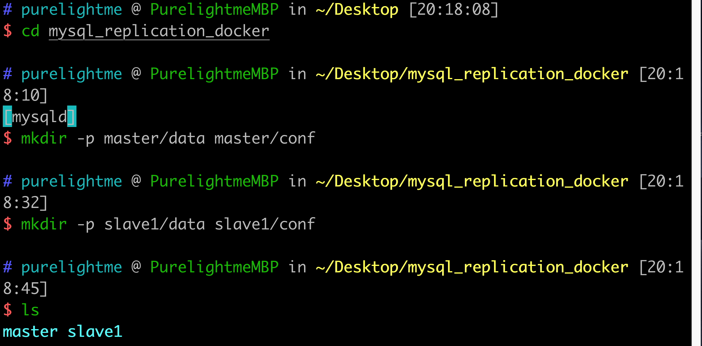
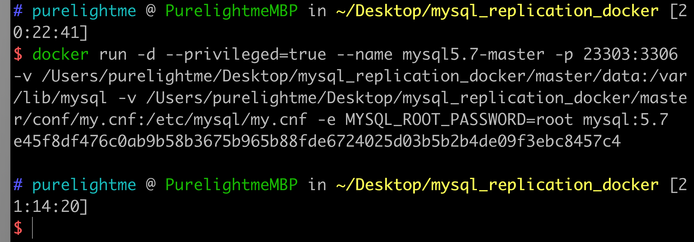
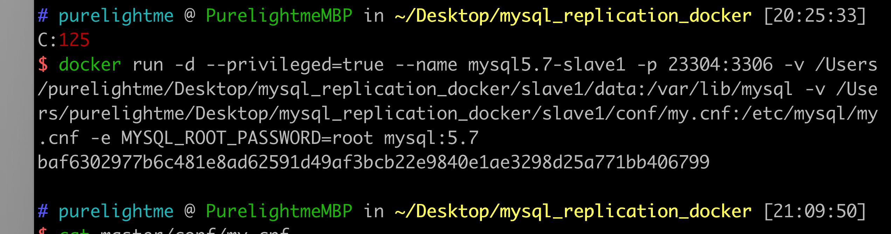
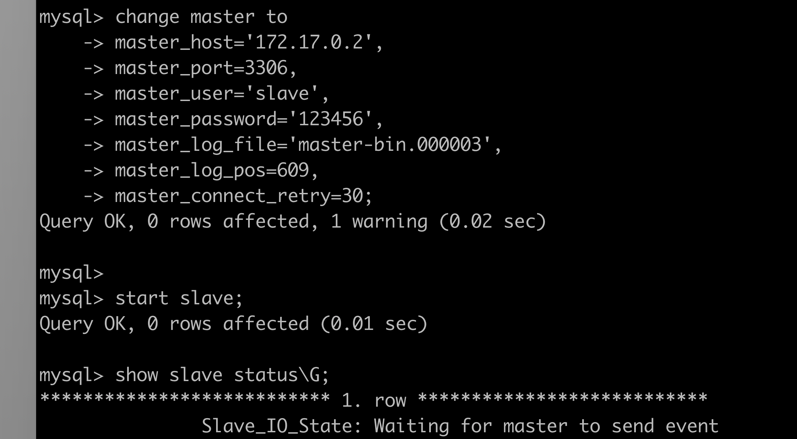

### MySQL主从复制搭建过程（docker）

###### 本机准备两个目录



master的my.cnf:

```
[mysqld]
server-id=1
log-bin=master-bin
user=mysql
character-set-server=utf8

[mysql]
default-character-set=utf8

[client]
default-character-set=utf8
```

slave的my.cnf:

```
[mysqld]
server-id=2
log-bin=slave1-bin
relay-log=slave-relay-bin
user=mysql
character-set-server=utf8

[mysql]
default-character-set=utf8

[client]
default-character-set=utf8
```

###### 启动两个MySQL容器





###### 配置master

```sql
create user 'slave'@'%' identified by '123456';
grant replication slave,replication client on *.* to 'slave'@'%';
show master status\G;
```

记下File和Position，一会配置slave会用到。

###### 配置slave

master的ip可以通过下面命令查看：

```docker
docker inspect --format='{{.NetworkSettings.IPAddress}}' mysql5.7-master
```



查看到SlaveIORunning与SlaveSQLRunning都为YES，则表示复制已经成功开始了。

接下来，就可以开始测试啦~

另外如果不是一开始就准备搭建主从，应该先将master进行mysqldump备份，导入slave后，再进行配置，以保持主从数据一致。