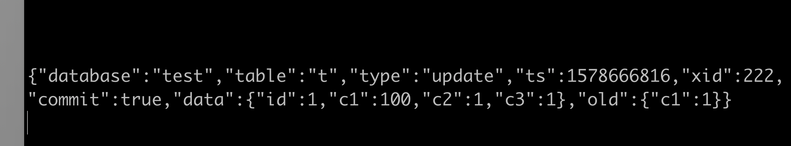

### 缘起

一开始我考虑的问题是MySQL与缓存(Redis等)的一致性问题，比如说电商平台，后台管理员修改商品价格，如果直接顺序操作商品价格表，然后更新cache，就可能发生cache更新失败，而db更新成功的问题。

该问题比较典型，其实没有太多比较好的办法，毕竟db与cache之间做不了“事务”。

有几个思路，操作db前，先尝试删除cache，删除失败的话就不让更新db。

### Maxwell

首先说明，这个不是解决db与cache一致性的，而是无侵入式消费mysql数据变更的一种轻量级解决方案。

##### 安装maxwell

```
brew install maxwell
```

##### 配置MySQL

```
[mysqld]

server_id=1

log-bin=master

binlog_format=row
```

##### 新建maxwell读取binlog的账号

```sql
mysql> GRANT ALL  on *.* to 'maxwell'@'%' identified by 'maxwell' ;

mysql> GRANT SELECT, REPLICATION CLIENT, REPLICATION SLAVE on *.* to 'maxwell'@'%';

mysql> flush privaleges;
```

##### 启动maxwell

```shell
./maxwell --user='maxwell' --password='maxwell' --host='127.0.0.1' --port=23305 --producer=stdout
```

##### 运行MySQL更新语句

```sql
update t set c1=100 where id=1;
```

##### 查看消费情况



### 总结

实际生产可用kafka消息队列的producer，maxwell支持的producer有：kafka，redis，rabbitmq……

这样不需要与应用程序耦合，是个不错的无侵入式解决方案，B站缓存更新就是使用的这种方式。

```2020-01-10```

