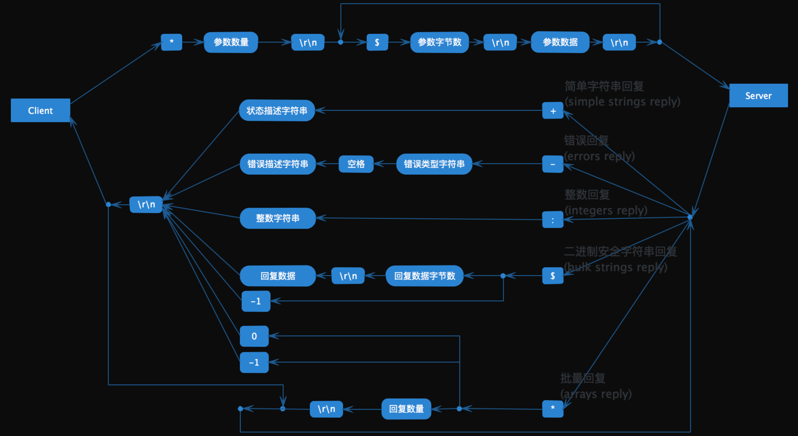
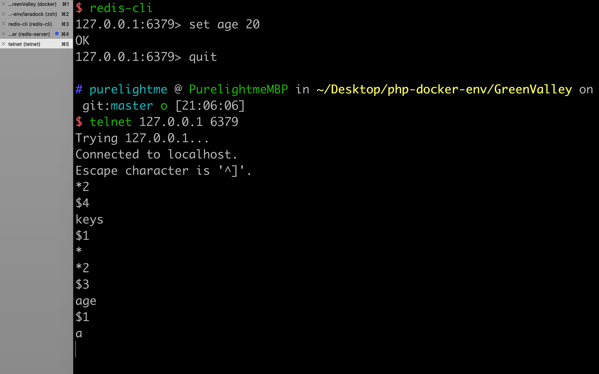

### Redis通信协议+php(socket扩展)写客户端

##### Redis协议

Redis客户端和服务端之间使用一种名为RESP(REdis Serialization Protocol)的二进制安全文本协议进行通信。RESP设计的十分精巧，下面是一张完备的协议描述图：



##### 举例说明

用SET命令来举例说明RESP协议的格式。

```bash
redis> SET age 20
"OK"
```

实际发送的请求数据：

```bash
*3\r\n$3\r\nSET\r\n$3\r\nage\r\n$2\r\n20\r\n
```

实际收到的响应数据：

```undefined
+OK\r\n
```

##### 下面用php写客户端

```php
<?php

$socket = socket_create(AF_INET, SOCK_STREAM, SOL_TCP);

$con = socket_connect($socket, '127.0.0.1', '6379');

var_dump($con);

$msg = "*2\r\n$4\r\nkeys\r\n$1\r\n*\r\n\r\n";

$num = 0;
$length = strlen($msg);
do {
    $buffer = substr($msg, $num);
    $ret = @socket_write($socket, $buffer);
    $num += $ret;
} while ($num < $length);

$ret = '';
do {
    $buffer = @socket_read($socket, 1024, PHP_BINARY_READ);
    $ret .= $buffer;
} while (strlen($buffer) == 1024);

socket_close($socket);

var_dump($ret);
```

仅测试了keys *命令的情况，实际使用过程中需要封装更多的命令，还是使用轮子比较方便，不过了解原理还是有帮助~

##### Telnet测试



```2020-03-26```

