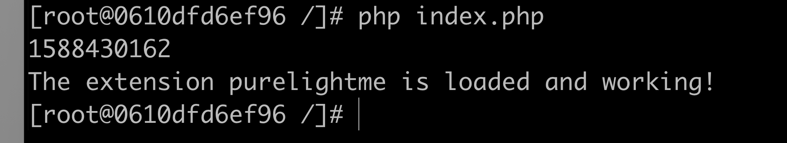

## 本章内容

php扩展开发入门，开发环境搭建，使用c语言实现一个php now()函数，环境打包到dockerhub。

### 开发环境搭建

1. 基于centos的docker镜像，在容器里面源码编译php7.2，使用最简参数安装方式，大概过程：

```
docker run -it --name php-ext-dev centos bash
cd /usr/local/src
yum install -y wget
wget https://www.php.net/distributions/php-7.4.5.tar.gz
tar -xvzf php-7.4.5.tar.gz
cd php-7.4.5
yum install -y gcc automake autoconf libtool make
./configure --prefix=/usr/local/php
make && make install
上面过程期间会提示libxml和sqlite的报错，安装以下包即可：
yum install -y libxml2-devel sqlite-devel
```

2. 使用ext_skel工具生成php扩展基本骨架

```
cd /usr/local/src/php-7.4.5/ext
php ext_skel.php --help
php ext_skel.php --ext purelightme
cd purelightme
```

### 扩展代码编写

```
vi purelightme.c
```

其实这个里面已经帮我们写了两个函数purelightme_test1和purelightme_test2，主要是打印扩展成功加载的信息，我再加一个函数now吧，返回时间戳。

```
#include<time.h>
...
PHP_FUNCTION(now)
{
	time_t t;
	t = time(NULL);
	RETURN_LONG(t);
}
...
static const zend_function_entry purelightme_functions[] = {
	PHP_FE(now,NULL)
	PHP_FE(purelightme_test1,		arginfo_purelightme_test1)
	PHP_FE(purelightme_test2,		arginfo_purelightme_test2)
	PHP_FE_END
};
...
```

### 安装扩展

```
cd purelightme
./configure --with-php-config=/usr/local/php/bin/php-config
make && make install
vi /usr/local/php/lib/php.ini
把extension=purelightme.so添加进去
```

#### 测试效果

```php
<?php
echo now();
echo "\n";
purelightme_test1();
```



### 环境打包推送Dockerhub

```dock
docker commit -a "scl" -m "php-ext develepment env" 0610dfd6ef96 php-ext:v1
docker tag php-ext:v1 purelightme/php-ext-env
docker push purelightme/php-ext-env
```

镜像地址：https://hub.docker.com/r/purelightme/php-ext-env

### 小结

过程还是比较顺利，因为只是一个hello world，没涉及php的太多东西，后面逐步学一下C如何跟PHP搭配起来，做一些有趣的事情，程序员就是要捣鼓~

参考资料：

鸟哥博客：https://www.laruence.com/2009/04/28/719.html

PHP官网资料：https://www.php.net/manual/zh/internals2.structure.files.php

```2020-05-02```

