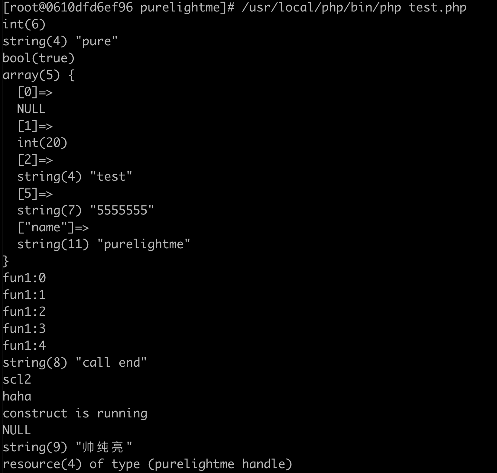

## 本章内容

php扩展里面如何接收函数参数，以及如何设定函数返回值。

#### 定义函数

zend api提供了一个快捷的宏 PHP_FUNCTION 可用于定义内部函数，上一节搭建环境中我们其实已经使用过了，上一节中，我们定义了一个 now 函数，用于获取当前时间戳。

```
#include<time.h>
...
PHP_FUNCTION(now)
{
	time_t t;
	t = time(NULL);
	RETURN_LONG(t);
}
...
static const zend_function_entry purelightme_functions[] = {
	PHP_FE(now,NULL)
	PHP_FE(purelightme_test1,		arginfo_purelightme_test1)
	PHP_FE(purelightme_test2,		arginfo_purelightme_test2)
	PHP_FE_END
};
...
```

然后通过 PHP_FE 宏将我们定义的C函数加入到扩展函数的数组中，最后，在purelightme_module_entry里面传递purelightme_functions，这样扩展会自动帮我们把C函数注册到php函数，也就是EG(function_tables)符号表，php调用的函数都会从符号表里面找。

#### 接收参数

php src  Zend/zend_API.h 里面定了一个获取函数参数的宏：

```
ZEND_API int zend_parse_parameters(int num_args,const char *type_spec,...)
```

- num_args，函数调用时实际传递的参数个数，通过 ZEND_NUM_ARGS() 获取即可，一般为了兼容线程安全，后面跟上 TSRMLS_CC 。
- type_spec，参数解析规则，是一个字符串，用于标志解析参数的类型，比如”la“标识第一个参数为整形，第二个参数为数组，按照这个规则解析到指定变量。
- ... 后面是传出参数，用于接收解析好的变量，个数不确定，这个值需要配合 type_spec 使用。

这里有一个表：

| 参数 |             代表的类型             |
| :--: | :--------------------------------: |
|  b   |              Boolean               |
|  l   |              Integer               |
|  d   |               Double               |
|  s   |               string               |
|  r   |              Resource              |
|  a   |               Array                |
|  o   |          Object Instance           |
|  O   | Object Intance Of a specified type |
|  z   |                zval                |
|  Z   |       zval** 指定类型的zval        |

前提是，你得知道php里面的所有变量都是 zval 类型，所以 z 可以接收任意类型的参数。

当然，php7以后，新增了Z_PARAM_***系列的宏接受参数，暂不讨论。

#### 返回值

我们之前定义函数时，使用的 PHP_FUNCTION 宏展开后，便是：

```
void zif_my_func(zend_execute_data *execute_data,zval *return_value)
```

execute_data 里面包含了函数入参信息，上面解析参数的宏实际就是解析这个里面的信息；return_value 就是返回值的指针，在 C 函数里面我们可以直接对这个指针赋值，就相当于返回了值，但是这样比较麻烦，容易出错，所以 ZEND 提供了很多针对特定类型的返回值场景的宏：

|       宏        | 返回类型 |
| :-------------: | :------: |
| RETURN_BOOL(b)  | Boolean  |
|  RETURN_TRUE()  |   TRUE   |
| RETURN_FALSE()  |  FALSE   |
|  RETURN_NULL()  |   NULL   |
|  RETURN_LONG()  | INTEGER  |
| RETURN_DOUBLE() |  FLOAT   |
|  RETURN_STR()   |  STRING  |
| RETURN_STRING() |  STRING  |
|  RETURN_RES()   | RESOURCE |
|  RETURN_ARR()   |  ARRAY   |
|  RETURN_OBJ()   |  OBJECT  |
|  RETURN_ZVAL()  |   ZVAL   |

其中，string类型的返回值方式其实还存在很多相似的宏，功能上也有差别，但基础的，掌握RETURN_STR(),RETURN_STRING()就基本够用。

> 还有个函数调用的宏，call_user_function，相当于php里面的call_user_func。

#### 测试

purelightme.c：

```c
#ifdef HAVE_CONFIG_H
# include "config.h"
#endif

#include "php.h"
#include "ext/standard/info.h"
#include "php_purelightme.h"
#include<time.h>

/* For compatibility with older PHP versions */
#ifndef ZEND_PARSE_PARAMETERS_NONE
#define ZEND_PARSE_PARAMETERS_NONE() \
	ZEND_PARSE_PARAMETERS_START(0, 0) \
	ZEND_PARSE_PARAMETERS_END()
#endif

PHP_FUNCTION(now)
{
	time_t t;
	t = time(NULL);
	RETURN_LONG(t);
}

PHP_FUNCTION(get_long)
{
    long num;
    if(zend_parse_parameters(ZEND_NUM_ARGS() TSRMLS_CC,"l",&num) == FAILURE){
	php_printf("参数解析有误\n");
	RETURN_NULL();
    }
    RETURN_LONG(num);
}

PHP_FUNCTION(get_string)
{
    char* str;
    long str_len;
    if(zend_parse_parameters(ZEND_NUM_ARGS() TSRMLS_CC,"s",&str,&str_len)==FAILURE){
	php_printf("参数解析失败");
	RETURN_NULL();
}
    RETURN_STRING(str);
}

PHP_FUNCTION(get_bool)
{
    zend_bool b;
    if(zend_parse_parameters(ZEND_NUM_ARGS() TSRMLS_CC,"b",&b)==FAILURE){
        php_printf("参数解析失败");
        RETURN_NULL();
}
    RETURN_TRUE;
}

static void purelightme_fd_destroy(zend_resource *rsrc)
{
    free(rsrc->ptr);
}

PHP_FUNCTION(get_array)
{
    array_init(return_value);
    add_next_index_null(return_value);
    add_next_index_long(return_value,20);
    add_next_index_string(return_value,"test");
    add_index_string(return_value,5,"5555555");
    add_assoc_string(return_value,"name","purelightme");
}

PHP_FUNCTION(get_callback)
{
    zval *function_name;
    zval retval;
    if (zend_parse_parameters(ZEND_NUM_ARGS() TSRMLS_CC, "z", &function_name) == FAILURE) {
        return;
    }
    if (Z_TYPE_P(function_name) != IS_STRING) {
        php_printf("Function require string argumnets!");
        return;
    }
    //TSRMLS_FETCH();
    if (call_user_function_ex(EG(function_table), NULL, function_name, &retval, 0, NULL, 0, NULL TSRMLS_CC) != SUCCESS) {
        php_printf("Function call failed!");
        return;
    }

    *return_value = retval;
    zval_copy_ctor(return_value);
    zval_ptr_dtor(&retval);

}

#include "php_ini.h"
PHP_INI_BEGIN()
    STD_PHP_INI_ENTRY("purelightme.greeting", "Hello World", PHP_INI_ALL,OnUpdateString,global_greeting, zend_purelightme_globals, purelightme_globals)
PHP_INI_END()

PHP_FUNCTION(hello)
{
    char *greeting = INI_STR("purelightme.greeting");
    php_printf("%s\n", greeting);
}

zend_class_entry *purelightme_ce;
ZEND_BEGIN_ARG_INFO_EX(arginfo_purelightme_who, 0, 0, 1)
                ZEND_ARG_INFO(0, love)
ZEND_END_ARG_INFO()
ZEND_BEGIN_ARG_INFO(arginfo_return__void, 0)
ZEND_END_ARG_INFO()

PHP_METHOD(Purelightme, who)
{
    char *love;
    size_t love_len;

#ifndef FAST_ZPP
    if (zend_parse_method_parameters(ZEND_NUM_ARGS(), getThis(), "s",&love, &love_len) == FAILURE) {
        return;
    }
#else
    ZEND_PARSE_PARAMETERS_START(1,1)
            Z_PARAM_STRING(love,love_len)
    ZEND_PARSE_PARAMETERS_END();
#endif
    zend_update_property_string(purelightme_ce,  getThis(), "name", sizeof("name") - 1, love);
}

PHP_METHOD(Purelightme,toString)
{
    php_printf("can not support");
}

PHP_METHOD(Purelightme,__construct){
    php_printf("construct is running\n");
}

const zend_function_entry purelightme_methods[] = {
        ZEND_ME(Purelightme, who, arginfo_purelightme_who, ZEND_ACC_PUBLIC )
        ZEND_ME(Purelightme,toString,arginfo_return__void,ZEND_ACC_PUBLIC | ZEND_ACC_STATIC )
        ZEND_ME(Purelightme,__construct,arginfo_return__void, ZEND_ACC_PUBLIC)
        {NULL, NULL, NULL}
};


static int le_purelightme;
#define le_purelightme_name "purelightme handle"

typedef struct {
    zend_string *filename;
    FILE *fp;
} my_file_t;

PHP_FUNCTION(ffopen)
{
    FILE *p;
    p = fopen("/tmp/1.log","w+");
    if(p == NULL){
        php_printf("文件打开失败");
	RETURN_NULL();
    }else{
	my_file_t *res;
	res = emalloc(sizeof(my_file_t));
	res->filename = "/tmp/1.log";
	res->fp = p;
        RETURN_RES(zend_register_resource(res, le_purelightme));
    }
}

PHP_FUNCTION(ffwrite)
{
    my_file_t *fs;
    zval *res;
    char *data;
    int data_len;
    if (zend_parse_parameters(ZEND_NUM_ARGS() TSRMLS_CC, "rs",&res, &data, &data_len) == FAILURE ){
	RETURN_NULL();
    }
    fs = Z_RES_VAL_P(res);
    fputs(data,fs->fp);
    RETURN_TRUE;
}


PHP_RINIT_FUNCTION(purelightme)
{
#if defined(ZTS) && defined(COMPILE_DL_PURELIGHTME)
	ZEND_TSRMLS_CACHE_UPDATE();
#endif
	return SUCCESS;
}

PHP_MINIT_FUNCTION(purelightme)
{
    le_purelightme = zend_register_list_destructors_ex(purelightme_fd_destroy,NULL,le_purelightme_name,module_number);
REGISTER_INI_ENTRIES();
    zend_class_entry ce;
    INIT_CLASS_ENTRY(ce, "Purelightme", purelightme_methods);
    purelightme_ce = zend_register_internal_class_ex(&ce, NULL);
    zend_declare_property_null(purelightme_ce,"name", sizeof("name") - 1,ZEND_ACC_PUBLIC);
    return SUCCESS;
}

PHP_MINFO_FUNCTION(purelightme)
{
	php_info_print_table_start();
	php_info_print_table_header(2, "purelightme support", "enabled");
	php_info_print_table_header(3, "purelightme age", "26");
	php_info_print_table_end();
}

static const zend_function_entry purelightme_functions[] = {
	PHP_FE(now,NULL)
	PHP_FE(get_long,NULL)
	PHP_FE(get_string,NULL)
	PHP_FE(get_bool,NULL)
	PHP_FE(get_array,NULL)
	PHP_FE(get_callback,NULL)
	PHP_FE(hello,NULL)
	PHP_FE(ffopen,NULL)
	PHP_FE(ffwrite,NULL)
	PHP_FE_END
};

zend_module_entry purelightme_module_entry = {
	STANDARD_MODULE_HEADER,
	"purelightme",					/* Extension name */
	purelightme_functions,			/* zend_function_entry */
	PHP_MINIT(purelightme),						/* PHP_MINIT - Module initialization */
	NULL,							/* PHP_MSHUTDOWN - Module shutdown */
	PHP_RINIT(purelightme),			/* PHP_RINIT - Request initialization */
	NULL,							/* PHP_RSHUTDOWN - Request shutdown */
	PHP_MINFO(purelightme),			/* PHP_MINFO - Module info */
	PHP_PURELIGHTME_VERSION,		/* Version */
	STANDARD_MODULE_PROPERTIES
};

#ifdef COMPILE_DL_PURELIGHTME
# ifdef ZTS
ZEND_TSRMLS_CACHE_DEFINE()
# endif
ZEND_GET_MODULE(purelightme)
#endif
```

test.php:

```php
<?php

var_dump(get_long(6));
var_dump(get_string('pure'));
var_dump(get_bool(false));
var_dump(get_array());

function t(){
for ($i = 0; $i < 5; $i++) {
        echo 'fun1:'.$i."\n";
    }
    return 'call end';
}
var_dump(get_callback("t"));
hello();
ini_set("purelightme.greeting","haha");
hello();

$c = new Purelightme();
var_dump($c->name);
$c->who("purelightme");
var_dump($c->name);

$f = ffopen();
var_dump($f);
```



下一节，打算详细研究下 zval 以及相关的操作。

