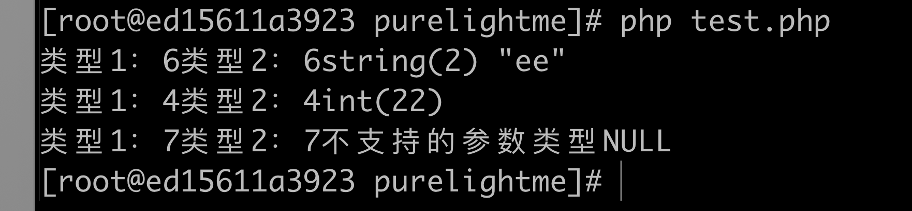

### 本章内容

本章主要包含php7的新版zval结构，以及一些基础的数据结构和数据类型转化，zval常用宏等。

#### 数据结构

上一节我们在研究 php 扩展如何接受函数参数以及如何返回值后，得出结论：要想全面掌握扩展开发，必须得从zval下手，开干。

> 我在三四年前研究过 php5.6 的 zval ，那时候 C 基础还属于完全小白的阶段，看得一知半解，现在 php7 都出来这么久了，就懒得再去看老版本的了。

新版 zval （php几乎所有数据类型都是以此为基础）：

```c
//这个在 src/Zend/zend_type.h文件
struct _zval_struct {
	zend_value        value;			/* value */
	union {
		struct {
			ZEND_ENDIAN_LOHI_3(
				zend_uchar    type,			/* active type */
				zend_uchar    type_flags,
				union {
					uint16_t  extra;        /* not further specified */
				} u)
		} v;
		uint32_t type_info;
	} u1;
	union {
		uint32_t     next;                 /* hash collision chain */
		uint32_t     cache_slot;           /* cache slot (for RECV_INIT) */
		uint32_t     opline_num;           /* opline number (for FAST_CALL) */
		uint32_t     lineno;               /* line number (for ast nodes) */
		uint32_t     num_args;             /* arguments number for EX(This) */
		uint32_t     fe_pos;               /* foreach position */
		uint32_t     fe_iter_idx;          /* foreach iterator index */
		uint32_t     access_flags;         /* class constant access flags */
		uint32_t     property_guard;       /* single property guard */
		uint32_t     constant_flags;       /* constant flags */
		uint32_t     extra;                /* not further specified */
	} u2;
};
```

zend_value 自然是这里面最重要的成员了，变量的值在里面。u1 看名字就知道大概是类型信息(type_info)，u2其实是一些辅助信息。

整个结构体是一个union，其大小是里面成员size多大的那个size，由于需要字节对齐的原因，这个zval占用16字节，比以前节省了不少空间，另外 is_ref 和 ref_count 都不直接在 zval 维护了，转移到了 zend_value 里面。

so，看看 zend_value 吧：

```c
// from src/Zend/zend_types.h
typedef union _zend_value {
	zend_long         lval;				/* long value */
	double            dval;				/* double value */
	zend_refcounted  *counted;
	zend_string      *str;
	zend_array       *arr;
	zend_object      *obj;
	zend_resource    *res;
	zend_reference   *ref;
	zend_ast_ref     *ast;
	zval             *zv;
	void             *ptr;
	zend_class_entry *ce;
	zend_function    *func;
	struct {
		uint32_t w1;
		uint32_t w2;
	} ww;
} zend_value;
```

字段名称见名知意，整形和浮点型直接用标量存了，其他的复杂类型各自有对应的结构体，乍一看，怎么没有bool，其实bool，null等都不需要值，php内核里面直接用类型标志了。

zend_types.h 里面定义了很多类型：

```c
/* regular data types */
#define IS_UNDEF					0
#define IS_NULL						1
#define IS_FALSE					2
#define IS_TRUE						3
#define IS_LONG						4
#define IS_DOUBLE					5
#define IS_STRING					6
#define IS_ARRAY					7
#define IS_OBJECT					8
#define IS_RESOURCE					9
#define IS_REFERENCE				10

/* constant expressions */
#define IS_CONSTANT_AST				11

/* internal types */
#define IS_INDIRECT             	13
#define IS_PTR						14
#define IS_ALIAS_PTR				15
#define _IS_ERROR					15

/* fake types used only for type hinting (Z_TYPE(zv) can not use them) */
#define _IS_BOOL					16
#define IS_CALLABLE					17
#define IS_ITERABLE					18
#define IS_VOID						19
#define _IS_NUMBER					20
```

zend_string，zend_array，zend_object……我就不一一列举了，直接翻源码 zend_types.h 里面看。

#### 常用宏

关于 zval 的常用宏基本也在 zend_types.h 里面，比如第一个：Z_TYPE(z)，用于获取 zval 的类型；Z_LVAL(z)，用于获取 zval 的整型值；类似的还有 Z_STRVAL(z)，Z_ARRVAL(z)等等。

跟上面那种风格相似，但作用完全不同的是：ZVAL_LONG(z,l)，将整形值赋给 zval，还有 ZVAL_DOUBLE，ZVAL_ARR……

其余还有很多有用的，就不列举了。

在开发扩展过程中尽量用这些宏去操作数据，而不是直接操作 zval 结构体。

### 类型转换

关于数据类型转换，文件 Zend/zend_operators.c 里面有详细的任意每种类型转换成其他类型的转换方式。举个例子：

任意类型转换成整形：

```c
ZEND_API void ZEND_FASTCALL convert_to_long(zval *op) /* {{{ */
{
	if (Z_TYPE_P(op) != IS_LONG) {
		convert_to_long_base(op, 10);
	}
}
//...
ZEND_API void ZEND_FASTCALL convert_to_long_base(zval *op, int base) /* {{{ */
{
	zend_long tmp;

try_again:
	switch (Z_TYPE_P(op)) {
		case IS_NULL:
		case IS_FALSE:
			ZVAL_LONG(op, 0);
			break;
		case IS_TRUE:
			ZVAL_LONG(op, 1);
			break;
		case IS_RESOURCE:
			tmp = Z_RES_HANDLE_P(op);
			zval_ptr_dtor(op);
			ZVAL_LONG(op, tmp);
			break;
		case IS_LONG:
			break;
		case IS_DOUBLE:
			ZVAL_LONG(op, zend_dval_to_lval(Z_DVAL_P(op)));
			break;
		case IS_STRING:
			{
				zend_string *str = Z_STR_P(op);
				if (base == 10) {
					ZVAL_LONG(op, zval_get_long(op));
				} else {
					ZVAL_LONG(op, ZEND_STRTOL(ZSTR_VAL(str), NULL, base));
				}
				zend_string_release_ex(str, 0);
			}
			break;
		case IS_ARRAY:
			tmp = (zend_hash_num_elements(Z_ARRVAL_P(op))?1:0);
			zval_ptr_dtor(op);
			ZVAL_LONG(op, tmp);
			break;
		case IS_OBJECT:
			{
				zval dst;

				convert_object_to_type(op, &dst, IS_LONG, convert_to_long);
				zval_ptr_dtor(op);

				if (Z_TYPE(dst) == IS_LONG) {
					ZVAL_LONG(op, Z_LVAL(dst));
				} else {
					ZVAL_LONG(op, 1);
				}
				return;
			}
		case IS_REFERENCE:
			zend_unwrap_reference(op);
			goto try_again;
		EMPTY_SWITCH_DEFAULT_CASE()
	}
}
```

可以很清晰看到，null,false直接转成0，true转成1，其他类型也有具体的转换方式，如果不清楚对php中某种写法结果不确定，可以来源码找一下对应的实现。

#### 补充

其实看了 zval 的结构和这些宏之后，就可以直接用php7新出的接收参数的方式接收参数了，来写个简单的demo吧：

```c
//file: structure.c
//
// Created by purelightme on 2020/8/20.
//

#include <zend_types.h>

PHP_FUNCTION (ptest) {
    zval *para;
    ZEND_PARSE_PARAMETERS_START(1,1)
        Z_PARAM_ZVAL(para)
    ZEND_PARSE_PARAMETERS_END();
    php_printf("类型1：%d",para->u1.type_info);
    php_printf("类型2：%d",Z_TYPE_P(para));
    if (para->u1.type_info == 4){
        RETURN_LONG(para->value.lval);
    }
    if (para->u1.type_info == 6){
        RETURN_STR(para->value.str);
    }
    php_printf("不支持的参数类型");
    RETURN_NULL();
}
```

```c
// file: purelightme.c
#include "structure.c"
//...
static const zend_function_entry purelightme_functions[] = {
	PHP_FE(purelightme_test1,		arginfo_purelightme_test1)
	PHP_FE(purelightme_test2,		arginfo_purelightme_test2)
	PHP_FE(now,NULL)
	PHP_FE(ptest,NULL)
	PHP_FE_END
};  
```

#### 测试一下

重新编译扩展，记得 make clean。

```php
<?php
$p = ptest('ee');
var_dump($p);
$r = ptest(22);
var_dump($r);
$t = ptest([]);
var_dump($t);
```



ps：偏重于记录学习成果，过程还是挺繁琐的~总之，源码多看


```2020-08-20```

