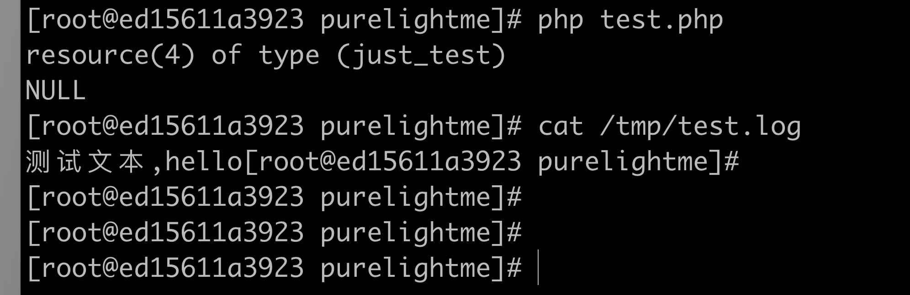

### 本章内容

本章主要介绍 php7 资源类型的使用，最终封装一个自己的文件操作函数。

#### 什么是资源

resource 是 php 的一种特殊类型，经常用于标志各种抽象的东西，比如文件句柄，流……

#### 资源是怎么实现的？

资源在 php 中用 zend_resource 标识，其结构体如下：

```C
// Zend/zend_types.h
struct _zend_resource {
	zend_refcounted_h gc;
	int               handle; // TODO: may be removed ???
	int               type;
	void             *ptr;
};
```

其中 type 代表资源类型，区分不同的资源。ptr 指针是资源的实际类型，这个是最重要的，围绕资源的几乎所有操作都围绕这个字段展开。

> 关于 zend_resource 的操作，都在 Zend/zend_list.c 中，包括资源的注册，资源的获取。

##### 资源注册

要使用资源，必须先注册资源。注册资源使用 ```ZEND_API int zend_register_list_destructors_ex(rsrc_dtor_func_t ld, rsrc_dtor_func_t pld, const char *type_name, int module_number)``` 。第1个参数很重要，是资源的销毁函数，因为 php 语言属于高级语言，用户很可能在使用完资源后忘记释放，比如通过 fopen 打开的文件描述符，在 C 中，如果不调用 fclose 可能会造成严重的后果，所以在 php 中我们必须考虑这点，通过注册资源的时候传递销毁函数，php 会在脚本结束自动帮我们释放资源；第2个参数一般传 NULL 就好；第3个就是资源类型名；第4个是模块的标志。

通常，我们需要在 php 的 MINIT 阶段调用资源注册函数。

##### 生成资源

生成资源使用 ```ZEND_API zend_resource* zend_register_resource(void *rsrc_pointer, int rsrc_type)``` ，第1个参数就是资源的ptr，实际使用到的内容，比如一般把 FILE *fp 放在这里；第2个参数是资源类型。

##### 解析资源

fopen 生成资源后，用户再调 fwrite 的时候传入 $ch ，我们需要从 ch 里面解析出 FILE *fp ；解析资源使用的函数是 ```ZEND_API void *zend_fetch_resource(zend_resource *res, const char *resource_type_name, int resource_type)``` ，参数名称也都是字解释的。

#### Demo

接下来，我们自己实现两个函数 pure_open(filename,mode)，pure_write(ch,content)。

```c
// resource_demo.c
//
// Created by purelightme on 2020/8/25.
//

#include <stdio.h>
#include "zend_types.h"

static int le_pf;
#define le_pf_name "just_test"

// 使用 struct 存储资源实际内容，方便扩展
typedef struct pfile_ch {
    FILE *p;
} pfilech;

static void file_dtor(zend_resource *rsrc)
{
    pfilech *pch = (pfilech *) rsrc->ptr;
    fclose(pch->p);
}

PHP_FUNCTION(pure_open)
{
    FILE *fp;
    pfilech *pch;
    char *path;
    long path_len;
    char *mode;
    long mode_len;
    ZEND_PARSE_PARAMETERS_START(2,2)
        Z_PARAM_STRING(path,path_len)
        Z_PARAM_STRING(mode,mode_len)
    ZEND_PARSE_PARAMETERS_END();
    fp = fopen(path,mode);
    if (fp == NULL){
        RETURN_NULL();
    }
    pch = ecalloc(1,sizeof(pfilech));
    pch->p = fp;
    ZVAL_RES(return_value,zend_register_resource(pch,le_pf));
}

PHP_FUNCTION(pure_write)
{
    zval *res;
    pfilech *pch;
    char *content;
    long content_len;
    ZEND_PARSE_PARAMETERS_START(2,2)
        Z_PARAM_RESOURCE(res)
        Z_PARAM_STRING(content,content_len)
    ZEND_PARSE_PARAMETERS_END();
    pch = (pfilech *)zend_fetch_resource(Z_RES_P(res),le_pf_name,le_pf);
    if (pch == NULL){
        php_printf("解析资源失败");
        RETURN_NULL();
    }
    fputs(content,pch->p);
    RETURN_NULL();
}
```

```c
// purelightme.c
#include "resource_demo.c"
//...
PHP_MINIT_FUNCTION(purelightme)
{
    REGISTER_INI_ENTRIES();

    le_pf = zend_register_list_destructors_ex(file_dtor,NULL,le_pf_name,module_number);
    return SUCCESS;
}
```

#### 重新编译扩展

- make clean
- make && make install

### php测试

```php
<?php
$fp = pure_open("/tmp/test.log","aw+");
var_dump($fp);
$res = pure_write($fp,"测试文本,hello");
var_dump($res);
```



### 小结

有了资源类型，php 可以很方便的做很多事情，只要是进程共享的资源，都可以用资源类型实现。比如我们可以用 epoll 实现 io多路复用，直接以扩展的形式结合到 php 里面，进而实现高效的网络服务。还有很多无限可能……


```2020-08-25```

