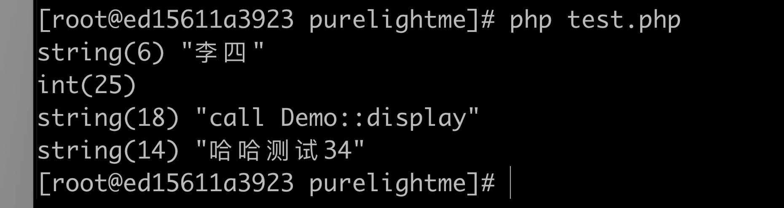

### 本章内容

本章主要介绍如何从扩展层面创建内部类，添加属性和方法。

### 注册类

在 php 源码中，类是用 zend_class_entry 结构体标志的：

```c
struct _zend_class_entry {
	char type;
	zend_string *name;
	/* class_entry or string depending on ZEND_ACC_LINKED */
	union {
		zend_class_entry *parent;
		zend_string *parent_name;
	};
	int refcount;
	uint32_t ce_flags;

	int default_properties_count;
	int default_static_members_count;
	zval *default_properties_table;
	zval *default_static_members_table;
	ZEND_MAP_PTR_DEF(zval *, static_members_table);
	HashTable function_table;
	HashTable properties_info;
	HashTable constants_table;

	struct _zend_property_info **properties_info_table;

	zend_function *constructor;
	zend_function *destructor;
	zend_function *clone;
	zend_function *__get;
	zend_function *__set;
	zend_function *__unset;
	zend_function *__isset;
	zend_function *__call;
	zend_function *__callstatic;
	zend_function *__tostring;
	zend_function *__debugInfo;
	zend_function *serialize_func;
	zend_function *unserialize_func;

	/* allocated only if class implements Iterator or IteratorAggregate interface */
	zend_class_iterator_funcs *iterator_funcs_ptr;

	/* handlers */
	union {
		zend_object* (*create_object)(zend_class_entry *class_type);
		int (*interface_gets_implemented)(zend_class_entry *iface, zend_class_entry *class_type); /* a class implements this interface */
	};
	zend_object_iterator *(*get_iterator)(zend_class_entry *ce, zval *object, int by_ref);
	zend_function *(*get_static_method)(zend_class_entry *ce, zend_string* method);

	/* serializer callbacks */
	int (*serialize)(zval *object, unsigned char **buffer, size_t *buf_len, zend_serialize_data *data);
	int (*unserialize)(zval *object, zend_class_entry *ce, const unsigned char *buf, size_t buf_len, zend_unserialize_data *data);

	uint32_t num_interfaces;
	uint32_t num_traits;

	/* class_entry or string(s) depending on ZEND_ACC_LINKED */
	union {
		zend_class_entry **interfaces;
		zend_class_name *interface_names;
	};

	zend_class_name *trait_names;
	zend_trait_alias **trait_aliases;
	zend_trait_precedence **trait_precedences;

	union {
		struct {
			zend_string *filename;
			uint32_t line_start;
			uint32_t line_end;
			zend_string *doc_comment;
		} user;
		struct {
			const struct _zend_function_entry *builtin_functions;
			struct _zend_module_entry *module;
		} internal;
	} info;
};
```

可以看到里面内容很多，因为 php 的面向对象知识真挺多的。里面字段基本是自解释的，name是类名称，parent 的 union 代表父类，function_table，properties_info，constants_table 为类的方法，属性，常量集合，类型都是 HashTable，另外还有一些 __construct 等魔术方法。

要注册类，使用 zend_register_internal_class_ex 函数生成上述结构体，使用 INIT_CLASS_ENTRY 宏注册类方法，使用 zend_declare_property_* 系列函数定义类属性，这一步骤放在 MINIT hook 里面。

### 小试牛刀

```c
// purelightme.c MINIT：
#include "class_demo.c";
//...
zend_class_entry ce;
INIT_CLASS_ENTRY(ce,"Demo",demo_methods);
demo_ce = zend_register_internal_class_ex(&ce,NULL);
zend_declare_property_null(demo_ce,"name", sizeof("name") - 1,ZEND_ACC_PUBLIC);
zend_declare_property_null(demo_ce,"age",sizeof("age") - 1,ZEND_ACC_PUBLIC);

zend_class_entry ce2;
INIT_CLASS_ENTRY(ce2,"Child",child_methods);
child_ce = zend_register_internal_class_ex(&ce2,demo_ce);
```

```c
//
// Created by purelightme on 2020/8/27.
//

#include <zend_interfaces.h>
#include "zend_types.h"

zend_class_entry *demo_ce;
zend_class_entry *child_ce;

PHP_METHOD (Demo, display) {
    RETURN_STRING("call Demo::display");
}

PHP_METHOD (Demo, setName) {
    zend_string *name;

    ZEND_PARSE_PARAMETERS_START(1, 1)
            Z_PARAM_STR(name)
    ZEND_PARSE_PARAMETERS_END();

    zend_update_property_string(demo_ce, getThis(), "name", sizeof("name") - 1, ZSTR_VAL(name));

    RETURN_TRUE;
}

const zend_function_entry demo_methods[] = {
        ZEND_ME(Demo, display, NULL, ZEND_ACC_PUBLIC)
        ZEND_ME(Demo, setName, NULL, ZEND_ACC_PUBLIC)
        {NULL, NULL, NULL}
};

PHP_METHOD(Child,getName)
{
    zval *attr;
    attr = zend_read_property(Z_OBJCE_P(getThis()),getThis(),"name", sizeof("name") - 1,0,NULL);
    if (Z_TYPE_P(attr) == IS_STRING){
        RETURN_STR(Z_STR_P(attr));
    } else{
        RETURN_NULL();
    }
}

const zend_function_entry child_methods[] = {
        ZEND_ME(Child, getName, NULL, ZEND_ACC_PUBLIC)
        {NULL, NULL, NULL}
};
```

定义了两个类，Demo 和 Child ，Demo 是 Child 的父类，Demo 有 name 和 age 两个属性和 setName 方法，setName 使用 zend_update_property_string 更新对象属性；Child 有 getName 方法，getName 使用 zend_read_property 获取对象属性；这两个操作对象属性的函数在源码 Zend/zend_API.c 里面，该文件还定义了许多操作对象属性的函数。

### 测试一下

```php
$demo = new Demo();
$demo->name = '张三';
$demo->age = 25;
$demo->setName('李四');
var_dump($demo->name);
var_dump($demo->age);
var_dump($demo->display());
$child = new Child();
$child->setName('哈哈测试34');
var_dump($child->getName());
```



### 总结

目前了解的这些已经可以用于基础的类封装了，其余的特性还没接触到，等后面需要再封装，而且我们可以用 php 代码去实现，所以我觉得在 c 层面了解这些基础的类封装已经够用了。不过可以研究下源码，有利于掌握 php 的面向对象一些知识，比如静态属性，类常量等等。


```2020-08-30```


