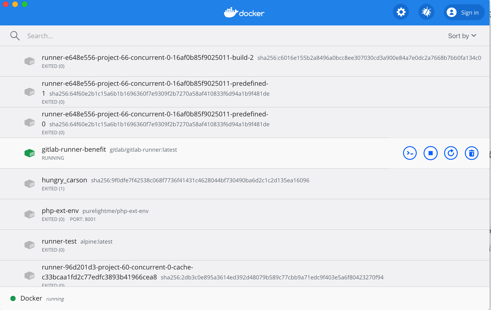

### 缘起

做 PHP 开发已经四五年了，待过很多公司。几乎都谈不上 DevOps ，有用 Gitlab 的，也有用 Gogs 的，之前北京待过的公司 Gitlab 几乎是用来做 Git 仓库的；Gogs 就更不用谈了，只是个 Git 服务而已。

至于代码部署，有用开源的 Walle 的，也有用 cli 下的 Deployer 的，都还比较不错。

Gitlab 作为老牌开源 DevOps 工具，应该还有更多功能待我们去使用，早已听闻 Gitlab CI，这不就来研究研究。

#### 简介

> GitLab offers a continuous integration service. If you
> add a .gitlab-ci.yml file to the root directory of your repository,
> and configure your GitLab project to use a Runner, then each commit or
> push, triggers your CI pipeline.

从官网 quick start 看到这句话，基本就知道怎么做了。在项目根目录添加 .gitlab-ci.yml 文件，另外再配置个 Runner 就可以跑起来了。

#### Runner

参考官网文档，发现支持很多种 Runner，毫无疑问选择 [Docekr](https://docs.gitlab.com/runner/register/#docker)。

直接运行：

```docker run --rm -it -v /Users/Shared/gitlab-runner/config:/etc/gitlab-runner gitlab/gitlab-runner register```

期间，会询问 GitLab instance URL 和 Token 等一些信息，这些可以在 Gitlab 仓库 CI/CD 设置那里找到，正确填写之后这个 Runner 就与这个项目关联起来了，这个是 ```Specific Runners```，还有一种是 ```Shared Runners```共享的，全局可以用，跨项目的。



现在，这个 docker 容器就运行起来了，该容器会与 Gitlab 通信，具体怎么通信的，我还没打算去研究，文档上说只要该容器能访问 Gitlab 就行了，所以我猜测该容器可能是轮询，又或者是长连接，与 Gitlab 保持联系，那边检测到有代码更新，就推送给容器，容器按 .gitlab-ci.yml 文件指定的方式运行指定任务。

#### 测试

.gitlab-ci.yml：

```shell
image: composer:2.0

before_script:
  - composer config -g repo.packagist composer https://mirrors.aliyun.com/composer/
  - composer install --dev --prefer-dist -vvv

purelight:
  script:
    - ./vendor/bin/phpunit tests/
```

这个对于 php 比较通用，直接用 composer:2.0 这个镜像去拉去代码，下载依赖，执行测试。

这样，每次 ```git push``` 都会触发自动集成。具体流程是在我本机新建个容器，用指定的镜像，拷贝整个项目代码到指定目录，然后运行 ```.gitlab-ci.yml``` 中的任务，如果成功，会在 commit 前面打上一个绿色的勾。

### 展望

Gitlab 远不止这些，逐步摸索吧，这里基本只用到了 CI 去做一个单元测试，另外还有自动部署，后面再研究部署相关的。

其实，单元测试做的越好，CI 的意义越重大。php 单元测试几乎都用 phpunit ，所以更多的把基础打牢，把代码写好，才有后面的 CI，CD等等。

Docker 乃大势所趋，K8S 成熟已久，加油！


```2020-09-17```

