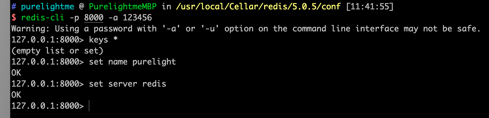

### 缘由

鉴于之前面试某大厂挂掉了，被面试官问了一些 Redis 和 MySQL 的高可用相关的东西，之前自己接触的项目没有用到过，也没有去深入研究，今日便来实践一番。

Redis 集群目前主要有3种方案，分别是：主从复制方案，sentinel哨兵模式，redis-cluster模式。

#### 主从复制方案

###### 理论基础

Redis 的主从复制与 MySQL 的 binlog 复制有些类似。Redis 本身有 rdb 和 aof 两种持久化方案，这是其能实现复制功能的基础。

我们可以通过`slaveof <host> <port>`命令，或者通过配置`slaveof`选项，来使当前的服务器（slave）复制指定服务器（master）的内容，被复制的服务器称为主服务器（master），对主服务器进行复制操作的为从服务器（slave）。

主服务器master可以进行读写操作，当主服务器的数据发生变化，master会发出命令流来保持对salve的更新，而从服务器slave通常是只读的（可以通过`slave-read-only`指定），在主从复制模式下，即便master宕机了，slave是不能变为主服务器进行写操作的。

主从复制的过程大概是：

1. 当slave启动后会向master发送`SYNC`命令，master节点收到从数据库的命令后通过`bgsave`保存快照（**「RDB持久化」**），并且期间的执行的些命令会被缓存起来。
2. 然后master会将保存的快照发送给slave，并且继续缓存期间的写命令。
3. slave收到主数据库发送过来的快照就会加载到自己的数据库中。
4. 最后master将缓存的命令同步给slave，slave收到命令后执行一遍，这样master与slave数据就保持一致了。

###### 实践

环境：Mac，homebrew，redis-5.0.5

1. 先在 ```/usr/local/Cellar/redis/5.0.5/conf```目录下建3个文件夹，分别放置不同实例的配置和数据，日志等文件。

2. 先创建master的配置文件：

   8000/redis.conf：（[redis配置文件详解](https://www.jianshu.com/p/658230585a8a)）

   ```
   bind 0.0.0.0
   protected-mode no
   port 8000
   timeout 30
   daemonize yes
   pidfile /usr/local/Cellar/redis/5.0.5/conf/8000/redis.pid
   logfile /usr/local/Cellar/redis/5.0.5/conf/8000/redis.log
   save 900 1
   save 300 10
   save 60 10000
   rdbcompression yes
   dbfilename dump.rdb
   dir /usr/local/Cellar/redis/5.0.5/conf/8000
   appendonly yes
   appendfsync everysec
   requirepass 123456
   ```

3. 再复制一份到slave

   ```shell
   cp 8000/redis.conf 8001/
   ```

   修改端口号和相关路径，然后在末尾加上salve的配置：

   ```
   slaveof 127.0.0.1 8000
   masterauth 123456
   slave-serve-stale-data no
   ```

4. 依次启动master和slave

   ```shell
   redis-server 8000/redis.conf
   redis-server 8001/redis.conf
   ```

5. 使用客户端测试一下：

master：

slave：


可以看到，数据同步过去了，我们试着将master进程kill掉，再看看slave能否继续提供服务：


不能继续提供服务，这个是通过配置参数：**slave-serve-stale-data**控制的，默认是yes，具体设置还得看实际业务需求。

另外，可以看到每个配置文件夹下有 appendonly.aof 文件，我们看看该文件的内容：


内容就是设计数据更新的语句的redis协议格式的内容，redis协议在[之前的文章](https://www.jianshu.com/p/63dc822687fe)说过了~

###### 优缺点

可见，主从复制方案支持读写分离，支持读扩展。但只有一个master，存在写的单点问题，而且不支持故障自动恢复，每个节点都是全部数据，不可扩容。

#### Sentinel 哨兵模式

###### 理论基础

哨兵模式是主从的升级版，因为主从的出现故障后，不会自动恢复，需要人为干预，这就很蛋疼啊。

在主从的基础上，实现哨兵模式就是为了监控主从的运行状况，对主从的健壮进行监控，就好像哨兵一样，只要有异常就发出警告，对异常状况进行处理。

哨兵模式的原理细节可以讲很久，所以暂不列出，可以查阅其他文档~

###### 实践

因为主从复制是 Sentinel 哨兵模式的基础，所以我们需要在上面的实践的基础上进行，现在再加一个salve，8001。然后开始

- 新建三个文件夹，9000，9001，9002，里面放sentinel.conf文件，模板：

  ```
  daemonize yes
  sentinel monitor mymaster 127.0.0.1 6379 1
  sentinel auth-pass mymaster 123456
  port 9000
  sentinel down-after-milliseconds mymaster 3000
  sentinel parallel-syncs mymaster 2
  sentinel failover-timeout mymaster 100000
  ```

- 依次启动3个sentinel：

  ```
  ../bin/redis-server 9000/sentinel.conf --sentinel
  ../bin/redis-server 9001/sentinel.conf --sentinel
  ../bin/redis-server 9002/sentinel.conf --sentinel
  ```

  

- 使用客户端测试一下：

  

  

  在master写入，成功同步到了slave；slave不能写，只能读。期间我有试过kill掉master的进程，sentinel成功切换了master。

  > 期间遇到一个坑，8000作为第一个master，之前是没有slave相关配置信息的，后面kill掉8000，又重启，发现其变成了slave，但是一直连接不上slave，查看日志之后发现是因为缺少 masterauth 配置。

  另外观察到sentinel会实时更新我们的配置文件：

  

  

###### 优缺点

可以看到，sentinel 明显的优势是可以自动进行故障切换。但是切换master后，我们无法得知新的master的地址，除非登录一台，执行```info replication```这样显得有点麻烦。

缺点也跟主从复制方案差不多，单台实例拥有全部数据，无法从存储层面扩容。

#### Redis-Cluster 模式

###### 理论基础

[深入理解Redis Cluster](https://www.cnblogs.com/ivictor/p/9762394.html)

###### 实践

- 新建7001-7007共7个文件夹，每个文件夹下一个redis.conf文件：

  ```
  port 7000(其他文件相应更改)
  cluster-enabled yes
  cluster-config-file /usr/local/Cellar/redis/5.0.5/conf/7000/nodes.conf
  cluster-node-timeout 5000
  appendonly yes
  daemonize yes
  masterauth 123456
  requirepass 123456
  ```

- 依次启动server

  ```shell
  ../bin/redis-server 7000/redis.conf
  ...
  ../bin/redis-server 7006/redis.conf
  暂时先留一个待集群建立起来之后加入
  ```

- 创建集群

  ```
  redis-cli --cluster create --cluster-replicas 1 127.0.0.1:7000 127.0.0.1:7001 127.0.0.1:7002  127.0.0.1:7003  127.0.0.1:7004  127.0.0.1:7005 127.0.0.1:7006  -a 123456
  ```

  输入yes确认之后，集群就建立成功了：

  

- 使用客户端测试一下：

  

  redis-cli 需要使用 -c 进入 redis-cluster 模式，可以看到，有一个 Redirect 的过程，key 最后hash到哪个实例，就 Redirect 到那个实例去了，而且 keys * 的结果是不准确的，只是单个实例的结果，并不是整个集群的。

- 加入新节点：

  

  

###### 优缺点

Redis-cluster 是真正意义上的集群，数据分散在多个实例，不存在容量的问题。而且每个节点都可以读写，不存在写的压力。

### PHP使用

predis 完美支持以上3种模式。简单测试一下：

- 主从：

  

  

- sentinel ：(predis sentinel 老是报错，所以换了python来测试~)

  

  

- redis-cluster：

  

  

### 总结

有些东西虽然没有用到，但是不能不知道！


```2020-09-25```

