### 探索

很久之前折腾过 MySQL5.7 的主从复制，当时基于docker成功搭建起来了整个复制环境，但是没有深入研究其原理，也没有实际项目应用经验，故准备借此基于 MySQL8.0 研究使用 GTID 的主从复制结构，并模拟各种复制异常事故，为应用于实际项目做准备。

#### Docker-Compose环境

先用 docker-compose 搭建起需要用到的 master，slave1，slave2 这几个 service。项目目录结构大致如此：

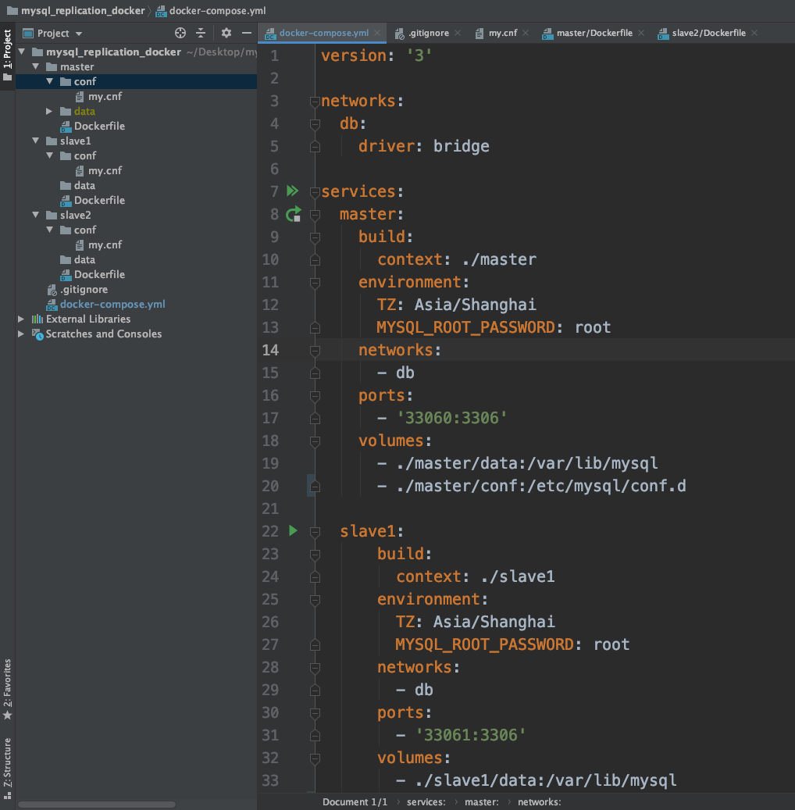

其中，my.cnf 配置如下：

```mysql
[mysqld]
character-set-server=utf8mb4

server-id=0
log-bin=mysql-bin
binlog_format=ROW
expire_logs_days=365
log_output=table
general_log=on

gtid_mode=on
enforce_gtid_consistency=1

innodb_flush_log_at_trx_commit=1
sync_binlog=1

[mysql]
default-character-set=utf8mb4

[client]
default-character-set=utf8mb4
```

Dockerfile 暂时只有一句话：

```dockerfile
FROM mysql:8.0
```

3个 service 就只有 server-id 的值不同，其他配置项完全一致。

#### 启动master

```shell
docker-compose up -d master
```

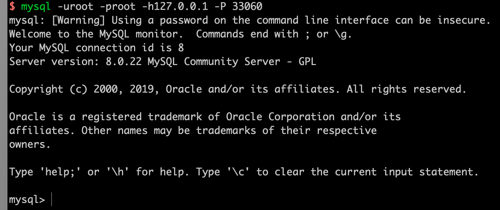

看起来一切正常。

```sql
mysql> show variables like "%gtid%";
+----------------------------------+------------------------------------------+
| Variable_name                    | Value                                    |
+----------------------------------+------------------------------------------+
| binlog_gtid_simple_recovery      | ON                                       |
| enforce_gtid_consistency         | ON                                       |
| gtid_executed                    | 2ea01898-2987-11eb-84e5-0242ac140002:1-5 |
| gtid_executed_compression_period | 1000                                     |
| gtid_mode                        | ON                                       |
| gtid_next                        | AUTOMATIC                                |
| gtid_owned                       |                                          |
| gtid_purged                      |                                          |
| session_track_gtids              | OFF                                      |
+----------------------------------+------------------------------------------+
9 rows in set (0.01 sec)
```

master先来点数据：

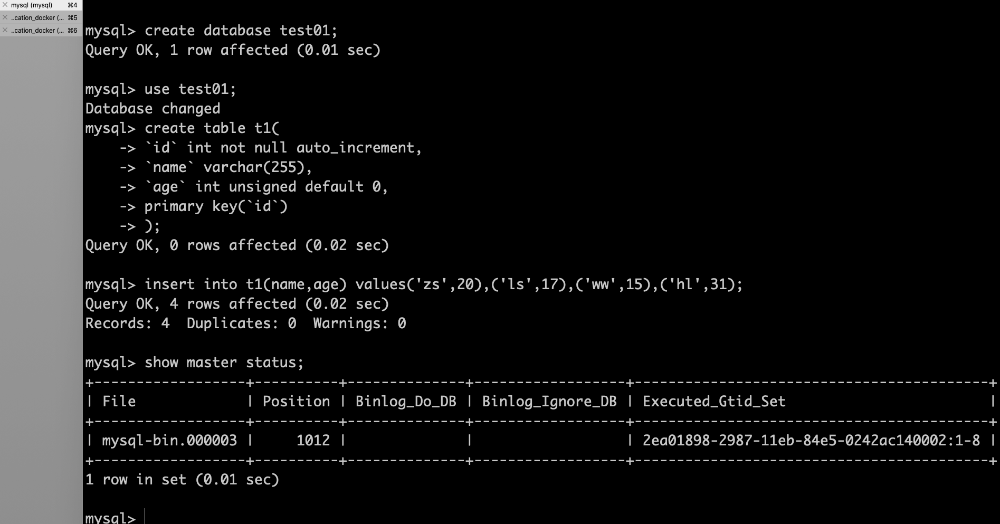

创建两个slave用的复制账号：

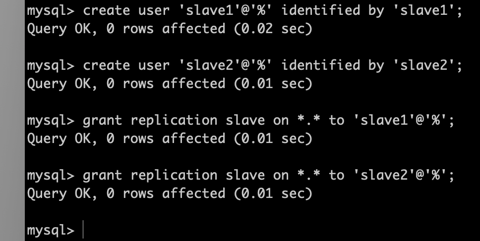

#### 启动slave

```shell
docker-compose up -d slave1 slave2
```

#### 开始复制

在slave1上依次执行：

```
change master to master_host='10.0.2.125',master_user='slave1',master_password='slave1',master_auto_position=1;
start slave;
show slave status;
```

结果发现Slave_IO_Running一直是Connecting状态，想起来是因为docker容易不认识ifconfig里面拿的宿主机ip，于是换成服务名试试：

```
change master to master_host='master',master_user='slave1',master_password='slave1',master_auto_position=1;
start slave;
show slave status;
```

然后，又出现新的问题：

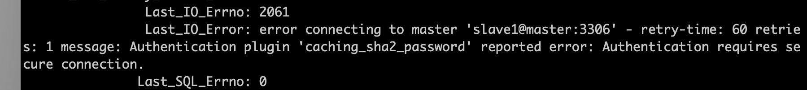

经查阅 https://dev.mysql.com/doc/refman/8.0/en/change-master-to.html ，添加GET_MASTER_PUBLIC_KEY=1可以解决。

重新尝试，又出现：

```sql
 Last_IO_Error: Got fatal error 1236 from master when reading data from binary log: 'Misconfigured master - master server_id is 0'
```

意思是 mater 的server_id 不能设置成0……

于是，将master的server_id改成100重新启动后，再次开启slave1上的slave，终于看到了曙光：

```
Slave_IO_Running: Yes
Slave_SQL_Running: Yes
```

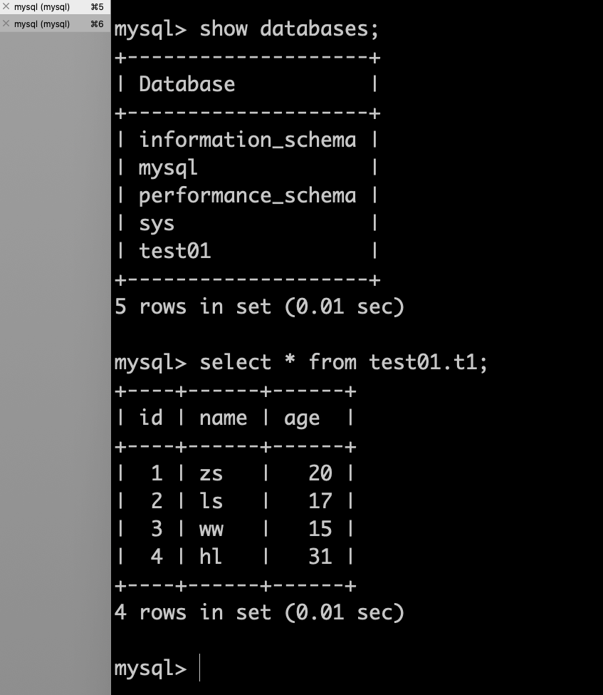

可以看到数据已经同步到了slave1，同理，现在去操作slave2。

#### 开启slave2

为了让过程看起来更“正常”一点，我先在slave2上面添加一些数据：

```sql
create database slave2;
```

然后开启复制：

```sql
change master to master_host='master',master_user='slave1',master_password='slave1',master_auto_position=1,GET_MASTER_PUBLIC_KEY=1;
start slave;
show slave status\G;
```

发现竟然没有问题，test01数据库同步过来了，slave2数据库也存在。

### 开始捣鼓

#### 异步 or 半同步 or 全同步

在很久以前，MySQL一直采用的是异步复制，也就是说主库并不会管从库的同步速度，如果从库crash，就会导致数据丢失。于是MySQL5.5引入了半同步复制，主库在事务提交前需要保证至少有一个从库接收并写到relay log。在2016年，MySQL在5.7.17中引入了一个全新的技术，称之为InnoDB Group Replication。目前官方MySQL 5.7.17基于Group replication的全同步技术已经问世，全同步技术带来了更多的数据一致性保障。

MySQL默认是异步复制，我们先验证一下，关闭两个slave，在master执行事务，看能不能提交：

```
docker-compose stop slave1 slave2
```

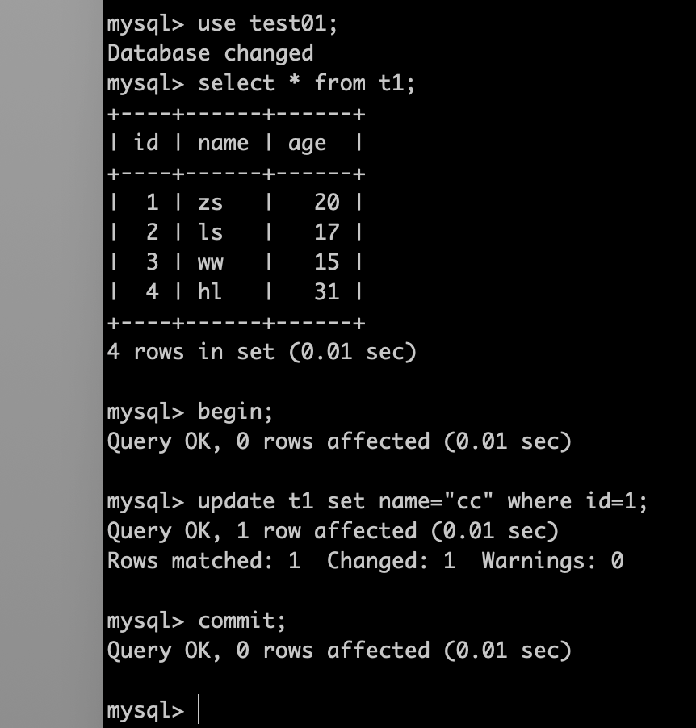

可以看到能成功提交。

#### 半同步复制

要支持半同步复制，需要安装插件。过程很简单：

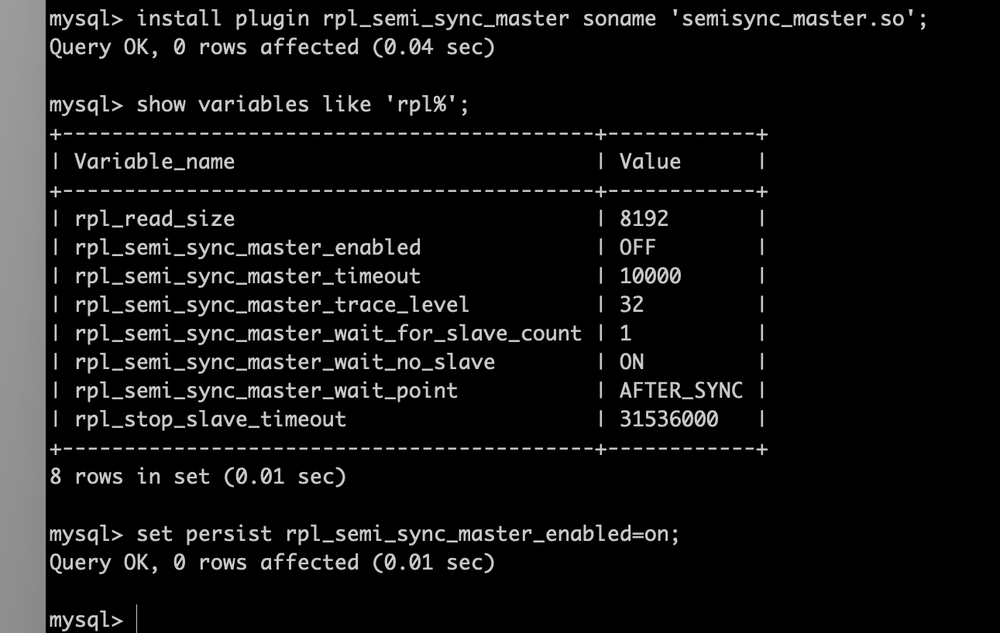

在slave1与slave2完成相应slave插件的安装。

查看半同步复制是否启用成功：

主库：

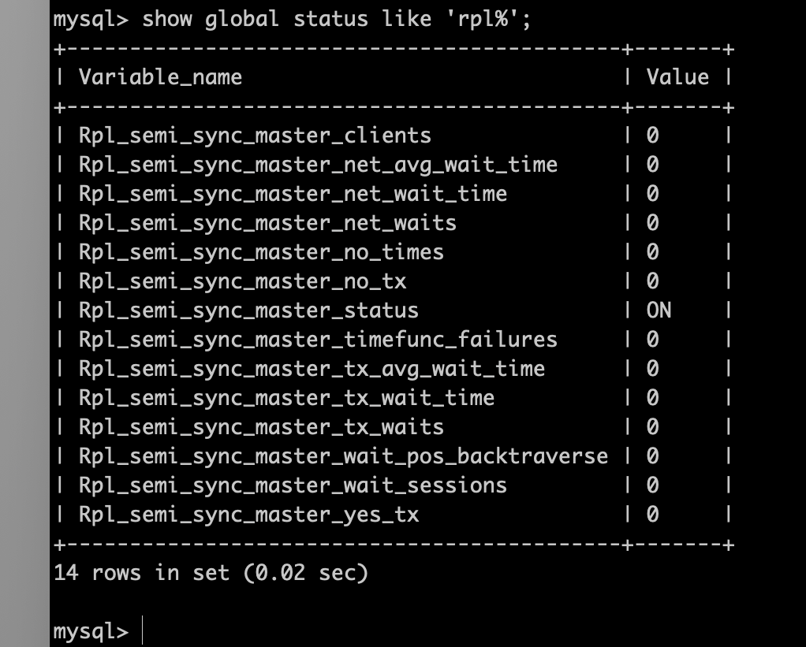

从库：

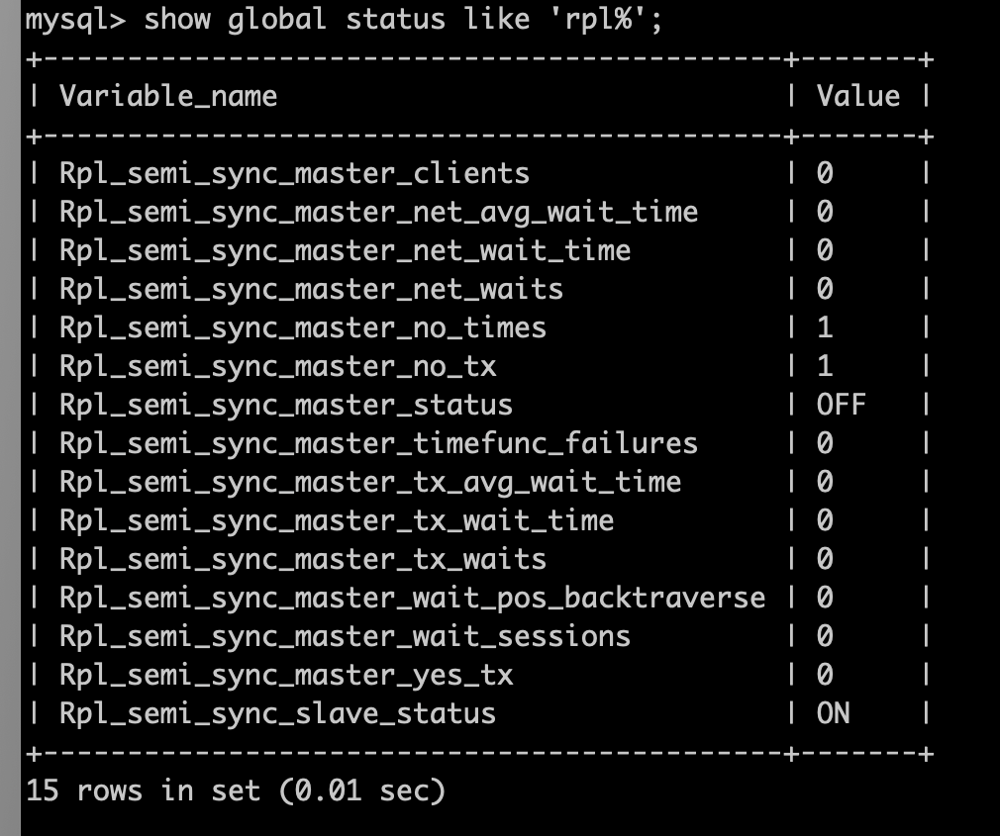

主库**Rpl_semi_sync_master_status** 和从库 **Rpl_semi_sync_slave_status** 都为 ON 标识半同步复制安装配置成功。

测试在slave全部挂掉的情况下，master的事务是否可以提交：

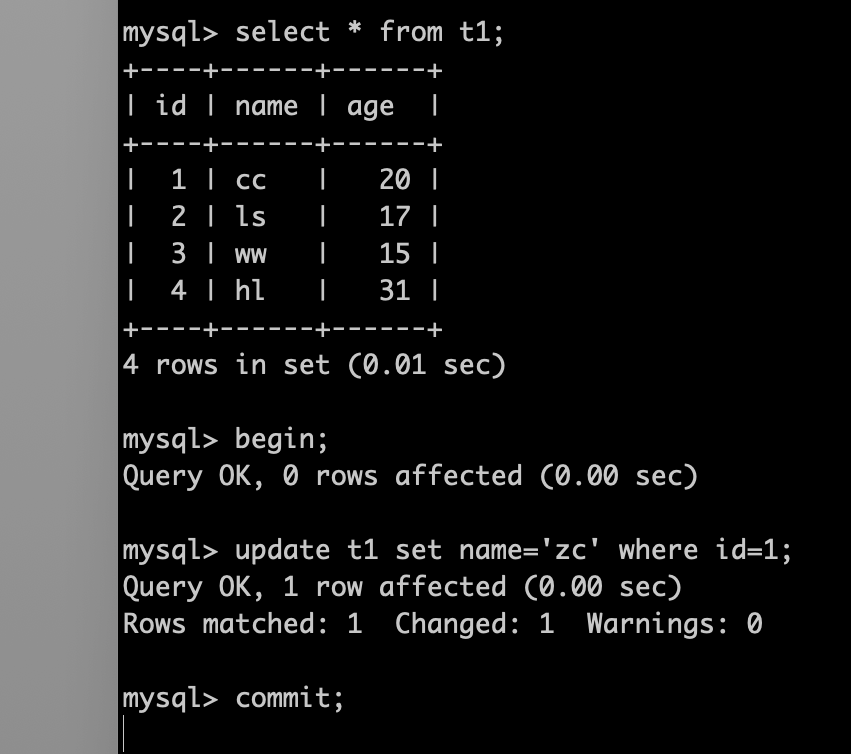

起初观察到 commit 语句阻塞了，满足我们的预期，但是过了一会，commit竟然成功了，查看数据，update已生效。挺纳闷儿的，不是说必须要保证一个从库写 relay_log 成功吗？

先不管了，把 slave1 和 slave2 启动看看情况：

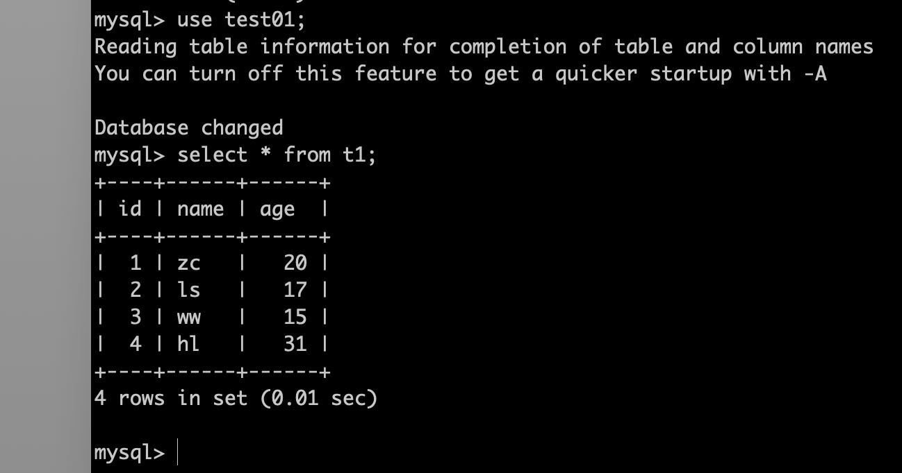

master 刚刚 update 的数据也同步过来了……

再来查看半同步复制状态呢？

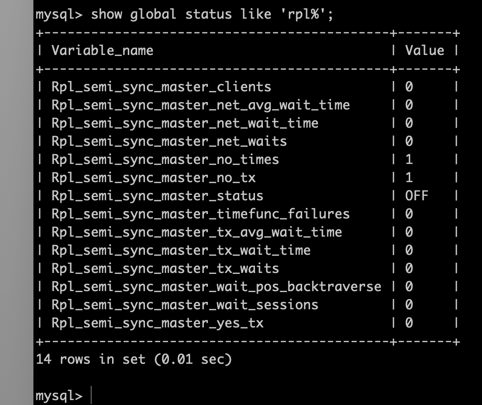

停止了！！！

没错，这是因为在超时情况下，半同步复制退化成了异步复制，超时时间可配置：

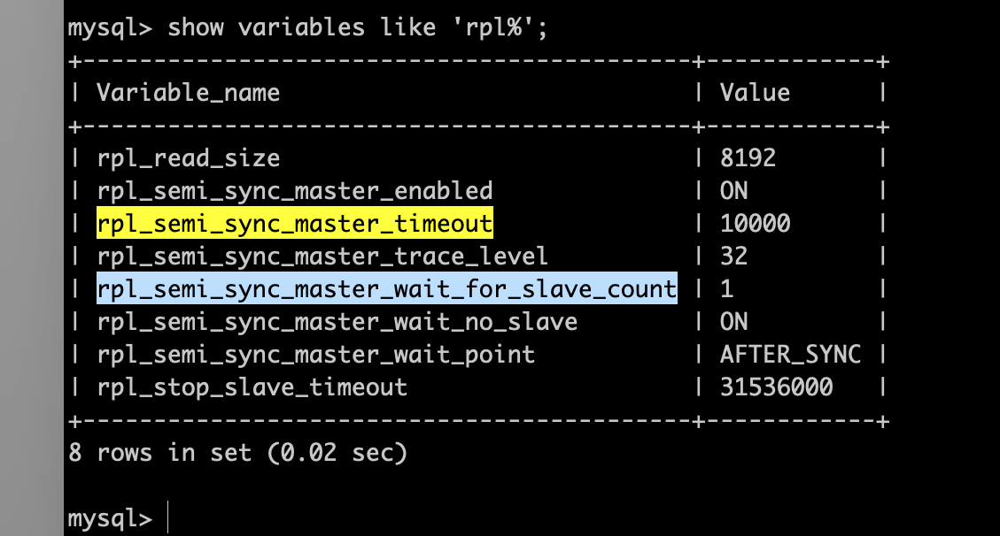

以上配置表示超时时间10秒钟，只要有一个从库ACK，即可commit事务。

重新开启半同步复制：

主库执行 ```SET GLOBAL rpl_semi_sync_master_enabled = 1;```，从库执行 ```SET GLOBAL rpl_semi_sync_slave_enabled = 1;``` 然后重新开始复制即可。

今天就先折腾到这里，改天继续来~

```2020-11-20```


