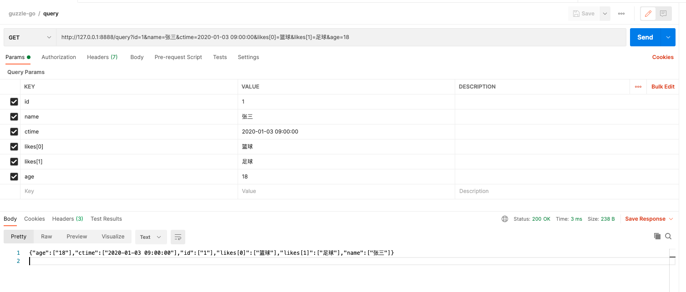
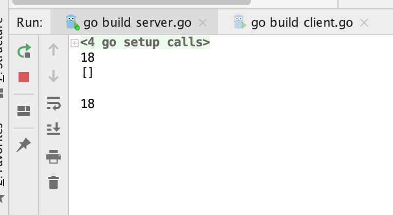
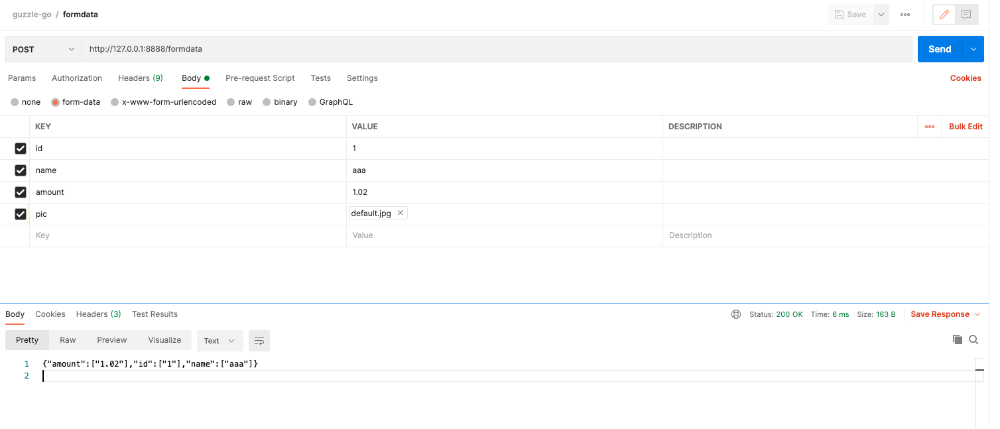
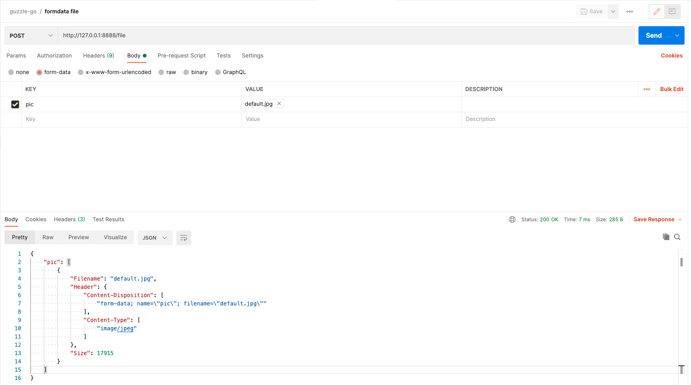
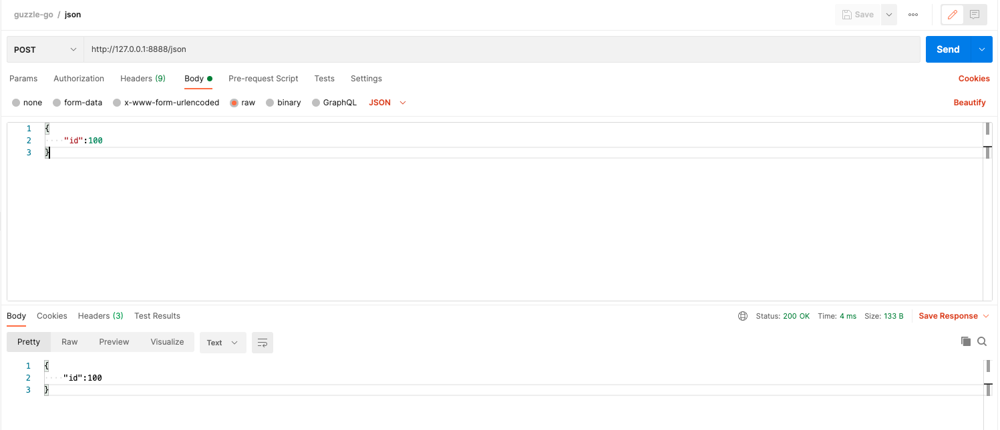

### 简介

这个系列将使用 Golang 模仿 PHP 的 Http 客户端之大作 [Guzzle](https://github.com/guzzle/guzzle) 。虽然 Http Client 的封装不是什么难事，甚至不用封装也可以写出能跑的代码，但是有一个封装良好，使用简单，得心应手的好工具能让代码更具优雅，更健壮，更易读，Guzzle 就是 PHP 里面我见过为数不少的 Http Client，很多 Composer 包都直接使用 Guzzle 发请求，你还在用 curl 吗？试试 Guzzle 吧！

我接触 Golang 其实已经很久了，从 2017 年刚大学毕业那会就在自己看书看教程学习了，因为工作中用的是 PHP 语言，算上平时花在其他地方的时间，Go 的学习时间其实也不长，自己也没信心找 Golang 的工作。但经验告诉我，语言是有相通性的，凌驾在语言之上的知识也是相通的，所以我打算多码一码~

#### Server 基础

要写 Client ，我觉得必须先熟悉 Server ，先看下 Go Http Server 是怎么玩的？

#### 启动一个 Http Server

在 Go 里面，启动一个 Http Server 非常简单，就像这样：

```go
package main

import (
  "net/http"
  "log"
)

func main() {
  mux := http.NewServerMux()
  mux.handleFunc("/",index)
  
  err := http.ListenAndServe(":8888",mux)
  if err != nil {
    log.Fatal(err)
  }
}

func index(w http.ResponseWriter,r *http.Request){
  fmt.Fprintf(w,"hello,golang")
}
```

核心就是 ```  err := http.ListenAndServe(":8888",mux)``` 这行代码，如果失败，比如端口被占用，会立马返回错误，如果成功，将会堵塞在那里，一直等待客户端连接，就像 socket 里面的 accept 一样。

index 这个方法是 http handler ，就是处理请求的方法，通过 mux 注册之后，有请求过来，go 就会找到对应的 handler 执行。其中注册的方式有很多种，这里列出的只是其中一种，感兴趣的可以去了解其他方式~

#### 接收 query string

通过 get 参数的形式传递到后端，获取方式有两种，一是取 r.URL.Query() 里面的，二是使用 r.Form 。（这里的 r 指的是 handler 接收参数里面的 *http.Request）

```go
func handleQueryString(w http.ResponseWriter,r *http.Request)  {
	v := r.URL.Query()
	fmt.Println(v.Get("age"))
	r.ParseForm()
	fmt.Println(r.Form["likes"])
	fmt.Println(r.Form.Get("likes"))
	fmt.Println(r.Form.Get("age"))
	bytes,err := json.Marshal(r.Form)
	if err != nil {
		fmt.Fprintln(w,err.Error())
		return
	}
	fmt.Fprintln(w,string(bytes))
}
```



用 postman 测试看看，控制台输出：



可以看到 r.URL.Qury() 和 r.Form 都拿到了 query string ，但是对于“数组”这种特殊类型，go 似乎并没有帮我们封装好，在 php 里面，这个 likes 后端到时候用 $_GET 获取到的就是一个数组，key 是 "likes" ，value 是包含“篮球”+“足球”的数组，不过问题不大，这里 go 对于每个值都用了 slice ，所以我只需要传递的时候用相同的 key ，就能达到一样的效果。

这里额外说明，r.Form["k"] 这种形式拿到的是 slice ，r.Form.GET("k") 这种形式拿到的是 string ，所以用单值还是多值完全由我们自己决定。

#### 接收 post 数据（x-www-form-urlencoded）

接收 post 数据，依然可以使用 r.Form 。但是仅限 enctype=x-www-form-urlencoded 的情况，r.Form 同时包含了 post 数据和 query string ，如果要区分，可以使用 r.PostForm 只取 post 里面的参数。

#### 接收 post 表单数据（form-data）

```go
func handleFormData(w http.ResponseWriter,r *http.Request)  {
	err := r.ParseMultipartForm(1024)
	if err != nil {
		fmt.Fprintln(w,err.Error())
		return
	}
	bytes,err := json.Marshal(r.MultipartForm.Value)
	if err != nil {
		fmt.Fprintln(w,err.Error())
		return
	}
	fmt.Fprintln(w,string(bytes))
}
```



可以发现，r.MultipartForm.Value 里面有我们想要的东西，但是注意到 pic 这张图片貌似没有拿到，莫慌，继续看~

#### 接收 post 文件（form-data）

```go
func handleFile(w http.ResponseWriter,r *http.Request)  {
	err := r.ParseMultipartForm(1024)
	if err != nil {
		fmt.Fprintln(w,err.Error())
		return
	}
	bytes,err := json.Marshal(r.MultipartForm.File)
	if err != nil {
		fmt.Fprintln(w,err.Error())
		return
	}
	fmt.Fprintln(w,string(bytes))
}
```



完美，r.MultipartForm.File 里面有我们想要的。

#### 接收 post json 数据（application/json）

```go
func handleJson(w http.ResponseWriter,r *http.Request)  {
	data,err := ioutil.ReadAll(r.Body)
	if err != nil {
		fmt.Fprintf(w,err.Error())
		return
	}
	fmt.Fprintf(w,string(data))
}
```



这个是藏在 r.Body 里面，Read 出来是 []byte 类型，意味着并不只是 json ，其他类型如：application/xml，plain/text 都用这个接收。

### 总结

服务端接收数据的大部分场景已经覆盖，还有 Cookie Session  什么的，留在后面 Client 出来后再补上。

Next Step：Client 快速封装。


```2021-02-10```

