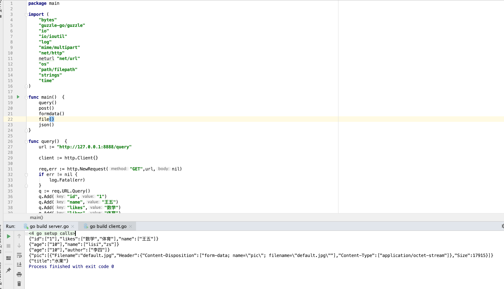

### 简介

在开始封装 client 之前，我们先了解一下 go http client 对应发数据的方式。

#### query string

```go
func query()  {
	url := "http://127.0.0.1:8888/query"

	client := http.Client{}

	req,err := http.NewRequest("GET",url,nil)
	if err != nil {
		log.Fatal(err)
	}
	q := req.URL.Query()
	q.Add("id","1")
	q.Add("name","王五")
	q.Add("likes","数学")
	q.Add("likes","体育")
	req.URL.RawQuery = q.Encode()

	res,err := client.Do(req)
	if err != nil {
		log.Fatal(err)
	}
	defer res.Body.Close()

	io.Copy(os.Stdout,res.Body)
}
```

#### post (x-www-form-urlencoded)

```go
func post()  {
	url := "http://127.0.0.1:8888/post"

	client := http.Client{}

	v := neturl.Values{}
	v.Add("name","lisi")
	v.Add("name","zs")
	v.Set("age","10")
	body := ioutil.NopCloser(strings.NewReader(v.Encode()))

	req,err := http.NewRequest("POST",url,body)
	if err != nil {
		log.Fatal(err)
	}
	req.Header.Set("Content-Type", "application/x-www-form-urlencoded")

	res,err := client.Do(req)
	if err != nil {
		log.Fatal(err)
	}
	defer res.Body.Close()

	io.Copy(os.Stdout,res.Body)
}
```

这种方式必须设置 ```	req.Header.Set("Content-Type", "application/x-www-form-urlencoded")``` ，否则 server 将不能正常处理。

#### post (form-data)

```go
func formdata()  {
	url := "http://127.0.0.1:8888/formdata"

	client := http.Client{}

	buffer := &bytes.Buffer{}
	writer := multipart.NewWriter(buffer)
	writer.WriteField("age","10")
	writer.WriteField("author","李四")
	writer.Close()
	contentType := writer.FormDataContentType()

	req,err := http.NewRequest("POST",url,buffer)
	if err != nil {
		log.Fatal(err)
	}
	req.Header.Set("Content-Type", contentType)

	res,err := client.Do(req)
	if err != nil {
		log.Fatal(err)
	}
	defer res.Body.Close()

	io.Copy(os.Stdout,res.Body)
}
```

核心是用 ```multipart.NewWrite()``` 去拼整个 form 。也是必须要设置 Content-Type 。

#### post (file)

```go
func file()  {
	url := "http://127.0.0.1:8888/file"

	client := http.Client{}

	buffer := &bytes.Buffer{}
	writer := multipart.NewWriter(buffer)
	file := "/Users/purelightme/Desktop/default.jpg"
	f,err := os.Open(file)
	if err != nil {
		log.Fatal(err)
	}
	defer f.Close()
	_,path := filepath.Split(file)
	w,_ := writer.CreateFormFile("pic",path)
	io.Copy(w,f)
	writer.Close()
	contentType := writer.FormDataContentType()

	req,err := http.NewRequest("POST",url,buffer)
	if err != nil {
		log.Fatal(err)
	}
	req.Header.Set("Content-Type", contentType)

	res,err := client.Do(req)
	if err != nil {
		log.Fatal(err)
	}
	defer res.Body.Close()

	io.Copy(os.Stdout,res.Body)
}
```

 跟普通 form-data 差不多，就是把值从文本换成了文件。

#### json (xml,text......)

```go
func json()  {
	url := "http://127.0.0.1:8888/json"

	client := http.Client{}

	data := []byte(`{"title":"水果"}`)
	//data := []byte("<xml><id>1</id></xml>")

	req,err := http.NewRequest("POST",url,bytes.NewBuffer(data))
	if err != nil {
		log.Fatal(err)
	}

	res,err := client.Do(req)
	if err != nil {
		log.Fatal(err)
	}
	defer res.Body.Close()

	io.Copy(os.Stdout,res.Body)
}
```

直接通过 http.NewRequest() 的第三个参数传递，不需要设置 Content-Type ，json,xml,text 等都可以用这个方式传。

### 效果

源码：[client.go]()



有了这些基础，咱们就可以开始动手封装了。

下回继续分解~


```2021-02-11```

