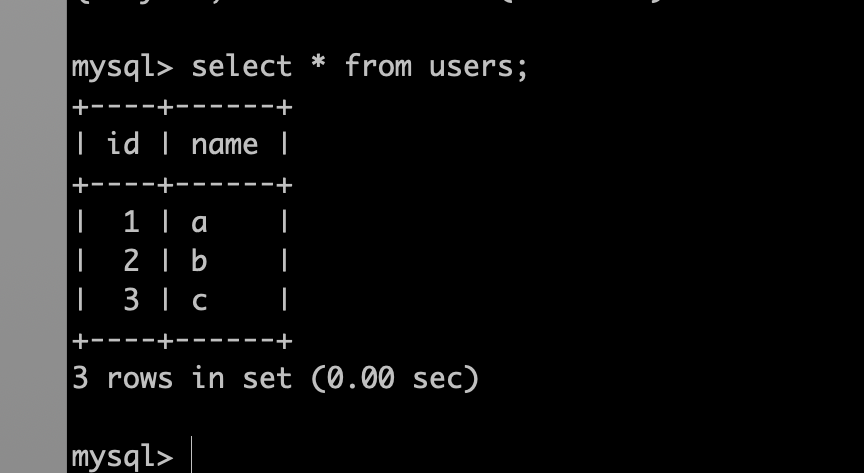
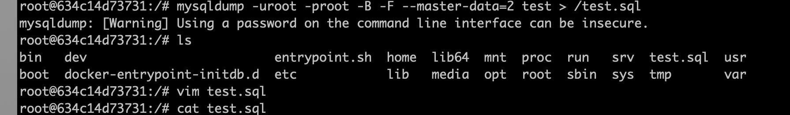
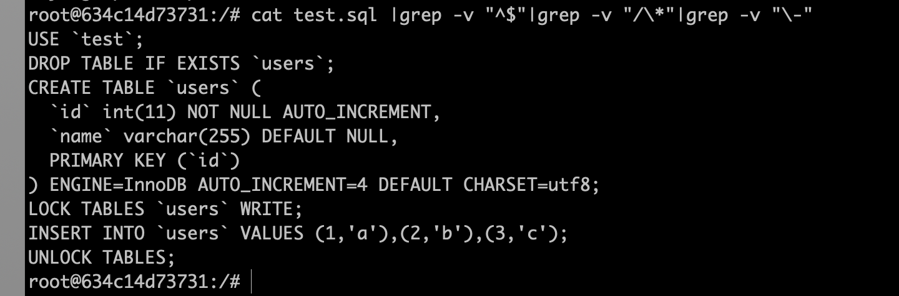
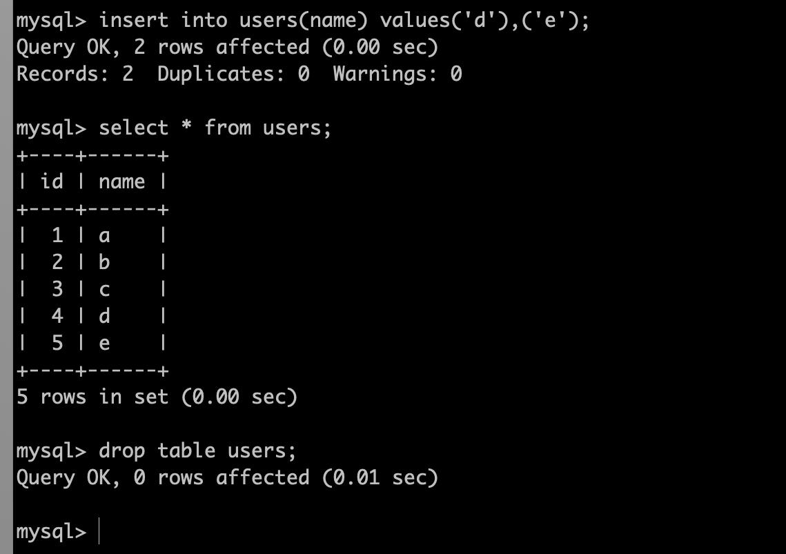
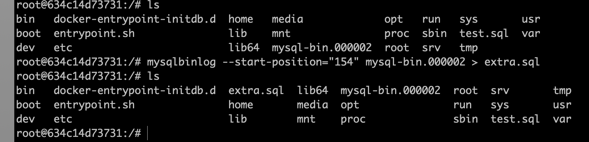
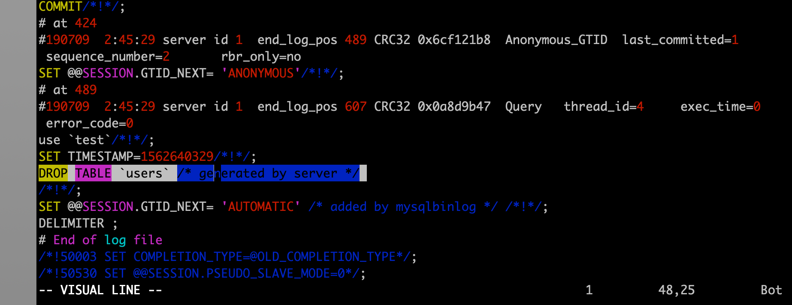
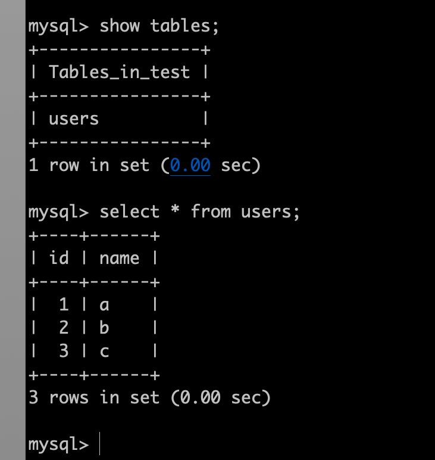
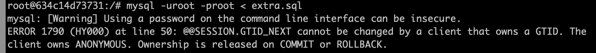
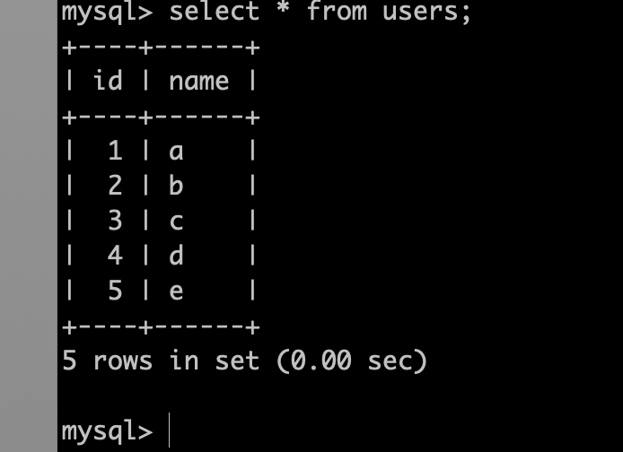

作为后端程序员，工作中或者自己平时写代码中经常会出现误删数据的情况，甚至是误删整个数据库，所以掌握误删数据的恢复方法显得尤为重要。

### 恢复思路

* 前置条件是要有全量备份文件和增量的binlog日志
* 先从最近一次全量备份文件恢复数据
* 再将增量的binlog日志转化为sql语句，剔除不需要的语句，导入增量数据

###  实验过程

#### mysql配置

在/etc/my.cnf文件里的[mysqld]区块添加：

```
log-bin=mysql-bin
server-id=1
```

然后重启mysql服务

#### 创建数据库test，并添加测试数据



#### 做全量备份





#### 模拟添加数据，并且删除数据表users



#### 恢复数据

查看test.sql文件，找到：

```-- CHANGE MASTER TO MASTER_LOG_FILE='mysql-bin.000002', MASTER_LOG_POS=154;```

这样一行数据（这是在mysqldump添加—master-data=2的效果），这表明在该文件之前的binlog文件中的数据都已经包含在这个全备的sql文件中了。记住仅指test数据库。


手动删除binlog转化为sql文件后不需要的sql，比如drop语句：


先导入全量备份：

```mysql -uroot -proot < test.sql```

查看数据库，现在已经有全量备份的数据了：



再导入增量binlog数据：

虽然报错了，但是我查看mysql，数据已经恢复成功了：



### 总结

其实基础恢复方法并不难，但是实际生产环境中比实验要复杂的多，mysqldump和mysqlbinlog参数较多，还需时日去仔细研究，今天先到这里把。
另外，binlog在我删除drop语句导入之后的报错，有知道的小伙伴还请指教~

```2019-07-09```