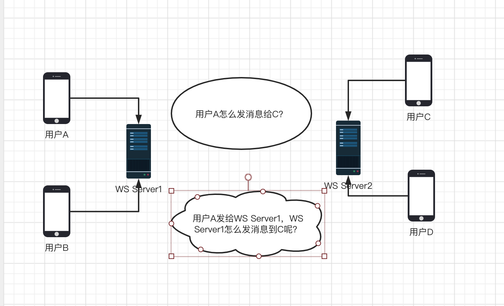
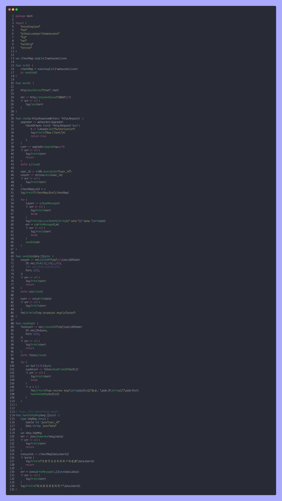
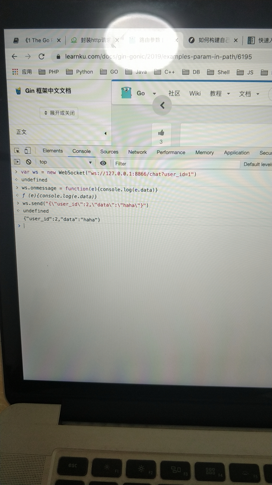
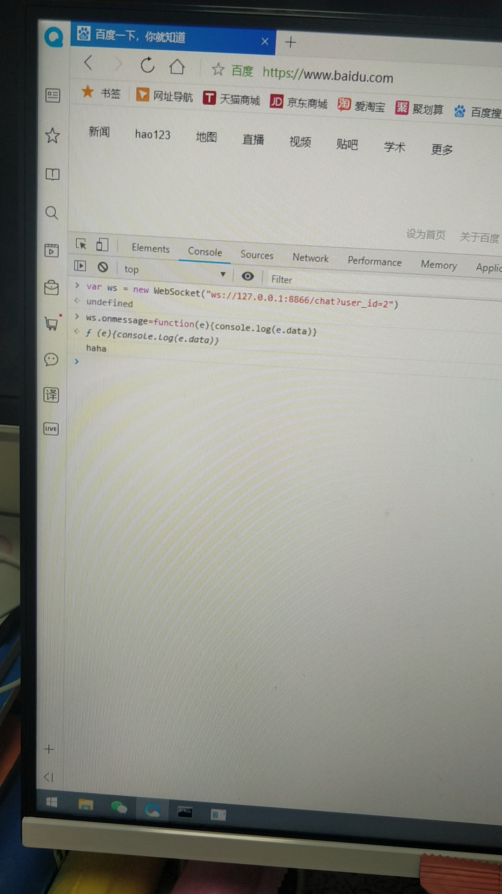
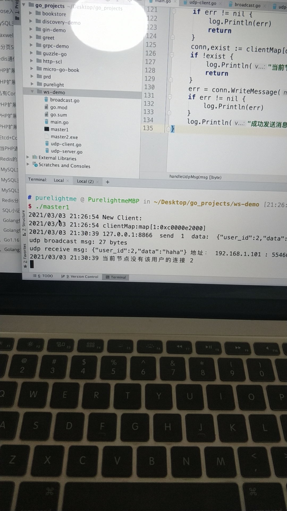
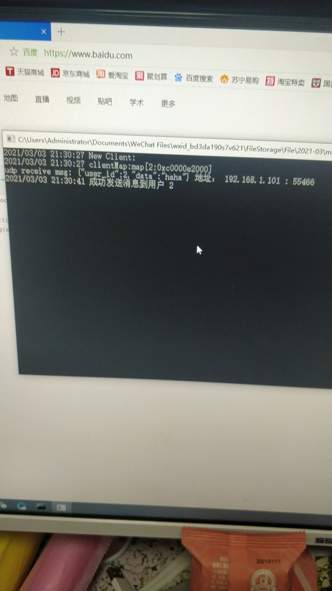

### 简介

WebSocket 是一种支持双向实时通信的技术，在音视频聊天，直播，游戏等领域有着广泛用途，是后端开发里面比较有意思的技术。

协议并不复杂，现在流行的后端语言基本都有各自的实现方式，大体流程相似：客户端发起连接，服务端校验，双方握手，从 HTTP 协议升级成 WebSocket 协议，此后保持长久连接，双方可以互发消息。

本次主要实践针对的是弹性扩容，websocket 不能简单像传统 web 那样做负载均衡，我们必须自己实现各个节点间通信。具体如下图：



用户C是与WS Server2建立的连接，不能又WS Server1直接发消息，我们只能先让 WS Server1 发消息给 WS Server2 让它去转发给C。如果有更多的 Server 加进来呢？

综合考虑，我们可以利用局域网 UDP 广播来完成节点间通信的功能，每条消息在每个节点都通知一遍，每个节点检查消息内容，需要自己处理则处理，不需要自己处理则忽略。这样单机百万连接的话，10台机器就是千万连接，讲道理是行得通的。

为啥用 UDP 而不用其他的，因为 UDP 快，websocket 消息本身就是要求实时性，而且对消息必达也没有非常严格的要求，所以 UDP 非常适合。

#### 语言选择

php 的话一般是借助于 swoole 扩展实现，我个人不是很推荐，因为用了人家的扩展就引入了依赖，“能不依赖就不依赖”，所以我用 Golang ，gorilla/wesocket 真香。

#### 编码

###### websocket 启动

```go
package main

import (
	"encoding/json"
	"fmt"
	"github.com/gorilla/websocket"
	"log"
	"net"
	"net/http"
	"strconv"
)

var clientMap map[int]*websocket.Conn

func init()  {
	clientMap = make(map[int]*websocket.Conn)
}

func main()  {

	http.HandleFunc("/chat", chat)

	err := http.ListenAndServe(":8866",nil)
	if err != nil {
		log.Fatal(err)
	}
}

func chat(w http.ResponseWriter,r *http.Request)  {
	upgrader := websocket.Upgrader{}
	c,err := upgrader.Upgrade(w,r,nil)
	if err != nil {
		log.Println(err)
		return
	}
	defer c.Close()

	user_id := r.URL.Query().Get("user_id")
	uid,err := strconv.Atoi(user_id)
	if err != nil {
		log.Println(err)
	}
	clientMap[uid] = c
	log.Printf("clientMap:%v\n",clientMap)

	for {
		t,m,err := c.ReadMessage()
		if err != nil {
			log.Println(err)
			break
		}
		log.Println(c.LocalAddr().String()," send ",t," data: ",string(m))
		err = c.WriteMessage(t,m)
		if err != nil {
			log.Println(err)
			break
		}
	}
}
```

就是如此简单，用户建立连接后，存到一个全局 clientMap 里面去，key 是用户唯一标志，例如用户ID，这里取 query 里面传的 user_id ，实际业务肯定是需要更安全的处理的，这里只做演示，value 是 websocket.Conn 连接。

###### udp 广播实现

***发送端***：(将消息广播到局域网所有主机)

这里需用 ```ifconfig``` 查看网卡的广播地址，一般是 ```en0``` 的 ```broadcast``` 。

```go
func sendUdp(data []byte)  {
	con,err := net.DialUDP("udp",nil,&net.UDPAddr{
		IP: net.IPv4(192,168,1,255),//广播地址
		Port: 2222,
	})
	if err != nil {
		log.Println(err)
		return
	}
	defer con.Close()

	n,err := con.Write(data)
	if err != nil {
		log.Println(err)
	}
	fmt.Println("udp broadcast msg:",n,"bytes")
}
```

***接收端***：(监听节点udp数据，处理数据)

```go
func readUdp()  {
	listen,err := net.ListenUDP("udp",&net.UDPAddr{
		IP: net.IPv4zero,//代表本机所有网卡地址
		Port: 2222,
	})
	if err != nil {
		log.Println(err)
		return
	}
	defer listen.Close()

	for {
		var buf [1024]byte
		n,addr,err := listen.ReadFromUDP(buf[:])
		if err != nil {
			log.Println(err)
			break
		}
		if n > 0 {
			fmt.Println("udp receive msg:",string(buf[:n]),"地址：",addr.IP.String(),":",addr.Port)
			handleUdpMsg(buf[:n])//处理消息
		}
	}
}
```

```go
// {"user_id":1,"data":"send data"}
func handleUdpMsg(msg []byte)  {
	type UdpMsg struct {
		UserId int `json:"user_id"`
		Data string `json:"data"`
	}
	var data UdpMsg
	err := json.Unmarshal(msg,&data)
	if err != nil {
		log.Println(err)
		return
	}
	conn,exist := clientMap[data.UserId]
	if !exist {
		log.Println("当前节点没有该用户的连接",data.UserId)//没有就不处理，说明目标用户的连接不在本机
		return
	}
	err = conn.WriteMessage(1,[]byte(data.Data))//在本机就直接转发消息
	if err != nil {
		log.Println(err)
	}
	log.Println("成功发送消息到用户",data.UserId)
}
```

###### 完整代码：

main.go：



图片生成使用的工具是：[https://github.com/matsuyoshi30/germanium](https://github.com/matsuyoshi30/germanium)

###### 交叉编译

在 Mac 上分别编译成 mac 和 windows 上的可执行文件：

```
 go build -o master1 main.go 
```

```
CGO_ENABLED=0 GOOS=windows GOARCH=amd64 go build -o master2.exe  main.go
```

###### 测试

mac 和 windows 都启动 ws-server 之后，使用浏览器 js 自带的 websocket api 测试：

```javascript
var ws = new WebSocket("ws://127.0.0.1:8866/chat?user_id=1")
ws.onmessage = function(e){console.log(e.data)}
ws.send("{\"user_id\":2,\"data\":\"haha\"}")
```

在 mac 上以用户1连接，然后在 windows 上以用户2连接，准备就绪后，在用户1端发送消息，试图发给用户2，

在 windows 端成功看到用户2收到了消息，部分截图如下：









### 总结

无论从理论还是实际出发，该方案都证明可行！其实也可以用消息队列，例如 kafka ，然后每个节点都去消费消息，但这样没有 udp 快，不建议。


```2021-03-03```

