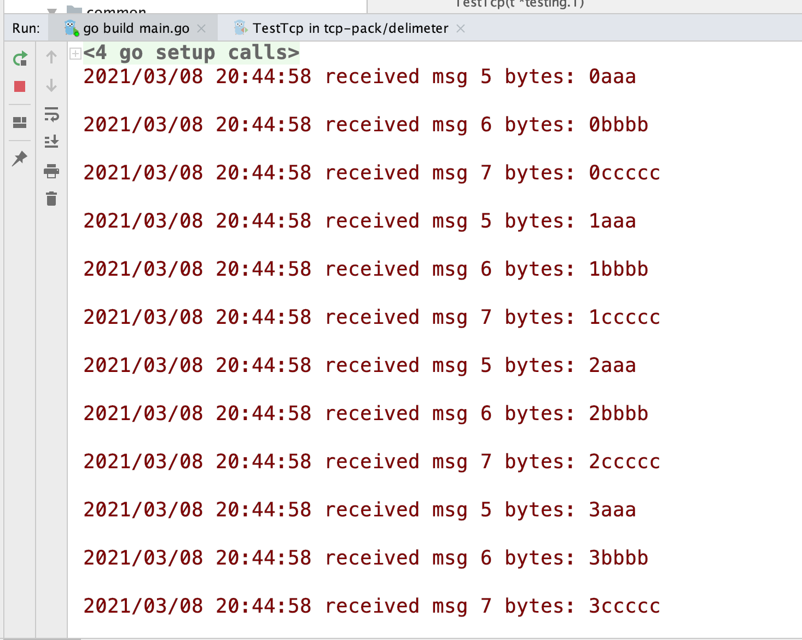

### 简介

TCP 协议是面向连接，可靠的流式协议，当 Server 去 Read 的时候，每次读到的数据都不一定是完整的，该方法会返回读到的字节数，因此，当我们写 Server 的时候，什么时候去回调用户设置的 callback ？也就是怎么样保证每次都能拿到一个完整的包数据，这个就是”粘包“问题的由来。

传统的，有两种方法解决。一是分隔符协议，即每条消息结尾设置固定分隔符，Server 读到分隔符就认为读到了完整的包数据；二是长度协议，即在每个消息头部设置固定长度的字段，表征消息长度，再往后读取该长度的消息即可。

目前长度协议用的较多，因为分隔符协议需要 Server 不停的检测，很耗费性能。长度协议实现中比较重要的点是头部的长度以及字节序，**2** 个字节可表示 **2^16-1** 个字节的内容，如果不够，那就上4字节，字节序相关的只是可以参考：[”字节序“是什么鬼？](https://zhuanlan.zhihu.com/p/21388517)

### 编码

先来个没处理粘包的：

common/server.go:

```go
package common

import (
	"io"
	"log"
	"net"
)

func Start()  {
	listener,err := net.Listen("tcp","127.0.0.1:8866")
	if err != nil {
		log.Fatal(err)
	}
	defer listener.Close()

	for  {
		con,err := listener.Accept()
		if err != nil {
			log.Println(err)
			continue
		}
		defer con.Close()

		for {
			var data = make([]byte,5)
			n,err := con.Read(data)
			if err != nil && err != io.EOF{
				log.Println(err)
			}
			if n > 0 {
				log.Println("received msg",n,"bytes:",string(data[:n]))
			}
		}
	}
}
```

测试一下：

```go
package common

import (
	"log"
	"net"
	"strconv"
	"testing"
	"time"
)

func TestTcp(t *testing.T)  {
	conn,err := net.Dial("tcp","127.0.0.1:8866")
	if err != nil {
		log.Fatal(err)
	}
	defer conn.Close()

	for i := 0;i < 10;i++ {
		var err error
		_, err = conn.Write([]byte(strconv.Itoa(i) + "aaa\n"))
		_, err = conn.Write([]byte(strconv.Itoa(i) + "bbbb\n"))
		_, err = conn.Write([]byte(strconv.Itoa(i) + "ccccc\n"))
		if err != nil {
			panic(err)
		}
	}
	time.Sleep(time.Second)
}
```


因为每次只读5个字节，可以明显看到消息”乱了“，但就算把这个值增大，你只要是设置了，就会存在这个问题。

#### 分隔符协议

delimeter/server.go:

```go
package delimeter

import (
	"bufio"
	"io"
	"log"
	"net"
)

func Start()  {
	listener,err := net.Listen("tcp","127.0.0.1:8866")
	if err != nil {
		log.Fatal(err)
	}
	defer listener.Close()

	for  {
		con,err := listener.Accept()
		if err != nil {
			log.Println(err)
			continue
		}
		defer con.Close()

		reader := bufio.NewReader(con)
		for {
			data,err := reader.ReadSlice('\n')
			if err != nil {
				if err != io.EOF {
					log.Println(err)
				}else {
					break
				}
			}
			log.Println("received msg",len(data),"bytes:",string(data))
		}
	}
}
```

还是拿上个测试脚本跑，结果：



这次看到每个消息长度不一样，但是都是”完整的“。

#### 长度协议

length/server.go:

```go
package length

import (
	"bufio"
	"bytes"
	"encoding/binary"
	"io"
	"log"
	"net"
)

func Start() {
	listener, err := net.Listen("tcp", "127.0.0.1:8866")
	if err != nil {
		log.Fatal(err)
	}
	defer listener.Close()

	for {
		con, err := listener.Accept()
		if err != nil {
			log.Println(err)
			continue
		}
		defer con.Close()

		reader := bufio.NewReader(con)
		for {
			peek,err := reader.Peek(4)
			if err != nil {
				if err != io.EOF {
					log.Println(err)
				}else {
					break
				}
			}

			buffer := bytes.NewBuffer(peek)
			var length int32
			err = binary.Read(buffer,binary.BigEndian,&length)
			if err != nil {
				log.Println(err)
			}
			if int32(reader.Buffered()) < length + 4 {
				continue
			}

			data := make([]byte, length + 4)
			_, err = reader.Read(data)
			if err != nil {
				continue
			}
			log.Println("received msg", string(data[4:]))
		}
	}
}
```

client 也得相应调整：

```go
package length

import (
	"bytes"
	"encoding/binary"
	"log"
	"net"
	"strconv"
	"testing"
	"time"
)

func TestLengthClient(t *testing.T) {
	conn,err := net.Dial("tcp","127.0.0.1:8866")
	if err != nil {
		log.Fatal(err)
	}
	defer conn.Close()

	for i := 0;i < 10;i++ {
		var err error
		data,err := Encode(strconv.Itoa(i) + "aaa\n")
		_, err = conn.Write(data)
		data,err = Encode(strconv.Itoa(i) + "bbbb\n")
		_, err = conn.Write(data)
		data,err = Encode(strconv.Itoa(i) + "ccccc\n")
		_, err = conn.Write(data)
		if err != nil {
			panic(err)
		}
	}
	time.Sleep(time.Second)
}

func Encode(message string) ([]byte, error) {
	var length = int32(len(message))

	var pkg = new(bytes.Buffer)
	err := binary.Write(pkg, binary.BigEndian, length)
	if err != nil {
		return nil, err
	}

	err = binary.Write(pkg, binary.BigEndian, []byte(message))
	if err != nil {
		return nil, err
	}

	return pkg.Bytes(), nil
}
```

测试结果：


效果跟分隔符协议一样，都可以解决”粘包“问题。

#### PHP 客户端

只要是 TCP 协议，任何语言都需要处理 ”粘包“ 问题，我们用 PHP 写一个客户端测试一下：

```php
<?php
/**
 * Created by
 * Author purelight
 * Date 2021/3/8
 * Time 20:50 下午
 */

$host = "127.0.0.1";
$port = 8866;
if (false === $socket = socket_create(AF_INET, SOCK_STREAM, SOL_TCP)){
    die('socket create fail');
}

if (false === socket_connect($socket, $host, $port)){
    die('socket connect fail');
}

$msg = 'hello socket';
if (false === $n = socket_write($socket, encode($msg))){
    die('socket write fail');
}

socket_close($socket);

echo 'socket test success'.PHP_EOL;

function encode(string $msg){
    $length = strlen($msg);
    $header = pack('N',$length);
    return $header.$msg;
}
```


完美！

### 总结

只有在直接使用 TCP 协议才存在 "粘包" 问题，其上层应用层协议比如 HTTP ，已经帮我们处理好了，无需关注这些底层，但是我们自己实现一个自定义协议，就必须考虑这些细节了。


```2021-03-08```

