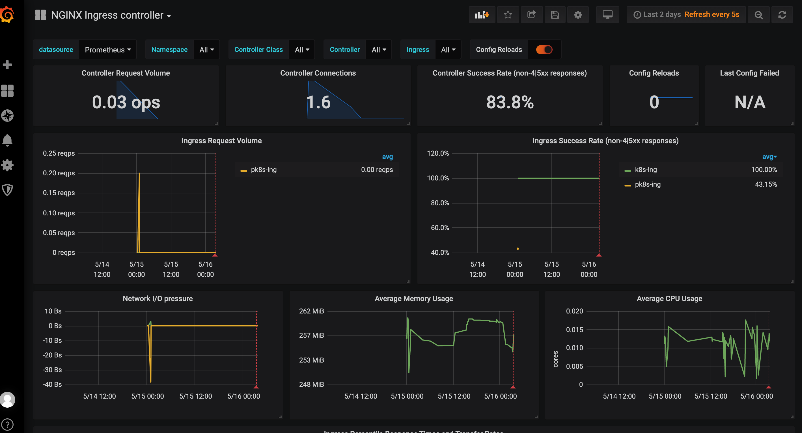

### 简介

Ingress 是 K8S Service 暴露内部服务的一种方式，比起 ClusterIP，NodePort，LoadBalancer等方式，Ingress 具有较多的优势。ClusterIP 仅限集群内部访问，NodePort 需要额外开放较多端口资源，LoadBalancer 需要云服务商提供支持，Ingress 无需云服务商支持，也无需开放太多端口，是比较好的解决方案。

Ingress 需要配合 Ingress Controller 运行，Ingress Controller 作为集群服务的统一入口点，实时监测 Ingress 资源的变化，并及时更新内部配置以生效。Ingress Controller 的实现方式有很多种，我选择的是 k8s 官方的 ingress-nginx 。

### 安装

参考官方文档，对于 Docker Desktop ，直接：

```shell
kubectl apply -f https://raw.githubusercontent.com/kubernetes/ingress-nginx/controller-v0.46.0/deploy/static/provider/cloud/deploy.yaml
```

不过我这里还是建议把 deploy.yaml 文件下载到本地，因为后面我们需要调整里面的内容。

```
# purelightme @ PurelightmeMBP in ~/Desktop/k8s/nginx-ingress [15:39:03]
$ kubectl get svc -n ingress-nginx

NAME                                 TYPE           CLUSTER-IP       EXTERNAL-IP   PORT(S)                                     AGE
ingress-nginx-controller             LoadBalancer   10.98.118.85     localhost     80:32090/TCP,443:31339/TCP,8866:32683/TCP   2d5h
ingress-nginx-controller-admission   ClusterIP      10.101.242.153   <none>        443/TCP                                     2d5h
```

看到 ingress-nginx namespace 下有 ingress-nginx-controller 的 service 就可以了。

### 配置

上篇文章 [容器化php项目](https://www.jianshu.com/p/a1e64196294e) 中，我们已经在 k8s 中通过 ingress 跑起来了 k8s.com 的 web 应用。

我们可以通过 ConfigMap 和 Annotations 配置 ingress controller 。ConfigMap 用于全局配置，所有 server 块都生效，Annotations 可用于 ingress  资源清单，配置特定的 server 块。

##### Annotations

###### 金丝雀发布

```yaml
apiVersion: networking.k8s.io/v1beta1
kind: Ingress
metadata:
  name: k8s-ing-canary
  namespace: k8s-demo
  annotations:
    nginx.ingress.kubernetes.io/canary: "true"
    nginx.ingress.kubernetes.io/canary-by-header: "X-VER"
    nginx.ingress.kubernetes.io/canary-by-header-value: "canary"
spec:
  rules:
  - host: k8s.com
    http:
      paths:
      - path: /
        backend:
          serviceName: k8s-com-canary-service
          servicePort: 80
```

这样，当 k8s.com 的请求包含 X-VER 的 header 并且值为“canary”的时候，ingress controller 将把请求转发给 k8s-com-canary-service 的 80 端口。

###### 限流

```yaml
apiVersion: networking.k8s.io/v1beta1
kind: Ingress
metadata:
  name: k8s-ing
  namespace: k8s-demo
  annotations:
    #nginx.ingress.kubernetes.io/limit-connections: "1"
    nginx.ingress.kubernetes.io/limit-rps: "1"
    nginx.ingress.kubernetes.io/limit-burst-multiplier: "5"
spec:
  rules:
  - host: k8s.com
    http:
      paths:
      - path: /
        backend:
          serviceName: k8s-com-service
          servicePort: 80
```

limit-rps 代表每秒一个请求，limit-burst-multiplier 表示最多允许5个突发请求，如果并发10个请求访问 k8s.com ，预计将有6个成功，4个失败。使用 golang 测试：

```go
package main

import (
	"fmt"
	"log"
	"net/http"
	"time"
)

func main()  {
	for i := 0;i < 10;i++ {
		go rate_limit(i)
	}
	time.Sleep(time.Minute)
}

func rate_limit(i int){
	fmt.Println("请求",i,"开始：",time.Now().Unix())

	url := "http://k8s.com/index.php"
	client := http.Client{}

	req,err := http.NewRequest("GET",url,nil)
	if err != nil {
		log.Fatal(err)
	}
	res,err := client.Do(req)
	if err != nil {
		log.Fatal(err)
	}
	defer res.Body.Close()

	fmt.Println("请求",i,"结束：",time.Now().Unix(),"状态码：",res.StatusCode)
}
```


可见，符合预期。

##### ConfigMap

我们安装 ingress-nginx controller 的时候，deploy.yaml 文件里面已经定义了 ConfigMap ：

```
$ kubectl get cm -n ingress-nginx
NAME                                  DATA   AGE
ingress-controller-leader-nginx       0      2d13h
ingress-nginx-controller              0      2d13h
```

ingress-nginx-controller 这个 cm 就是 ingress-nginx controller 使用的。

###### add_headers

可以选择直接 `kubectl edit cm ingress-nginx-controller -n ingress-nginx ` 编辑，也可以修改 deploy.yaml 对应 cm 配置，这里选择直接修改文件。

先创建 add_header 需要的 configmap ：

```yaml
$ cat add_header_configmap.yaml
apiVersion: v1
data:
  X-AUTHOR: "purelightme"
kind: ConfigMap
metadata:
  name: add-header
  namespace: ingress-nginx
$ kubectl apply -f add_header_configmap.yaml
configmap/add-header created  
```

编辑 deploy.yaml ：

```yaml
# Source: ingress-nginx/templates/controller-configmap.yaml
apiVersion: v1
kind: ConfigMap
metadata:
  labels:
    helm.sh/chart: ingress-nginx-3.30.0
    app.kubernetes.io/name: ingress-nginx
    app.kubernetes.io/instance: ingress-nginx
    app.kubernetes.io/version: 0.46.0
    app.kubernetes.io/managed-by: Helm
    app.kubernetes.io/component: controller
  name: ingress-nginx-controller
  namespace: ingress-nginx
data:
  - add-headers: "ingress-nginx/add-header"
```

```
kubectl apply -f deploy.yaml
```


可见，已经生效。

### TCP服务

除了支持 http 的七层代理，ingress-nginx 还支持代理 tcp，udp 等服务。方法就是通过配置 ingress-nginx controller ，指定接收端口，配置转发到 namespace/service:port 下面。

先封装一个 tcp 服务的镜像，这里采用 [Golang 解决TCP“粘包“问题](https://www.jianshu.com/p/61ac90f553d7) 一文中的代码，构造 Dockerfile：

```dockerfile
FROM golang:1.16

WORKDIR /go/src/app
COPY . .

RUN go build .

EXPOSE 8866

ENTRYPOINT ["./tcp-pack"]
```

推送到 dockerhub ，https://hub.docker.com/r/purelightme/tcp-go

tcp-go-deployment.yaml：

```yaml
apiVersion: apps/v1
kind: Deployment
metadata:
  namespace: k8s-demo
  name: tcp-go-deployment
  labels:
    app: tcp-go
    version: v1
spec:
  replicas: 1
  selector:
    matchLabels:
      app: tcp-go
      version: v1
  template:
    metadata:
      labels:
        app: tcp-go
        version: v1
    spec:
      containers:
        - name: golang
          image: purelightme/tcp-go:v1
          ports:
            - containerPort: 8866
```

tcp-go-service.yaml：

```yaml
apiVersion: v1
kind: Service
metadata:
  namespace: k8s-demo
  name: tcp-go-service
  labels:
    app: tcp-go
    version: v1
spec:
  selector:
    app: tcp-go
    version: v1
  ports:
    - port: 8866
      targetPort: 8866
```

ingress-tcp-config.yaml：

```yaml
apiVersion: v1
kind: ConfigMap
metadata:
  name: tcp-services
  namespace: ingress-nginx
data:
  8866: "k8s-demo/tcp-go-service:8866"
```

```
kubectl apply -f ./*
```

修改 deploy.yaml 中的 nginx-ingress-controller 的 command line arguments：

```
- /nginx-ingress-controller
            - --publish-service=$(POD_NAMESPACE)/ingress-nginx-controller
            - --election-id=ingress-controller-leader
            - --ingress-class=nginx
            - --configmap=$(POD_NAMESPACE)/ingress-nginx-controller
            - --validating-webhook=:8443
            - --validating-webhook-certificate=/usr/local/certificates/cert
            - --validating-webhook-key=/usr/local/certificates/key
            - --tcp-services-configmap=$(POD_NAMESPACE)/tcp-services
```

重载 deploy.yaml 即可代理 8866 端口上的 tcp 服务。

### Metrics

再来看看监控方面的问题，官方文档给的方案是有遗漏的，导致 prometheus 部署上去后拉不到数据，解决办法有两种。一是修改 deploy.yaml ，二是使用 ServiceMonitor 。为了方便，这里直接修改 deploy.yaml：

```yaml
# Source: ingress-nginx/templates/controller-deployment.yaml
apiVersion: apps/v1
kind: Deployment
metadata:
  labels:
    helm.sh/chart: ingress-nginx-3.30.0
    app.kubernetes.io/name: ingress-nginx
    app.kubernetes.io/instance: ingress-nginx
    app.kubernetes.io/version: 0.46.0
    app.kubernetes.io/managed-by: Helm
    app.kubernetes.io/component: controller
  name: ingress-nginx-controller
  namespace: ingress-nginx
spec:
  selector:
    matchLabels:
      app.kubernetes.io/name: ingress-nginx
      app.kubernetes.io/instance: ingress-nginx
      app.kubernetes.io/component: controller
  revisionHistoryLimit: 10
  minReadySeconds: 0
  template:
    metadata:
      annotations:
        prometheus.io/port: "10254" //这里加上这两个 annotations 即可
        prometheus.io/scrape: "true"
      labels:
        app.kubernetes.io/name: ingress-nginx
        app.kubernetes.io/instance: ingress-nginx
        app.kubernetes.io/component: controller
    spec:
  ******  
```

然后按照官方文档的提示依次部署 prometheus 和 grafana 。

grafana 配置数据源的时候，需要用 prometheus server 的 service name 做 host ，而不是 127.0.0.1 。

效果图：




### 总结

官方文档只要是教我们怎么用，至于实现原理，几乎没怎么提到，需要我们自己实践踩坑，尤其是监控那块儿，按照其文档描述操作，依然是收集不到数据，后来查阅相关资料才发现的解决办法。

当然，还有些内容没做说明，其实也很重要，比如多实例，能有效解决扩展性问题。ingress-nginx controller 作为 k8s 集群统一流量入口，许多微服务通用功能就可以实现了，比如限流，认证，鉴权，服务发现等等。

另外 nginx 官方也开发了一个 ingress controller ，跟 k8s 官方开发的各有特色，这里暂不细说。

其实，为了更加方便管理集群流量，微服务通信，业界使用的比较多的是 istio ，下次再研究~


`2021-05-16`

