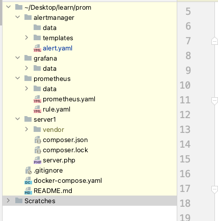
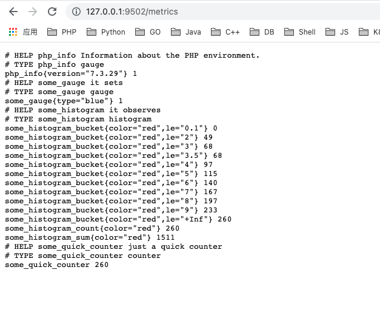
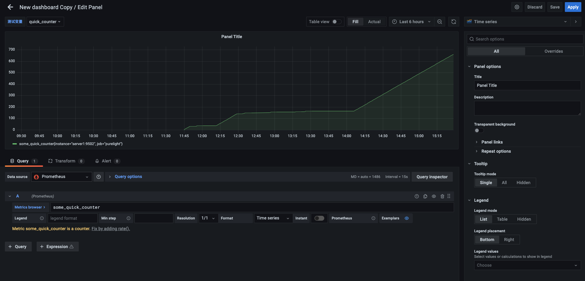

### 简介

众所周知，prometheus(普罗米修斯)是微服务监控领域的新星，这几年发展迅猛。之前用过一些框架自带metrics，接触过prometheus，这次准备系统的深入研究一下相关监控方案。

先看看prometheus及周边生态的结构图：


### 环境搭建

按照惯例，先把环境搭起来，hello world跑通再说。

docker-compose.yaml

```yaml
version: '3'

services:
  prometheus:
    image: prom/prometheus
    volumes:
      - "./prometheus/prometheus.yaml:/etc/prometheus/prometheus.yml"
      - "./prometheus/data:/prometheus"
      - "./prometheus/rule.yaml:/etc/prometheus/rule.yml"
    ports:
    - "9090:9090"

  server1:
    image: phpswoole/swoole:php7.3
    volumes:
    - "./server1:/app"
    ports:
    - "9502:9502"
    command: php /app/server.php start

  grafana:
    image: grafana/grafana
    ports:
    - '3000:3000'
    volumes:
    - "./grafana/data:/var/lib/grafana"

  alertmanager:
    image: prom/alertmanager
    ports:
    - '9093:9093'
    volumes:
    - "./alertmanager/alert.yaml:/etc/alertmanager/alertmanager.yml"
    - "./alertmanager/data:/alertmanager"
    - "./alertmanager/templates:/templates"
```

目录结构：



metrics:

```php
<?php

use Prometheus\CollectorRegistry;
use Prometheus\RenderTextFormat;
use Prometheus\Storage\InMemory;
use Swoole\Coroutine\Http\Server;
use function Swoole\Coroutine\run;

require_once __DIR__ . '/vendor/autoload.php';

run(function () {

    $registry = new CollectorRegistry(new InMemory());

    $server = new Server('0.0.0.0', 9502, false);

    $server->set([
        'mode' => SWOOLE_BASE,
        'worker_num' => 1
    ]);

    $GLOBALS['gauge'] = 1;

    $server->handle('/metrics', function ($request, $response)use ($registry) {
        $registry->getOrRegisterCounter('','some_quick_counter','just a quick counter')
            ->inc();
        $registry->getOrRegisterGauge('','some_gauge','it sets',['type'])
            ->set($GLOBALS['gauge'],['blue']);
        $registry->getOrRegisterHistogram('','some_histogram','it observes',['color'],[0.1,2,3,3.5,4,5,6,7,8,9])
            ->observe(random_int(1,10),['red']);

        $render = new RenderTextFormat();
        $metrics = $render->render($registry->getMetricFamilySamples());

        $response->header('Content-Type',RenderTextFormat::MIME_TYPE);
        $response->end($metrics);
    });

    $server->handle('/reset',function ($request,$response)use ($registry){
        $GLOBALS['gauge'] = 0;
        $response->end($GLOBALS['gauge']);
    });

    $server->start();
});
```

用 swoole server 借助 prometheus client 实现 metrics 逻辑，配置 pull job 即可。

prometheus 配置：

```yaml
global:
  scrape_interval: 10s
  evaluation_interval: 10s
  scrape_timeout: 10s
  external_labels:
    prom: 'a'

scrape_configs:
  - job_name: 'purelight'
    static_configs:
      - targets: ['server1:9502']
  - job_name: 'prometheus'
    static_configs:
      - targets: ['127.0.0.1:9090']

alerting:
  alertmanagers:
    - static_configs:
        - targets: ['alertmanager:9093']

rule_files:
  - "/etc/prometheus/rule.yml"

```

这样，prometheus 就会每10s抓取server1的metrics，以及prometheus自身的metrcis，另外，alertmanagers配置告警。

启动：`docker-compose up -d`

### Prometheus

访问：http://127.0.0.1:9502/metrics



这就是 prometheus pull 模式抓取 metrics 信息的消息大致格式。

#### 数据类型

prometheus 数据组成：

- 指标(metric)：metric name和描述当前样本特征的labelsets;

- 时间戳(timestamp)：一个精确到毫秒的时间戳;

- 样本值(value)： 一个float64的浮点型数据表示当前样本的值。

指标格式：`<metric name>{<label name>=<label value>, ...}`

metric 又分4种类型(metric type)：Counter（计数器）、Gauge（仪表盘）、Histogram（直方图）、Summary（摘要）。

###### Counter

Counter类型的指标其工作方式和计数器一样，只增不减（除非系统发生重置）。常见的监控指标，如http_requests_total，node_cpu都是Counter类型的监控指标。 一般在定义Counter类型指标的名称时推荐使用_total作为后缀。

php client 示例：

```php
$registry = new CollectorRegistry(new InMemory());

$counter = $registry->getOrRegisterCounter('','some_quick_counter','just a quick counter');
$counter->inc();
```

###### Gauge:

与Counter不同，Gauge类型的指标侧重于反应系统的当前状态。因此这类指标的样本数据可增可减。常见指标如：node_memory_MemFree（主机当前空闲的内容大小）、node_memory_MemAvailable（可用内存大小）都是Gauge类型的监控指标。

php client 示例:

```php
$gauge = $registry->getOrRegisterGauge('','some_gauge','it sets',['type']);
$gauge->set(2.5, ['blue']);
```

###### Histogram和Summary分析数据分布情况

除了Counter和Gauge类型的监控指标以外，Prometheus还定义了Histogram和Summary的指标类型。Histogram和Summary主用用于统计和分析样本的分布情况。

在大多数情况下人们都倾向于使用某些量化指标的平均值，例如CPU的平均使用率、页面的平均响应时间。这种方式的问题很明显，以系统API调用的平均响应时间为例：如果大多数API请求都维持在100ms的响应时间范围内，而个别请求的响应时间需要5s，那么就会导致某些WEB页面的响应时间落到中位数的情况，而这种现象被称为长尾问题。

为了区分是平均的慢还是长尾的慢，最简单的方式就是按照请求延迟的范围进行分组。例如，统计延迟在0~10ms之间的请求数有多少而10~20ms之间的请求数又有多少。通过这种方式可以快速分析系统慢的原因。Histogram和Summary都是为了能够解决这样问题的存在，通过Histogram和Summary类型的监控指标，我们可以快速了解监控样本的分布情况。

例如，指标prometheus_tsdb_wal_fsync_duration_seconds的指标类型为Summary。 它记录了Prometheus Server中wal_fsync处理的处理时间，通过访问Prometheus Server的/metrics地址，可以获取到以下监控样本数据：

```
# HELP prometheus_tsdb_wal_fsync_duration_seconds Duration of WAL fsync.
# TYPE prometheus_tsdb_wal_fsync_duration_seconds summary
prometheus_tsdb_wal_fsync_duration_seconds{quantile="0.5"} 0.012352463
prometheus_tsdb_wal_fsync_duration_seconds{quantile="0.9"} 0.014458005
prometheus_tsdb_wal_fsync_duration_seconds{quantile="0.99"} 0.017316173
prometheus_tsdb_wal_fsync_duration_seconds_sum 2.888716127000002
prometheus_tsdb_wal_fsync_duration_seconds_count 216
```

从上面的样本中可以得知当前Prometheus Server进行wal_fsync操作的总次数为216次，耗时2.888716127000002s。其中中位数（quantile=0.5）的耗时为0.012352463，9分位数（quantile=0.9）的耗时为0.014458005s。

在Prometheus Server自身返回的样本数据中，我们还能找到类型为Histogram的监控指标prometheus_tsdb_compaction_chunk_range_bucket。

```
# HELP prometheus_tsdb_compaction_chunk_range Final time range of chunks on their first compaction
# TYPE prometheus_tsdb_compaction_chunk_range histogram
prometheus_tsdb_compaction_chunk_range_bucket{le="100"} 0
prometheus_tsdb_compaction_chunk_range_bucket{le="400"} 0
prometheus_tsdb_compaction_chunk_range_bucket{le="1600"} 0
prometheus_tsdb_compaction_chunk_range_bucket{le="6400"} 0
prometheus_tsdb_compaction_chunk_range_bucket{le="25600"} 0
prometheus_tsdb_compaction_chunk_range_bucket{le="102400"} 0
prometheus_tsdb_compaction_chunk_range_bucket{le="409600"} 0
prometheus_tsdb_compaction_chunk_range_bucket{le="1.6384e+06"} 260
prometheus_tsdb_compaction_chunk_range_bucket{le="6.5536e+06"} 780
prometheus_tsdb_compaction_chunk_range_bucket{le="2.62144e+07"} 780
prometheus_tsdb_compaction_chunk_range_bucket{le="+Inf"} 780
prometheus_tsdb_compaction_chunk_range_sum 1.1540798e+09
prometheus_tsdb_compaction_chunk_range_count 780
```

与Summary类型的指标相似之处在于Histogram类型的样本同样会反应当前指标的记录的总数(以_count作为后缀)以及其值的总量（以_sum作为后缀）。不同在于Histogram指标直接反应了在不同区间内样本的个数，区间通过标签len进行定义。

同时对于Histogram的指标，我们还可以通过histogram_quantile()函数计算出其值的分位数。不同在于Histogram通过histogram_quantile函数是在服务器端计算的分位数。 而Sumamry的分位数则是直接在客户端计算完成。因此对于分位数的计算而言，Summary在通过PromQL进行查询时有更好的性能表现，而Histogram则会消耗更多的资源。反之对于客户端而言Histogram消耗的资源更少。在选择这两种方式时用户应该按照自己的实际场景进行选择。

### PromQL

###### 瞬时向量 vs 区间向量

metric name 默认就是瞬时向量，代表当前最新一条数据；区间向量是过去一段时间的多条数据，使用方法是 metric name 后跟 [5m] 这种时间标志，支持：s - 秒，m - 分钟，h - 小时，d - 天，w - 周，y - 年。

###### 时间位移

在瞬时向量表达式或者区间向量表达式中，都是以当前时间为基准。而如果我们想查询，5分钟前的瞬时样本数据，或昨天一天的区间内的样本数据呢? 这个时候我们就可以使用位移操作，位移操作的关键字为**offset**。

```
http_request_total{} offset 5m
http_request_total{}[1d] offset 1d
```

###### 操作符

支持数学运算符：`+` (加法)，`-` (减法)，`*` (乘法)，`/` (除法)，`%` (求余)，`^` (幂运算)。

支持布尔运算符：`==` (相等)，`!=` (不相等)，`>` (大于)，`<` (小于)，`>=` (大于等于)，`<=` (小于等于)。

###### 函数

`sum` (求和)，`min` (最小值)，`max` (最大值)，`avg` (平均值)，`stddev` (标准差)，`stdvar` (标准方差)，`count` (计数)，`count_values` (对value进行计数)，`bottomk` (后n条时序)，`topk` (前n条时序)，`quantile` (分位数) ......

PromQL 的发挥主要是在 Grafana 图表绘制中。

### Grafana

Grafana 主要用于可视化图表绘制，内置支持 prometheus 数据源。

简单看下如何添加一个 counter 类型的数据图表绘制方法：



非常简单，但这只是凤毛棱角，grafana+prometheus 还支持更多的图表类型。

### 应用层

工具花里胡哨的太多，对于项目来说，最重要的还是做好 metrics 统计指标，借助 prometheus client ，提供 /metrics http endpoint，让 prometheus 主动定时 pull 。

prometheus 除了 pull 模式，还支持客户端主动 push 的模式，这个用于客户端不方便开放 http 端口的情况。


下次探讨 alertmanager 以及 prometheus 更多内容……


`2021-07-12`

