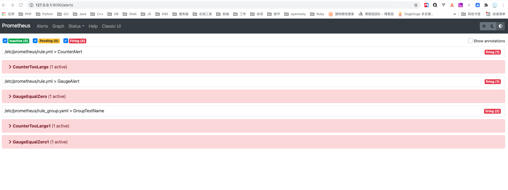
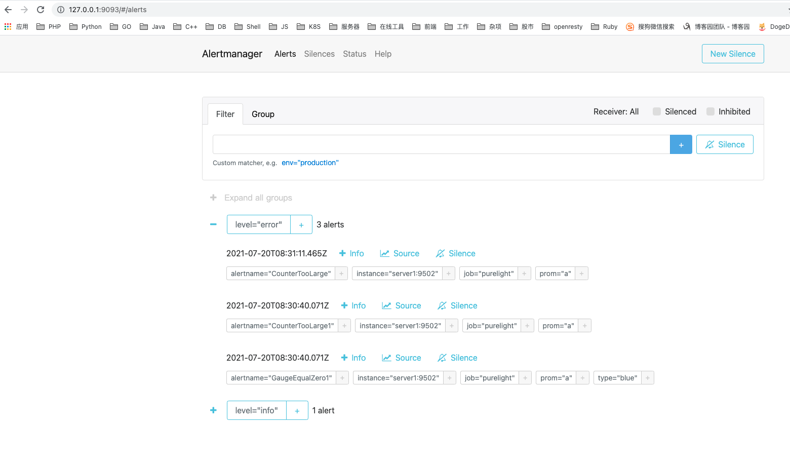
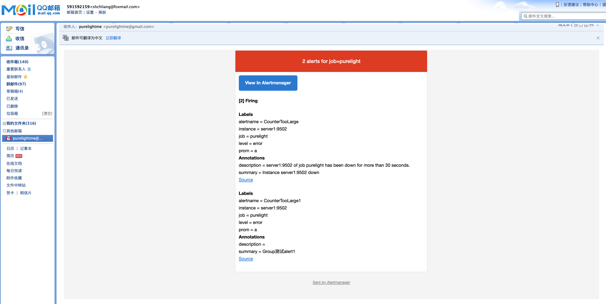

### 简介

监控的一个重要目的就是当系统出问题时，能及时通知相应的人，处理然后修复系统故障。所以，这节主要是 Alertmanager 相关的内容。

### AlertManager

```yaml
  alertmanager:
    image: prom/alertmanager
    ports:
    - '9093:9093'
    volumes:
    - "./alertmanager/alert.yaml:/etc/alertmanager/alertmanager.yml"
    - "./alertmanager/data:/alertmanager"
    - "./alertmanager/templates:/templates"
```

截取 docker-compose.yml 文件中的 alertmanager 部分，核心就是配置文件及模板文件。

alertmanager.yaml:

```yaml
global:
  resolve_timeout: 5m
  smtp_smarthost: 'smtp.qq.com:25'
  smtp_from: '591592159@qq.com'
  smtp_auth_username: '591592159@qq.com'
  smtp_auth_password: '**********'
  smtp_require_tls: false

route:
  group_by: ['job']
  group_wait: 10s
  group_interval: 10s
  repeat_interval: 10s
  receiver: 'zs'
  routes:
    - match:
        level: error
      receiver: 'purelight1'
    - match:
        level: info
      receiver: 'zs'

receivers:
  - name: 'purelight1'
    email_configs:
      - to: 'purelightme@gmail.com'
        headers: { Subject: "Prometheus 告警邮件" }
        send_resolved: true
        html: '{{ template "email.default.html" . }}'
  - name: 'zs'
    email_configs:
      - to: 'purelightme@gmail.com'
        headers: { Subject: "Prometheus 告警了" }

templates:
  - "/templates/*"
```

alertmanager 自带邮件，微信企业消息，slack等通知类型，另外还支持 web_hook 方便开发者任意扩展。只需配置上 smtp 相关必要参数，即可使用 email 通知。

其中 route 配置块是路由入口，所有告警经过 route 匹配，找到最终的 receiver ，即接收者。支持 match 等值匹配和 match_re 正则匹配，匹配都是基于标签的方式。

group_by 用于分组功能，上述例子中，将所有告警(alert)按标签 job 分组，job值相同的告警将会被分到同一个组。这主要是方便将多个相关的告警通知到同一个负责人的场景。

receivers 定义了接收者列表，定义好之后，在 route 里面的 receiver 项可以直接用 name 引用对应的接收者。email_configs 指示使用邮件通知接收者，其他方式可参考官方文档。

global 里面配置全局参数，resolve_timeout 标识告警解除之前必须经历的时间。

至于 inhibit_rules 抑制规则，如：

```yaml
inhibit_rules:
  - source_match:
      alertname: NodeDown
      severity: critical
    target_match:
      severity: critical
    equal:
      - node
```

含义：当集群中的某一个主机节点异常宕机导致告警NodeDown被触发，同时在告警规则中定义了告警级别severity=critical。由于主机异常宕机，该主机上部署的所有服务，中间件会不可用并触发报警。根据抑制规则的定义，如果有新的告警级别为severity=critical，并且告警中标签node的值与NodeDown告警的相同，则说明新的告警是由NodeDown导致的，则启动抑制机制停止向接收器发送通知。

与之相关的还有静默规则，直接在alertmanager ui界面上添加 Silence 。

### Prometheus

prometheus 关联 alertmanager 需增加配置：

```yaml
global:
	******
scrape_configs:
	******
alerting:
  alertmanagers:
    - static_configs:
        - targets: ['alertmanager:9093']

rule_files:
  - "/etc/prometheus/rule.yml"
  - "/etc/prometheus/rule_group.yaml
```

rule_group.yaml:

```yaml
groups:
  - name: GroupTestName
    rules:
      - alert: CounterTooLarge1
        expr: some_quick_counter > 10
        labels:
          level: error
        annotations:
          summary: "Group测试alert1"
          description: ""

      - alert: GaugeEqualZero1
        record: gauge_zero
        expr: some_gauge == 0
        labels:
          level: error
        annotations:
          summary: "Group测试alert2"
          description: ""
```

这里的 groups 只是 peometheus 里面的组，将相关 rules 集中起来管理而已，并非是 alertmanager 里面的组概念。

几个主要参数是：

- alert 指定告警名称，可用于在 alertmanager 端用 group_by: [alertname] 进行分组。
- expr 即 PromQL 表达式，满足此表达式则有机会被投放到 alertmanager。
- for 指定延续时间，如果 expr 表达式持续 for 时长，就会被投放到 alertmanager。
- labels 补充或者覆盖标签。
- annotations 注解，主要用在 template 中，补充额外信息。

### 效果







成功收到邮件告警通知。至于模板，可以修改官方的 default.tmpl 文件，内容是基于 golang template 语法的。


`2021-07-20`

