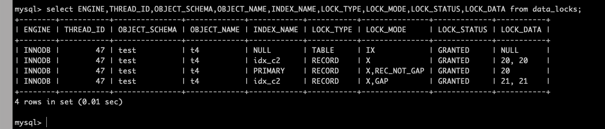

出于对数据并发访问的控制，MySQL引入众多锁的概念。

#### 锁的粒度

按作用的数据范围分类，有表级锁，行级锁。

- 表级锁：作用在整张表上，锁的粒度比较大。
- 行级锁：作用在数据行上，锁的粒度比较小。

再大点的粒度还有全局锁，如 FTWRL（flush table with read lock）禁止全局更新，或者把整个实例设置为read only。

#### 锁的分类

按照锁的兼容性，是否能共存，MySQL又分为共享锁和排它锁。

- 共享锁：简称S锁。S锁可以同时被多个事务持有，最简单的，我们可以用 `select ... lock in share mode` (8.0支持 select ... for share) 加上S锁。

- 排它锁：简称X锁。X锁不能同时被多个事务持有，X锁加锁方式有2种：一是自动加锁，在对数据进行增删改的时候由系统自动加上；二是手动加锁，如 `select ... for update`。

另外还有个意向锁，意向锁是由数据库自己维护的，一般来说，当我们给一行数据加上共享锁之前，数据库会自动在这张表上加上`意向共享锁`(IS锁)；当我们给一行数据加上排它锁之前，数据库会自动在这张表上加上`意向排它锁`(IX锁)。

意向锁可以认为是S锁和X锁在数据表上的标志，通过意向锁可以快速判断表中是否有记录被上锁，从而避免通过遍历的方式来查看表中是否有记录被上锁，提升加锁效率。例如，我们要加表级别的X锁，这时候数据表里如果存在行级别的X锁或者S锁，加锁就会失败，此时直接根据 `意向锁` 就能知道这张表是否有行级别的锁。

简而言之呢，意向锁纯内部使用，在分析锁冲突的时候可不用看它。

#### 表级锁

- S锁。

  lock table t4 read；

  

  给表加上只读锁之后，其它会话不能对这个表update：

  

  可以从 `performance_schema.metadata_locks` 观察到 MDL 锁的情况：

  

  图中显示，48那个线程即执行update语句的线程，在申请表t4上的意向排它锁时被阻塞了，处于PENDING状态，所以update语句将一直被阻塞直到前面那个会话执行 `unlock tables` 释放表锁。

- X锁。

  lock table t4 write；

  表级别的排它锁，一但有会话执行这个操作，那么其它会话执行简单的select都会被阻塞。

  在一会话执行上述语句后，MDL 锁状态为：

  

  其他会话执行简单select：

  

  观察此时的MDL锁状态：

  

  发现，普通select也会尝试对表加共享读锁(图中48线程)，显然处于PENDING被阻塞了。

  所以，这个语句锁定范围大，连普通select都阻塞，一般只在备份恢复的时候用，常见于 mysqldump 生成的文件。

- 自增锁。

  系统针对 `AUTO_INCREMENT` 列，就是用自增锁保证递增的。关于自增锁的行为，有个参数：innodb_autoinc_lock_mode。主要是锁要不要等到insert语句执行完成后再释放锁的区别，[具体可以参考文档](https://dev.mysql.com/doc/refman/5.7/en/innodb-auto-increment-handling.html)。

  只要不去更新主键值(如：update t set id=x where id=y)，就不会出什么意外情况。这也是共识，应该不会有人去写这种奇怪的逻辑吧？

#### InnoDB的行级锁

先复习下MySQL读的类型，有快照读，当前读，半一致性读。

- 快照读：普通select，以及事务里面的select。事务有一个ReadView的概念，RR隔离级别借此实现MVCC，创建ReadView快照的时机是事务里第一条select语句执行的时候，除非显示使用 `start transaction with consistent read` 。
- 当前读：始终读取当前最新的数据，`select ... for share/update` 。另外事务里面的update语句也会采用当前读。
- 半一致性读：这个只存在于RC隔离级别，并且是update语句。

行锁的一个大前提是：Innodb引擎，并且涉及的列有索引。

InnoDB 的行锁，是通过锁住索引来实现的，如果加锁查询的时候没有使用索引，会将整个聚簇索引都锁住(主键上全部加临键锁Next-Key Lock)，相当于锁表。

根据锁定范围不同，行锁又分为：记录锁(Record Lock)，间隙锁(Gap Lock)，临键锁(Next-Key Lock)。

- 记录锁。

  基于唯一索引上的等值或者范围查询，会加记录锁。如果是辅助索引，除了辅助索引会加锁，相应主键索引也会加锁。

  C1是表t4上的唯一索引：

  

  此时，索引c1上应该有7把记录锁(会向右扫描到第一个不符合条件的记录，并且加上记录锁)，相应主键上有6把锁。

  

  注意c1=11这行记录，只有c1索引加锁了，没有去主键上面加锁，所以：

  

- 间隙锁。

  间隙锁指的是两个记录之间逻辑上尚未填入数据的部分，主要是为了解决幻读而引入。普通索引等值查询，唯一索引范围查询都会加GAP锁。就拿上述例子来看，c1索引上的(2,5),(7,11)其实是被加上了间隙锁的，验证：

  

  c1=8 在 (7,11) 的间隙，所以插入会被阻塞，查看此时的行锁情况：

  

  显示，c1索引上的X,GAP,INSERT_INTENTION处于PENDING状态，对应记录值是11，明显GAP锁冲突。

- 临键锁。

  即Next-Key Lock，Lock ORDINARY，指的是间隙加上它右边的记录组成的左开右闭区间。

  MySQL默认的行锁类型就是临键锁，唯一索引上的等值查询并且命中记录则退化成记录锁，唯一索引上的等值查询未命中记录则退化成间隙锁。

  

  c1=21 未匹配到任何记录，临键锁退化成间隙锁：

  

  (20,+) 20到正无穷的区间被锁住，此时插入c1=22的记录将被阻塞：

  

#### 行锁试验

###### 无索引

t4表上c2列没有索引，

```sql
mysql> show create table t4;
+-------+--------------------------------------------------------------------------------------------------------------------------------------------------------------------------------------------------------------------------------------------------+
| Table | Create Table                                                                                                                                                                                                                                     |
+-------+--------------------------------------------------------------------------------------------------------------------------------------------------------------------------------------------------------------------------------------------------+
| t4    | CREATE TABLE `t4` (
  `id` int NOT NULL AUTO_INCREMENT,
  `c1` int DEFAULT NULL,
  `c2` int DEFAULT '0',
  PRIMARY KEY (`id`),
  UNIQUE KEY `idx_c1` (`c1`)
) ENGINE=InnoDB AUTO_INCREMENT=23 DEFAULT CHARSET=utf8mb4 COLLATE=utf8mb4_general_ci |
+-------+--------------------------------------------------------------------------------------------------------------------------------------------------------------------------------------------------------------------------------------------------+
1 row in set (0.01 sec)

mysql>
```


此时观察行锁情况：


发现主键索引上全部被加上了临键锁，还有个 `supremum pseudo-record` 虚拟最大值，意味着整个表现在不可以插入任何数据，效率极低。


GAP锁冲突，验证了主键索引上加的是临键锁，即Next-Key lock，每个都是左开右闭区间。

包括 `select * from t4 where id=21 for update;` 和 `update t4 set c1=c1+1 where id=21;` 这种都会被阻塞，不过这时候是记录锁冲突，不是GAP锁冲突了：


顺带说一下，DDL语句会加表级别的IX锁，所以此时 alter table 等DDL语句也会被阻塞。

最开始那个查询语句，除了加行锁，还有MDL锁，先看一眼：


可见MDL锁冲突了，t4表级别排它锁需要等待。

###### 普通索引




可见，c2=20 被加上了临键锁，主键20被加上记录锁，另外(20,21)是有一个GAP锁，因为最后一个记录的c2值是21，类型是int，所以这个GAP没什么意义。此时插入c2=15的值被阻塞，因为(11,20)有个GAP锁：


此时若插入c2=21的值，就没有问题，因为c2=21上没有记录锁。

这是命中记录的情况，未命中呢？


仅在c2=20上加了GAP锁，此时插入[11,19]的c2值将被阻塞，锁冲突情况如图：


按照左开右闭的原则，c2=11应该不会被阻塞，但是这里实际上是会被阻塞的，因为GAP锁会阻塞意向插入锁，即图中INSERT_INTENSTION，但是意向插入锁不会阻塞GAP锁，这个可能难以理解，举例看看：

```sql
update t4 set c2=15 where id=20;
//id=20上有记录锁，同时c2上会有隐式的插入意向锁
```

```sql
select * from t4 where c2=16 for update;
//只有c2上面GAP锁
```

因为 c2=15和c2=16的记录都不存在，c2有(11,20)的区间，所以，上面如果先执行update语句，后执行select...for update，则不会被阻塞，因为插入意向锁不会阻塞GAP锁；相反，先执行select...for update，后执行update，就会被阻塞，因为GAP锁会阻塞插入意向锁。

范围查询呢？


这里c2索引上c2=7的那行显示加上了临键锁，这据说是个bug，实际这里应该只是个GAP锁，因为此时insert c2=7的值是可以成功的，insert c2=6的值会被阻塞。

###### 唯一索引

等值查询，匹配到记录的时候加的是索引上的记录锁和主键上的记录锁，X,REC_NOT_GAP；未匹配到记录的时候，加的是索引上的下一个记录的GAP锁，X,GAP，如果没有下一条记录，则加在supremum pseudo-record虚拟列上的临键锁，其实作用是一样的。

范围查询，将符合条件的索引列加上临键锁，X，相应的回溯到主键索引上加记录锁，X，REC_NOT_GAP，同时向右扫描到第一个不满足的记录，并且加上临键锁（但是不回溯到主键加锁）。

总之，间隙锁和临键锁都是用来解决幻读问题的，在RC隔离级别下，两者都会失效。

#### 其他锁

你可能还听说过许多其它锁，`自旋锁` 用于innodb内部cpu的资源分配；`备份锁`，8.0引入的，`lock instance for backup` ，会阻塞ddl操作，不会影响普通update。

#### 总结

最重要的表锁和行锁，MDL锁及行锁，要会用各种手段和工具去分析现象。MDL锁可以从表 perfomance_schema.medadata_locks 查看，行锁可以从 performance_schema.data_locks 查看，其他情况可以从 `show engine innodb status` 查看或者其他方式。

