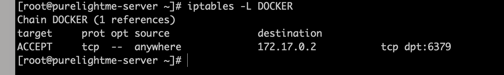

### 简介

了解 Docker 网络模式，Docker 如何操作 iptables 以实现网络端口映射，使用 iptables 控制主机网络流量规则。

#### Docker网络模式

##### Bridge模式

当`Docker`进程启动时，会在主机上创建一个名为`docker0`的虚拟网桥，此主机上启动的`Docker`容器会连接到这个虚拟网桥上。虚拟网桥的工作方式和物理交换机类似，这样主机上的所有容器就通过交换机连在了一个二层网络中。从`docker0`子网中分配一个 IP 给容器使用，并设置 docker0 的 IP 地址为容器的**默认网关**。在主机上创建一对虚拟网卡`veth pair`设备，Docker 将 veth pair 设备的一端放在新创建的容器中，并命名为`eth0`（容器的网卡），另一端放在主机中，以`vethxxx`这样类似的名字命名，并将这个网络设备加入到 docker0 网桥中。`bridge`模式是 docker 的默认网络模式，不写`–net`参数，就是`bridge`模式。使用`docker run -p`时，docker 实际是在`iptables`做了`DNAT`规则，实现端口转发功能。可以使用`iptables -vnL`查看。

##### Host模式

如果启动容器的时候使用`host`模式，那么这个容器将不会获得一个独立的`Network Namespace`，而是和宿主机共用一个 Network Namespace。容器将不会虚拟出自己的网卡，配置自己的 IP 等，而是使用宿主机的 IP 和端口。但是，容器的其他方面，如文件系统、进程列表等还是和宿主机隔离的。

##### Container模式

这个模式指定新创建的容器和已经存在的一个容器共享一个 Network Namespace，而不是和宿主机共享。新创建的容器不会创建自己的网卡，配置自己的 IP，而是和一个指定的容器共享 IP、端口范围等。同样，两个容器除了网络方面，其他的如文件系统、进程列表等还是隔离的。两个容器的进程可以通过 lo 网卡设备通信。

##### None模式

使用`none`模式，Docker 容器拥有自己的 Network Namespace，但是，并不为Docker 容器进行任何网络配置。也就是说，这个 Docker 容器没有网卡、IP、路由等信息。需要我们自己为 Docker 容器添加网卡、配置 IP 等。

#### Iptables使用

```shell
[root@purelightme-server ~]# iptables -h
iptables v1.4.21

Usage: iptables -[ACD] chain rule-specification [options]
       iptables -I chain [rulenum] rule-specification [options]
       iptables -R chain rulenum rule-specification [options]
       iptables -D chain rulenum [options]
       iptables -[LS] [chain [rulenum]] [options]
       iptables -[FZ] [chain] [options]
       iptables -[NX] chain
       iptables -E old-chain-name new-chain-name
       iptables -P chain target [options]
       iptables -h (print this help information)

Commands:
Either long or short options are allowed.
  --append  -A chain		Append to chain
  --check   -C chain		Check for the existence of a rule
  --delete  -D chain		Delete matching rule from chain
  --delete  -D chain rulenum
				Delete rule rulenum (1 = first) from chain
  --insert  -I chain [rulenum]
				Insert in chain as rulenum (default 1=first)
  --replace -R chain rulenum
				Replace rule rulenum (1 = first) in chain
  --list    -L [chain [rulenum]]
				List the rules in a chain or all chains
  --list-rules -S [chain [rulenum]]
				Print the rules in a chain or all chains
  --flush   -F [chain]		Delete all rules in  chain or all chains
  --zero    -Z [chain [rulenum]]
				Zero counters in chain or all chains
  --new     -N chain		Create a new user-defined chain
  --delete-chain
            -X [chain]		Delete a user-defined chain
  --policy  -P chain target
				Change policy on chain to target
  --rename-chain
            -E old-chain new-chain
				Change chain name, (moving any references)
Options:
    --ipv4	-4		Nothing (line is ignored by ip6tables-restore)
    --ipv6	-6		Error (line is ignored by iptables-restore)
[!] --protocol	-p proto	protocol: by number or name, eg. `tcp'
[!] --source	-s address[/mask][...]
				source specification
[!] --destination -d address[/mask][...]
				destination specification
[!] --in-interface -i input name[+]
				network interface name ([+] for wildcard)
 --jump	-j target
				target for rule (may load target extension)
  --goto      -g chain
                              jump to chain with no return
  --match	-m match
				extended match (may load extension)
  --numeric	-n		numeric output of addresses and ports
[!] --out-interface -o output name[+]
				network interface name ([+] for wildcard)
  --table	-t table	table to manipulate (default: `filter')
  --verbose	-v		verbose mode
  --wait	-w [seconds]	maximum wait to acquire xtables lock before give up
  --wait-interval -W [usecs]	wait time to try to acquire xtables lock
				default is 1 second
  --line-numbers		print line numbers when listing
  --exact	-x		expand numbers (display exact values)
[!] --fragment	-f		match second or further fragments only
  --modprobe=<command>		try to insert modules using this command
  --set-counters PKTS BYTES	set the counter during insert/append
[!] --version	-V		print package version.
```

iptables 通过3个 chain（INPUT,FORWARD,OUTPUT）即可完成对网络流量的控制，其屏蔽了底层操作 netfilter 的细节，常用案例：

- 阻止其他主机的ping请求

  ```shell
  iptables -A INPUT -p icmp -j REJECT
  ```

- 开放本机的9501端口

  ```shell
  iptables -I INPUT -p tcp --dport 9501 -j ACCEPT
  iptables -I INPUT -p udp --dport 9501 -j ACCEPT
  ```

  这里 --dport 必须配合 -p 参数一起使用，不然会报错。

- 禁止本机访问外部web服务

  ```shell
  iptables -A OUTPUT -p tcp --dport 80 -j REJECT
  ```

使用 `iptables -L` 可以查看已设置的规则，`iptables -D` 可以删除规则，iptables 命令执行完是即时生效的，但是如果主机重启，已设置的规则就会丢失，这里可以使用 `iptables-save ` 和 `iptables-restore` 。

iptables-save 将现有规则保存成文件，iptables-restore 从文件中恢复规则。

#### Docker与Iptables

```shell
docker run -d --name redis01 -p 6380:6379 redis
```

该命令执行后，docker 会在 iptables 自定义链 DOCKER 中定义转发规则，如果此时系统的 `net.ipv4.ip_forward` 为0，该命令执行完会提示：WARNING: IPv4 forwarding is disabled. Networking will not work，只需打开该配置就行了，无需重启容器。



此时查看 DOCKER 链可以看到添加了一条允许所有来源转发到6379端口的流量，用 redis-cli 也可以顺利连上，如果我们手动执行:

```shell
iptables -I FARWORD -p tcp --dport 6379 -j REJECT
```

发现现在 redis-cli 连不上了~ 将命令中的 -I 换成 -D 删除即可。

#### Tips

开发中，经常会遇到容器里面放问宿主机的情况，除了使用 `host.docker.internal` 之外，还可以配置 extra_hosts 解决，因为 docker0 与 宿主机是相通的，直接用 `ifconfig` 查看宿主机 `en0` 网卡的ip地址，配置到 extra_hosts 即可，如：

```
version: '3'

networks:
  web-network:
    driver: bridge

services:
  fpm:
    build:
      context: ./fpm
    ports:
      - '8080:8080'
    networks:
      - web-network
    extra_hosts:
      - "test.com:192.168.1.100"
```

##### 其它

iptables 在  centos 系列正在逐渐被 firewalld 替换，firewalld 底层也是操作的 iptables ，在同时操作这两个工具的时候就容易出现互相覆盖影响的情况，建议两个不要同时使用，使用其一即可。

