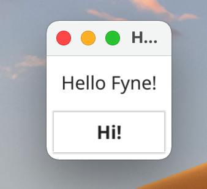
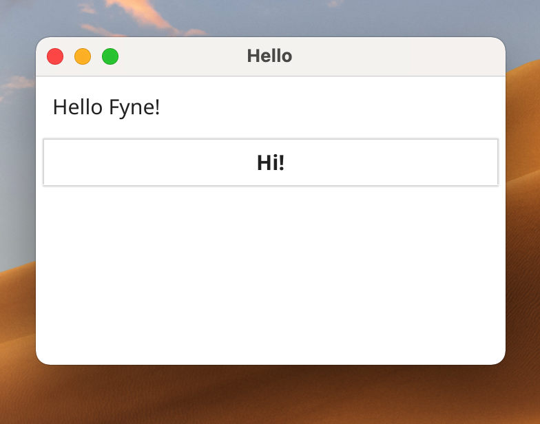
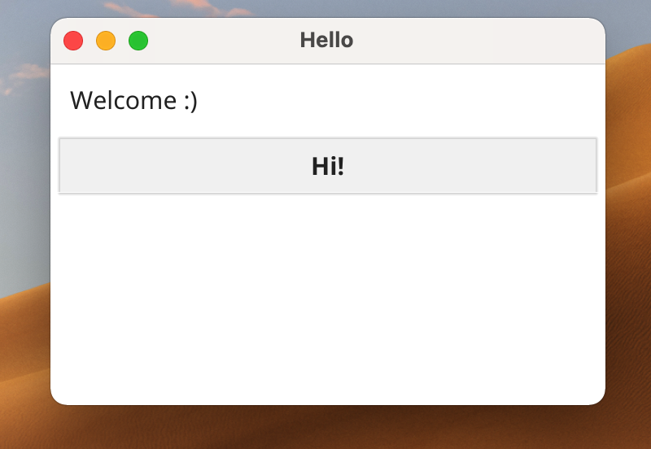
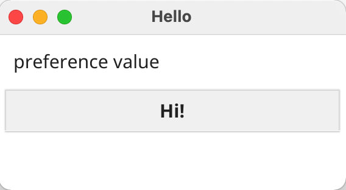
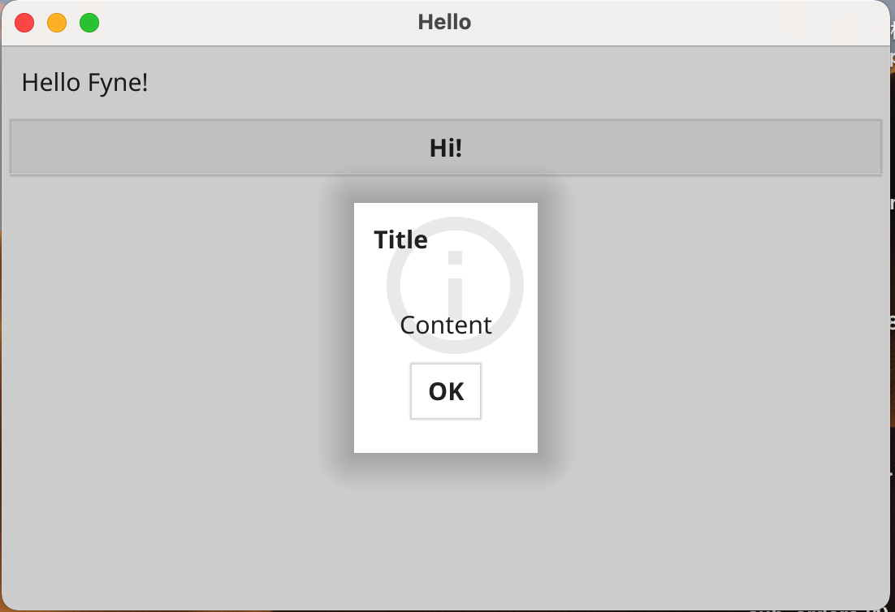
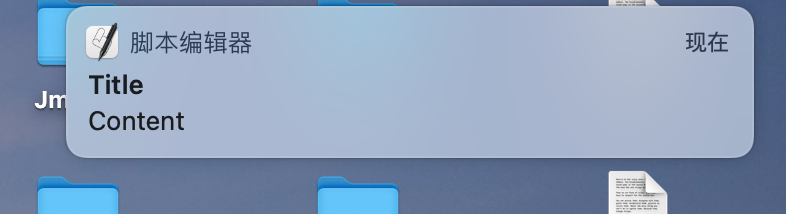
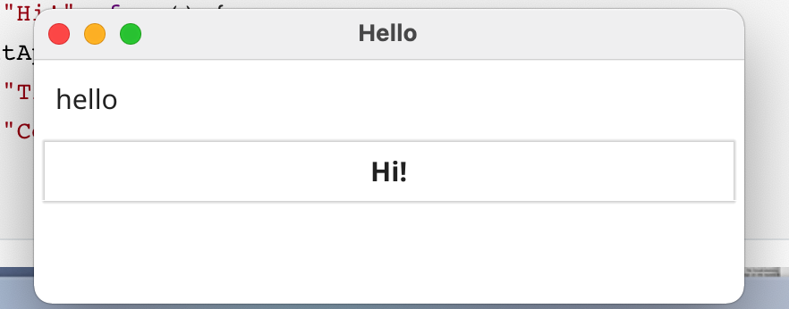

### 简介

Fyne 是构建桌面端应用的选型之一，其使用 Golang 语言开发，借助语言的优势，既能保证高效开发，又能有不错的性能。准确来说，Fyne 不仅仅是一个 GUI 方案，它是跨平台的，一套代码，借助 fyne-cross ，可以打包成 Windows，MacOS，Android，Ios，Linux 端的应用，其 UI 组件设计风格参考了 Material Design ，并且作者维护很积极，文档完善，如果你正在考虑使用哪款工具构建 GUI 程序，那我觉得你可以试试 Fyne(https://github.com/fyne-io/fyne) 。

### 基本使用

截止目前，Fyne 的最新版本是 2.1.2。先看看 QuickStart：

```shell
mkdir fyne-demo
cd fyne-demo
go mod init fyne-demo
go get fyne.io/fyne/v2
```

然后新建 main.go ,写一个最简单的示例

```go
package main

import (
	"fyne.io/fyne/v2/app"
	"fyne.io/fyne/v2/container"
	"fyne.io/fyne/v2/widget"
)

func main() {
	a := app.New()
	w := a.NewWindow("Hello")

	hello := widget.NewLabel("Hello Fyne!")
	w.SetContent(container.NewVBox(
		hello,
		widget.NewButton("Hi!", func() {
			hello.SetText("Welcome :)")
		}),
	))

	w.ShowAndRun()
}
```

使用 go run main.go 运行程序，即可



窗口默认为所有组件的 MinSize ，最小尺寸，我们可以拖动手动缩放将窗口调大：



点击 ”Hi!“ 按钮，上排的文本将会变成 "Welcome :)"：



例子很简单，但展示了使用 Fyne 开发的基本流程，`app.New()` 创建 app ，`a.NewWindow()` 表示创建一个窗口，`w.SetContent()` 给窗口设置内容，完了之后使用 `w.ShowAndRun()` 显示窗口并运行程序，程序将阻塞在这里，开启 EventLoop ，这样，GUI 程序就启动了~

###### 基础组件

`fyne.io/fyne/v2/widget ` 这个子包里面包含了大部分 fyne 的自带组件，场景的有以下几种:

- `Label` 。`widget.NewLabel(text string) *Label `创建一个文本组件，展示一段文本，可使用 `\n` 换行。NewLabelWithStyle(text string, alignment fyne.TextAlign, style fyne.TextStyle) 可指定文本的对齐方式以及文本样式，但这里的文本样式仅包括文本的加粗，倾斜，是否使用系统等宽字体，Tab键宽度。
- `Button` 。`widget.NewButton(label string, tapped func()) *Button `创建一个按钮组件，可以响应用户点击事件，默认文本是居中的，还有个 `widget.NewButtonWithIcon(label string, icon fyne.Resource, tapped func()) *Button` 可以在文本前加 icon 。
- `Entry` 。`widget.NewEntry() *Entry` 创建一个输入框，用于统计用户输入，`widget.NewPasswordEntry() *Entry` 创建密码输入框，`widget.NewMultiLineEntry() *Entry` 创建多行文本输入框，类似 textarea 。
- `Choices` 。`widget.NewCheck(label string, changed func(bool)) *Check` 主要用于多选框场景，`NewRadioGroup(options []string, changed func(string))  *RadioGroup` 主要用于单选场景，`NewSelect(options []string, changed func(string))  *Select` 用于下拉选择场景。
- `Form` 。`widget.NewForm(items ...*FormItem)  *Form` 用于构造表单，该组件可保证表单项对齐，不用过多考虑样式问题，直接使用默认样式即可。
- `Toobar` 。`widget.NewToolbar(items ...ToolbarItem) *Toolbar ` 可构造顶部帮助按钮之类的 toolbar。
- `List` 。`NewList(length func() int, createItem func() fyne.CanvasObject, updateItem func(ListItemID, fyne.CanvasObject)) *List` 可构造列表数据。
- `Table` 。`NewTable(length func() (int, int), create func() fyne.CanvasObject, update func(TableCellID, fyne.CanvasObject)) *Table` 用于展示大量表格数据。

###### 存储

Fyne 支持 Preference Api，要使用 Preference 必须用 `app.NewWithID("com.xxx.yyy")` 初始化 app ，使用示例：

```go
package main

import (
	"fyne.io/fyne/v2/app"
	"fyne.io/fyne/v2/container"
	"fyne.io/fyne/v2/widget"
)

func main() {
	a := app.NewWithID("com.xxx.yyy")
	w := a.NewWindow("Hello")

	hello := widget.NewLabel("Hello Fyne!")
	a.Preferences().SetString("a","preference value")
	w.SetContent(container.NewVBox(
		hello,
		widget.NewButton("Hi!", func() {
			hello.SetText(a.Preferences().String("a"))
		}),
	))

	w.ShowAndRun()
}
```

点击按钮后：



###### 弹出框

```go
widget.NewButton("Hi!", func() {
			dialog.ShowInformation("Title","Content",w)
}),
```



```go
widget.NewButton("Hi!", func() {
			fyne.CurrentApp().SendNotification(&fyne.Notification{
				Title:   "Title",
				Content: "Content",
			})
}),
```



```go
package main

import (
	"fyne.io/fyne/v2/app"
	"fyne.io/fyne/v2/container"
	"fyne.io/fyne/v2/storage"
	"fyne.io/fyne/v2/widget"
)

func main() {
	a := app.NewWithID("com.xxx.yyy")
	w := a.NewWindow("Hello")

	hello := widget.NewLabel("Hello Fyne!")

	resource := storage.NewFileURI("./fyne.txt")
	writer,_ := storage.Writer(resource)
	writer.Write([]byte{'h','e','l','l','o'})

	w.SetContent(container.NewVBox(
		hello,
		widget.NewButton("Hi!", func() {
			reader,_ := storage.Reader(resource)
			defer reader.Close()
			content := make([]byte,1024)
			reader.Read(content)
			hello.SetText(string(content))
		}),
	))

	w.ShowAndRun()
}
```



并且该方法将在项目根目录下创建 fyne.txt 文件~

###### 布局

- `NewHBox(objects ...fyne.CanvasObject) *fyne.Container` 垂直布局子组件，宽度取所有子组件的最大的 MinSize 。类似的有 `NewVBox(objects ...fyne.CanvasObject) *fyne.Container` 水平布局，高度取所有子组件最大的 MinSize 。
- `NewGridWithColumns(cols int, objects ...fyne.CanvasObject) *fyne.Container` 固定列数的网格布局。
- `NewBorder(top, bottom, left, right fyne.CanvasObject, objects ...fyne.CanvasObject) *fyne.Container` Border 布局，Fyne 不支持 margin，padding 那些，所以这个 Border 布局使用的场景还是比较多的，objects 将居中布局。

###### canvas

渲染图片：

```go
img := canvas.NewImageFromResource(theme.FyneLogo())
img.FillMode = canvas.ImageFillOriginal
```

自定义颜色的文本：

```go
NewText(text string, color color.Color) *Text
```

### 常见问题

###### 中文支持问题

使用自定义主题，`fyne bundle` 将字体文件打包成资源即可。

###### windows console 问题

推荐使用 fyne-cross ，基于 docker ，自动打包，还支持各种自定义需求。

###### window 被系统关闭，不能再次打开问题

```go
w.SetCloseIntercept(func() {
		w.Hide()
})
```

覆盖系统关闭按钮的逻辑，使用隐藏，而不是”关闭“。

###### 怎么设置logo？

```go
logo,_ := fyne.LoadResourceFromPath("logo.png")
a.SetIcon(logo)
```

### 总结

Fyne 比较友好的一点是，使用 Golang 语言，可方便使用协程的优点，对常年做后端的人来说上手很快。样式方面，支持自定义主题，色彩方便，偏黑白系，没有 element-ui 那种组件库那么完善，所以总体感觉样式风格偏朴素。

