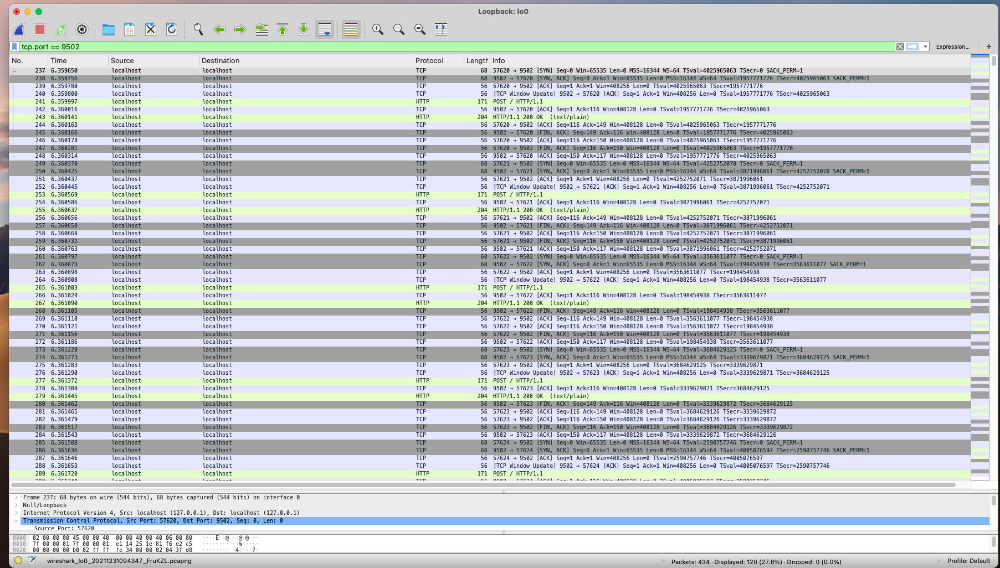

### 说明

Http 连接是很珍贵的资源，其基于 Tcp ，Http1.1 的 Connection: keep-alive 使得 Http 客户端在发完一个请求后并不会立即关闭 Tcp 连接，它会继续等待一段时间，如果该连接上又有新的 Http 请求，就复用这个连接。

Tcp 主动关闭的一方会有 TIME_WAIT 状态，该状态会占用端口资源，如果服务器在短时间内发起大量的外部 Http 请求，将会积压很多 TIME_WAIT 连接，消耗服务器资源，甚至可能导致一些不可预料的bug。

所以，复用 Http 请求连接就显得格外重要，当然，Golang 是支持我们复用这个连接的，原理就是利用 http.Client 的参数 [Transport](https://pkg.go.dev/net/http#Transport) 。

> Transport is an implementation of RoundTripper that supports HTTP, HTTPS, and HTTP proxies (for either HTTP or HTTPS with CONNECT).
>
> By default, Transport caches connections for future re-use.

### 客户端测试

```go
type Transport struct {
  .......
  // MaxIdleConns controls the maximum number of idle (keep-alive)
  // connections across all hosts. Zero means no limit.
  MaxIdleConns int

  // MaxIdleConnsPerHost, if non-zero, controls the maximum idle
  // (keep-alive) connections to keep per-host. If zero,
  // DefaultMaxIdleConnsPerHost is used.
  MaxIdleConnsPerHost int

  // MaxConnsPerHost optionally limits the total number of
  // connections per host, including connections in the dialing,
  // active, and idle states. On limit violation, dials will block.
  //
  // Zero means no limit.
  MaxConnsPerHost int
  
  // IdleConnTimeout is the maximum amount of time an idle
	// (keep-alive) connection will remain idle before closing
	// itself.
	// Zero means no limit.
	IdleConnTimeout time.Duration
  ......
}
```

我们自定义 Transport ，设置 `MaxConnsPerHost` 参数即可限制每个 Host 的最大连接数。这里需要注意的是，IP:PORT 这样一个元组区分不同的 Host 。

在多提一点，默认的 Transport ：

```go
// DefaultTransport is the default implementation of Transport and is
// used by DefaultClient. It establishes network connections as needed
// and caches them for reuse by subsequent calls. It uses HTTP proxies
// as directed by the $HTTP_PROXY and $NO_PROXY (or $http_proxy and
// $no_proxy) environment variables.
var DefaultTransport RoundTripper = &Transport{
	Proxy: ProxyFromEnvironment,
	DialContext: (&net.Dialer{
		Timeout:   30 * time.Second,
		KeepAlive: 30 * time.Second,
		DualStack: true,
	}).DialContext,
	ForceAttemptHTTP2:     true,
	MaxIdleConns:          100,
	IdleConnTimeout:       90 * time.Second,
	TLSHandshakeTimeout:   10 * time.Second,
	ExpectContinueTimeout: 1 * time.Second,
}
```

即默认 MaxConnsPerHost 是没有限制的。

main.go:

```go
package main

import (
	"fmt"
	"io/ioutil"
	"log"
	"net/http"
	"sync"
	"time"
)

func main()  {
	client := &http.Client{
		Timeout: time.Second * 10,
		Transport: &http.Transport{
			MaxConnsPerHost:1,
		},
	}
	var wg sync.WaitGroup
	wg.Add(10)
	for i := 0;i < 10 ;i++  {
		go NewRequest(&wg,client)
	}
	wg.Wait()
	fmt.Println("全部完成")
}

func NewRequest(wg *sync.WaitGroup,client *http.Client)  {
	defer wg.Done()
	req,err := http.NewRequest("POST","http://*********:9502",nil)
	if err != nil {
		log.Fatal(err)
	}
	res,err := client.Do(req)
	if err != nil {
		log.Fatal(err)
	}
	defer res.Body.Close()
	content,err := ioutil.ReadAll(res.Body)
	if err != nil {
		log.Fatal(err)
	}
	fmt.Println(string(content))
}
```

### 抓包验证

使用 Wireshark 抓包，tcp.port == 9502 过滤之后可以清晰的观察到整个过程只有一次 TCP 的三次握手和四次挥手过程：


Follow Http 可以看到整个过程是串行的：


### 前提

复用连接的前提是客户端，服务端同时支持，如果任意一方不支持，连接将不会被复用。调整服务端代码：

```go
  s := &http.Server{
		Addr:           ":9502",
		Handler:        r, // < here Gin is attached to the HTTP server
		//  ReadTimeout:    10 * time.Second,
		//  WriteTimeout:   10 * time.Second,
		//  MaxHeaderBytes: 1 << 20,
	}
	s.SetKeepAlivesEnabled(false)
	err := s.ListenAndServe()
	if err != nil {
		fmt.Println(err)
	}
```

客户端再测试抓包：



很明显，连接没有复用，仔细数的话有10次连接重建的过程。但在客户端这边是始终只保持一个连接的，后续请求都是在前面的连接关闭之后再发起的。

### 其他参数

`MaxIdleConns` 限制最大空闲连接数，`MaxIdleConnsPerHost` 限制单个 Host 最大空闲连接数。

调整客户端代码：

```go
client := &http.Client{
		Timeout: time.Second * 10,
		Transport: &http.Transport{
			MaxIdleConnsPerHost:1,
			MaxConnsPerHost:2,
			IdleConnTimeout:time.Second * 2,
		},
	}
	var wg sync.WaitGroup
	wg.Add(6)
	for i := 0;i < 2 ;i++  {
		go NewRequest(&wg,client)
	}
	time.Sleep(time.Second * 3)
	for i := 0;i < 2 ;i++  {
		go NewRequest(&wg,client)
	}
	time.Sleep(time.Second * 3)
	for i := 0;i < 2 ;i++  {
		go NewRequest(&wg,client)
	}
	wg.Wait()
```

同时恢复服务端，支持连接复用，再抓包观察：


可以明显看到是两个连接建立，各发起一个请求，然后两个连接关闭；再重复该过程。

调整请求间隔：

```go
client := &http.Client{
		Timeout: time.Second * 10,
		Transport: &http.Transport{
			MaxIdleConnsPerHost:1,
			MaxConnsPerHost:2,
			IdleConnTimeout:time.Second * 2,
		},
	}
	var wg sync.WaitGroup
	wg.Add(6)
	for i := 0;i < 2 ;i++  {
		go NewRequest(&wg,client)
	}
	time.Sleep(time.Second)
	for i := 0;i < 2 ;i++  {
		go NewRequest(&wg,client)
	}
	time.Sleep(time.Second * 3)
	for i := 0;i < 2 ;i++  {
		go NewRequest(&wg,client)
	}
	wg.Wait()
```


这一次又有不同，这个是只 Sleep 1秒，由于 MaxIdleConnsPerHost=1 所以第一波两个请求发完，必须关闭其中一个连接，没有到达 IdleConnTimeout ，所以第一波的另外一个连接可以复用，只需创建一个新连接即可完成第二波请求。后面 Sleep 3秒，显然都过了 Idle 时间，两个连接都关闭了再发起最后一波请求。

### 总结

服务间接口调用，尤其是需要调用第三方接口的场景，复用连接对性能非常有帮助。合理设置相关参数，做到”心中有数“。


`2021-12-31`

