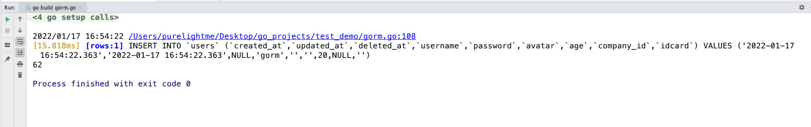
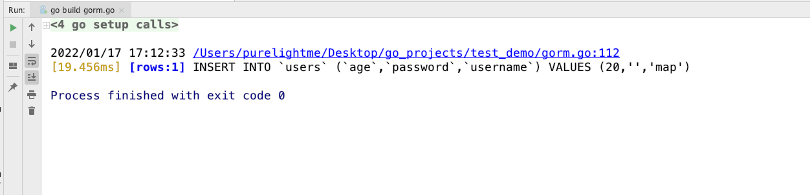

### 简介

[gorm](https://gorm.io/) 是 go orm 实现之一，这篇文章将以 mysql 为例，带你体验 gorm 80%+ 的内容。

##### 安装

```
go get -u gorm.io/gorm
go get -u gorm.io/driver/mysql
```

##### 连接池

```go
db, err := gorm.Open(mysql.Open("root:root@tcp(localhost:3306)/demo?parseTime=true&loc=Asia%2FShanghai"), &gorm.Config{})
	if err != nil {
		log.Fatal(err)
	}
	sqlDb, _ := db.DB()
	sqlDb.SetMaxOpenConns(5)
	sqlDb.SetMaxIdleConns(2)
	sqlDb.SetConnMaxIdleTime(time.Minute)
```

这样就初始化了一个最大连接数为5，最大空闲连接数为2，最大空闲时间为1分钟的连接池。后续直接使用 db 操作数据库即可。

##### AutoMigrate

gorm 使用结构体标识 table ，即一个 struct 对应数据库里的一个 table 。

```go
type BaseModel struct {
	ID        uint      `gorm:"primary_key" json:"id"`
	CreatedAt JsonTime  `json:"created_at"`
	UpdatedAt JsonTime  `json:"updated_at"`
	DeletedAt gorm.DeletedAt `sql:"index" json:"-"`
}

type User struct {
	BaseModel
	Username string `json:"username"`
	Password string `json:"password"`
	Avatar string `json:"avatar"`
	Age *int
}

err = db.AutoMigrate(&models.User{})
	if err != nil {
		log.Fatal(err)
	}
```

JsonTime 是内嵌 time.Time 的自定义类型，主要用于格式化日期，以更好的符合国内使用者的习惯。

```go
type JsonTime struct {
	time.Time
}

func (t JsonTime)MarshalJSON()([]byte,error)  {
	str := fmt.Sprintf("\"%s\"", t.Format("2006-01-02 15:04:05"))
	return []byte(str),nil
}

func (t JsonTime)Value()(driver.Value,error)  {
	var zeroTime time.Time
	if t.Time.UnixNano() == zeroTime.UnixNano() {
		return nil,nil
	}
	return t.Time,nil
}

func (t *JsonTime)Scan(v interface{}) error  {
	value,ok := v.(time.Time)
	if ok {
		*t = JsonTime{Time: value}
		return nil
	}
	return fmt.Errorf("error %v",v)
}
```

运行代码，gorm 就会自动帮你把 table 创建出来，名称规范遵循 `蛇形命名` 。

##### 创建记录

```go
age := 20
	user := models.User{Username:"gorm",Password:"",Age:&age}
	db.Debug().Create(&user)
	fmt.Println(user.ID)
```

Debug() 将会在终端显示运行的 sql 语句：



也可以使用 map 创建记录，但是必须通过 Model() 或者 Table() 指定表名。

```go
user := map[string]interface{}{
		"username":"map",
		"password":"",
		"age":20,
	}
	db.Debug().Model(&models.User{}).Create(&user)
```



##### 更新

```go
var user models.User
	db.Last(&user)
	user.Avatar = "xxxx"
	*user.Age += 1
	db.Debug().Save(&user)
	fmt.Println(user)
```

只要模型具有 ID 属性且不为空，Save() 将做全字段更新，可以使用 Select 指定需要更新的字段，只需更新一个字段则使用 UpdateColumn() 更为方便。

使用 struct 更新默认不会更新零值，可以通过 Select 或者使用 map 更新解决。

##### 删除

```go
tx := db.Debug().Where("name = ?", "jinzhu").Delete(&email)
	if tx.Error != nil {
		log.Fatal(tx.Error)
	}
	fmt.Println(tx.RowsAffected)
```

gorm 默认使用软删除，Delete 方法实际是做更新操作。如果强制删除，则添加 .Unscoped() 方法。

##### 查询

查询涉及到的内容就比较多了，gorm 使用链式 Api ，跟其他语言的 ORM 使用起来非常类似。

```go
var user models.User
db.Debug().First(&user)
db.Debug().Where("username = ?","purelight").First(&user)
db.Debug().Find(&user,18)
var age int
db.Debug().Select("age").Model(&models.User{}).First(&age)
```

有两个比较重要的，一是确定 table ，这个可以通过 Model() ，Table() ，或者通过 Find 等 `Finisher` 方法的结构体指针参数确定；二是获取查询结果，除了直接映射到结构体指针和map指针外，还可以使用 .Rows() 然后去遍历。

另外由于默认采用了软删除，所以 gorm 在查询是会自动带上 deleted_at is not null 的条件。

其他常见的 Where，Order，GroupBy，Offset，Limit，Distinct，Join，Count 都是支持的，详细可查阅具体文档。

##### Scope

```go
func AgeOfAdult(db *gorm.DB) *gorm.DB  {
	return db.Where("age >= ?",18)
}

db.Scopes(AgeOfAdult).First(&user)
```

很好理解，跟 Laravel 的 scope 相似，用于封装通用过滤条件。

##### 模型关联

- Belongs To

  ```go
  type Pet struct {
  	BaseModel
  	Name *string `json:"name"`
  	Age *int `json:"age"`
  	UserID int `json:"-"`
  	User User `json:"-"`
  }
  ```

  pet 属于 user ，UserID 是外键，对应的数据表列名是 user_id ，当然，可以通过 tag 修改默认映射的列名，比如我们数据表列名是 u_id ，只需：

  ```gp
  type Pet struct {
  	BaseModel
  	Name *string `json:"name"`
  	Age *int `json:"age"`
  	UserID int `json:"-" gorm:"column:u_id"`
  	User User `json:"-"`
  }
  ```

  如果我们的 struct 已经有一个 UID 字段并且就是外键，我们可以重写外键：

  ```go
  type Pet struct {
  	BaseModel
  	Name *string `json:"name"`
  	Age *int `json:"age"`
  	UID int
  	User User `json:"-" gorm:"foreignKey:UID"`
  }
  ```

  如果不是关联的 user 的 id ，比如 name ，则可以重写引用：

  ```go
  type Pet struct {
  	BaseModel
  	Name *string `json:"name"`
  	Age *int `json:"age"`
  	UserID int `json:"-"`
    User User `json:"-" gorm:"references:Name"`
  }
  ```

  查询使用 Preload() 可以提前加载关联，可以避免 `N+1` 的问题。

- Has One

  ```go
  type User struct {
    gorm.Model
    CreditCard CreditCard
  }
  
  type CreditCard struct {
    gorm.Model
    Number string
    UserID uint
  }
  ```

  可见，与 Belongs To 相似。

  还有种自引用：

  ```go
  type Area struct {
  	BaseModel
  	Name string
  	ParentID *uint
  	Children []Area `gorm:"ForeignKey:ParentID"`
  }
  ```

- HasMany

  ```go
  type User struct {
  	BaseModel
  	Username string `json:"username"`
  	Password string `json:"password"`
  	Avatar string `json:"avatar"`
  	Age *int
  	CreditCards []CreditCard
  }
  ```

  就是将 Has One 的单个模型改成 slice 。

- 多态（适用于 Has One 和 Has Many）

  ```go
  type Cat struct {
  	BaseModel
  	Name string
  	Animal Animal  `gorm:"polymorphic:Owner;"`
  }
  
  type Dog struct {
  	BaseModel
  	Name string
  	Animal Animal `gorm:"polymorphic:Owner;"`
  }
  
  type Animal struct {
  	BaseModel
  	Name string
  	OwnerID int
  	OwnerType string
  }
  
  tx := db.Create(&models.Dog{Name:"dog1",Animal:models.Animal{Name:"dog1"}})
  	fmt.Println(tx.Error)
  	var dog models.Dog
  	tx = db.Debug().Model(models.Dog{}).Preload("Animal").First(&dog)
  	if tx.Error != nil {
  		log.Fatal(tx.Error)
  	}
  	fmt.Println(dog.Animal)
  ```

- Many To Many

  ```go
  type Languages struct {
  	BaseModel
  	Name string
  	Users []User `gorm:"many2many:user_languages"`
  }
  
  type User struct {
  	BaseModel
  	Username string `json:"username"`
  	Languages []Languages `gorm:"many2many:user_languages;"`
  }
  ```

  这里会创建中间表 user_languages ，表仅有两列：user_id 和 language_id 。

虽然关联模式中默认的列名可以更改，但是建议开发中还是按照框架约定的规范来，不仅看着舒服，代码还能更简洁。

Preload() 只是会提前加载关联关系，如果我们仅仅只想获取关联关系怎么办？这是应使用 Associations ：

```go
var user models.User
	db.Debug().Find(&user,54)
	var langs []models.Languages
	db.Debug().Model(&user).Where("name = ?","English").Association("Languages").Find(&langs)
	fmt.Println(len(langs))
	for _,lang := range langs  {
		fmt.Println(lang.Name)
	}
```

并且支持多层关联：

```go
var departments []models.Department
	err := db.Debug().Model(&user).Association("Company.Departments").Find(&departments)
	if err != nil {
		log.Fatal(err)
	}
	for _,dep := range departments {
		fmt.Println(dep.Name)
	}
```

##### 错误处理

```go
if err := db.Where("name = ?", "jinzhu").First(&user).Error; err != nil {
  // 处理错误...
}
```

主动进行错误处理是个好习惯~

##### Hook

gorm 提供查询，更新，删除，创建场景下的 hook ，相当完善。

```go

func (user *User)BeforeDelete(db *gorm.DB)(err error)  {
	fmt.Println(user.ID,"即将删除")
	return nil
}

func (user *User)BeforeUpdate(db *gorm.DB)(err error)  {
	fmt.Println(user.ID,"更新")
	return nil
}
```

##### 链式操作

建议完成参考文档 [链式方法](https://gorm.io/zh_CN/docs/method_chaining.html) 。

关键是要注意协程安全，想要复用 db ，务必确保其处于 ”新建会话模式“ 。

##### 事务

```go
err := db.Debug().Transaction(func(tx *gorm.DB) error {
		if err := tx.Create(&models.User{Username:"trans1"}).Error;err != nil {
			return err
		}

		tx.Transaction(func(tx2 *gorm.DB) error {
			user := models.User{Username:"trans2"}
			user.ID = 55
			if err := tx.Create(&user).Error;err != nil {
				return err
			}
			return nil
		})

		return nil
	},nil)
	if err != nil {
		log.Fatal(err)
	}
	fmt.Println("事务执行成功")
```

这是自动模式，return error 自动回滚，否则自动提交。另外还有手动控制提交回滚的方式。

gorm 基于 savepoint 支持嵌套事务。

关于事务，gorm 创建更新删除操作默认也是在事务里面执行，配置关闭:SkipDefaultTransaction: true 将会提升不少性能。

##### Migrator

```go
fmt.Println(db.Migrator().HasTable(models.User{}))
```

Migrator 更为精细化控制 table metadata 。

##### Logger

```go
f,err := os.OpenFile("sql.log",os.O_APPEND|os.O_RDWR|os.O_CREATE,os.ModePerm)
	if err != nil {
		log.Fatal(err)
	}
	defer f.Close()
	logger1 := logger.New(log.New(f,"\r\n",log.LstdFlags),logger.Config{
		SlowThreshold: time.Second,   // 慢 SQL 阈值
		LogLevel:      logger.Info, // 日志级别
		IgnoreRecordNotFoundError: true,   // 忽略ErrRecordNotFound（记录未找到）错误
		Colorful:      false,         // 禁用彩色打印
	})
	var user models.User
	var user2 models.User
	tx := db.Session(&gorm.Session{Logger:logger1})
	tx.First(&user)
	tx.Last(&user2)
	fmt.Println(user.Username)
	fmt.Println(user2.Username)
```

##### 自定义类型

```go
type Book struct {
	ID uint64
	CreatedAt JsonTime
	UpdatedAt JsonTime
	DeletedAt DeletedAt
	Name string
	Tags StringArray `gorm:"type:varchar(255)"`
}

type StringArray []string

func (sa *StringArray)Scan(value interface{}) error  {
	tags,ok := value.([]byte)
	if !ok {
		return errors.New("类型有误")
	}
	*sa = strings.Split(string(tags),",")
	return nil
}

func (sa StringArray)Value() (driver.Value,error){
	if len(sa) == 0 {
		return "",nil
	}
	return strings.Join(sa,","),nil
}
```

这里将切片类型的 tags 转成 `,` 分隔的文本存入数据库，读取的时候再将文本转成切片使用：

```go
book := models.Book{Name:"ruby",Tags:models.StringArray{"xx","ff"}}
	db.Debug().Create(&book)
	var b1 models.Book
	db.Debug().Where("name = ?","ruby").First(&b1)
	fmt.Println(b1.Tags)
```

##### dbresolver

可实现读写分离，负载均衡。

```go
master1 := "root:root@tcp(localhost:33060)/demo?parseTime=true&loc=Asia%2FShanghai"
	replica1 := "root:root@tcp(localhost:33061)/demo?parseTime=true&loc=Asia%2FShanghai"
	replica2 := "root:root@tcp(localhost:33062)/demo?parseTime=true&loc=Asia%2FShanghai"
	db,err := gorm.Open(mysql.Open(master1),&gorm.Config{})
	if err != nil {
		log.Fatal(err)
	}
	db.Use(dbresolver.Register(dbresolver.Config{
		Sources:[]gorm.Dialector{mysql.Open(master1)},
		Replicas:[]gorm.Dialector{mysql.Open(replica1),mysql.Open(replica2)},
		Policy:dbresolver.RandomPolicy{},
	}).SetMaxOpenConns(10).SetMaxIdleConns(5).SetConnMaxIdleTime(time.Minute))

	db.AutoMigrate(&models.User{})

	//age := 10
	//u1 := models.User{Username:"scl",Age:&age}
	//if err = db.Create(&u1).Error;err != nil {
	//	log.Fatal(err)
	//}
	//fmt.Println("u1创建成功")
	//var user models.User
	//db.Debug().First(&user)
	//var rs int
	//db.Debug().Raw("select sleep(120);").Scan(&rs)
	//fmt.Println(user.Username)
	db.Clauses(dbresolver.Write).Debug().Exec("select sleep(300);")
```

需自行搭配好数据库的主从集群，使用主从依然存在一个问题，创建场景下刚创建的数据立马去查从库，从库大概率没这么快同步完成，这时候要去主库查，其他框架一般有个 Sticky 选项，gorm 这里可以通过 Clause(dbresolver.Write) 指定从主库读取。

##### 安全

```go
userInput := "jinzhu;drop table users;"

// 安全的，会被转义
db.Where("name = ?", userInput).First(&user)

// SQL 注入
db.Where(fmt.Sprintf("name = %v", userInput)).First(&user)

```

永远不要相信用户的输入。

### 其它

原生SQL，Context，约束，配置，插件相关内容请查阅 gorm 官方文档。

### 总结

麻雀虽小，腑脏俱全。基本该有的都有，毕竟我也只深入了解了 gorm 这一个 orm ，与其他 orm 的对比还请参考搜索引擎 。


`2022-01-17`

