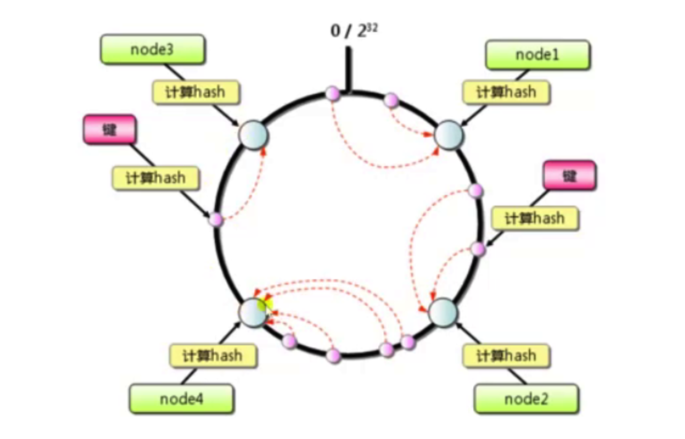
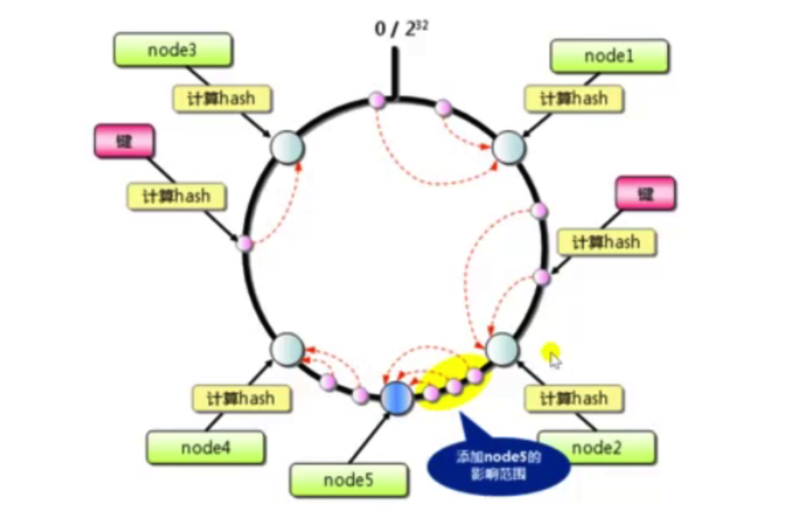

```
Directives
     upstream
     server
     zone
     state
     hash
     ip_hash
     keepalive
     keepalive_requests
     keepalive_time
     keepalive_timeout
     ntlm
     least_conn
     least_time
     queue
     random
     resolver
     resolver_timeout
     sticky
     sticky_cookie_insert
Embedded Variables
```

上游服务，负载均衡模块。

#### 配置

round-robin 轮询：

```nginx
upstream app {
    server nginx2;
    server nginx3;
}
location /up {
    proxy_pass http://app;
}
```

加权轮询：

```nginx
upstream app {
    server nginx2 weight=1;
    server nginx3 weight=2;
}
```

max_fails 与 fail_timeout 参考：[参考](https://blog.51cto.com/kexiaoke/2316851)

```nginx
upstream app {
    server nginx2 weight=1 max_fails=2 fail_timeout=10;
    server nginx3 weight=2;
    server nginx backup;
}
location /up {
    proxy_pass http://app;
    proxy_connect_timeout 3s;
    proxy_read_timeout 3s;
    proxy_next_upstream http_500; # 定义server unavaliable 的条件。
}
```

ip_hash 与 hash 策略：

```nginx
upstream app {
    #ip_hash;
    hash user_$arg_username;
    server nginx2 weight=1 max_fails=2 fail_timeout=10;
    server nginx3 weight=2;
    #server nginx backup;
}
```

hash 策略在某台 server down 掉或者新加 server 的时候，hash 固有的缺陷就显现了，一致性 hash ：





使用很简单，添加 consistent ：

```nginx
upstream app {
    #ip_hash;
    hash user_$arg_username consistent;
    server nginx2 weight=1 max_fails=2 fail_timeout=10;
    server nginx3 weight=2;
    #server nginx backup;
}
```

least_conn 以及 使用 zone ，用共享内存解决 worker 之间共享信息的问题：

```nginx
upstream app {
    #ip_hash;
    #hash user_$arg_username;
    least_conn;
    zone xx 64k;
    server nginx2 weight=1 max_fails=2 fail_timeout=10;
    server nginx3 weight=2;
    #server nginx backup;
}
```

与 upstream 保持 keepalive ：

```nginx
location /up {
    proxy_pass http://app;
    proxy_connect_timeout 3s;
    proxy_read_timeout 3s;
    #proxy_next_upstream http_500;
    proxy_http_version 1.1; # 不设置下面这两句的话 keepalive 不会生效。
    proxy_set_header Connection "";
}
```

 proxy_http_version 1.1; 和 proxy_set_header Connection ""; 基本为固定写法。proxy_http_version 默认为 1.0 ，虽然也可以使用 proxy_set_header Connection "Keep-Alive" ，但是不建议。

upstream 设置 keepalive ：

```nginx
upstream app {
    #ip_hash;
    #hash user_$arg_username;
    #least_conn;
    zone xx 64k;
    server nginx2 weight=1 max_fails=2 fail_timeout=10;
    #server nginx3 weight=2;
    #server nginx backup;
    keepalive 1; # 必须设置，意为每个 nginx worker 可以保持的 keepalive conn 最大数。不建议设置过大值。
    keepalive_requests 4; # 每个 keepalive conn 最大处理请求数。
    keepalive_timeout 60s; # keepalive conn 超时关闭时间。
}
```

tcpdump 查看 keepalive 效果：

```
15:25:37.264143 IP 172.18.0.1.57220 > purelight-php_nginx_1.purelight-php_web-network.80: Flags [S], seq 16320911, win 65495, options [mss 65495,sackOK,TS val 645953038 ecr 0,nop,wscale 7], length 0
15:25:37.265068 IP purelight-php_nginx_1.purelight-php_web-network.45708 > 8181b9d298c6.80: Flags [S], seq 2511631817, win 64240, options [mss 1460,sackOK,TS val 4203609952 ecr 0,nop,wscale 7], length 0
15:25:37.265110 IP 8181b9d298c6.80 > purelight-php_nginx_1.purelight-php_web-network.45708: Flags [S.], seq 2536051365, ack 2511631818, win 65160, options [mss 1460,sackOK,TS val 3638293007 ecr 4203609952,nop,wscale 7], length 0
15:25:37.265194 IP purelight-php_nginx_1.purelight-php_web-network.45708 > 8181b9d298c6.80: Flags [.], ack 1, win 502, options [nop,nop,TS val 4203609952 ecr 3638293007], length 0
15:25:37.265392 IP purelight-php_nginx_1.purelight-php_web-network.45708 > 8181b9d298c6.80: Flags [P.], seq 1:70, ack 1, win 502, options [nop,nop,TS val 4203609953 ecr 3638293007], length 69: HTTP: GET /up HTTP/1.1
15:25:37.265413 IP 8181b9d298c6.80 > purelight-php_nginx_1.purelight-php_web-network.45708: Flags [.], ack 70, win 509, options [nop,nop,TS val 3638293008 ecr 4203609953], length 0
15:25:37.265558 IP 8181b9d298c6.80 > purelight-php_nginx_1.purelight-php_web-network.45708: Flags [P.], seq 1:246, ack 70, win 509, options [nop,nop,TS val 3638293008 ecr 4203609953], length 245: HTTP: HTTP/1.1 500 Internal Server Error
15:25:37.265707 IP purelight-php_nginx_1.purelight-php_web-network.45708 > 8181b9d298c6.80: Flags [.], ack 246, win 501, options [nop,nop,TS val 4203609953 ecr 3638293008], length 0

------------

15:25:56.812996 IP purelight-php_nginx_1.purelight-php_web-network.45708 > 8181b9d298c6.80: Flags [P.], seq 70:139, ack 246, win 501, options [nop,nop,TS val 4203629536 ecr 3638293008], length 69: HTTP: GET /up HTTP/1.1
15:25:56.813048 IP 8181b9d298c6.80 > purelight-php_nginx_1.purelight-php_web-network.45708: Flags [.], ack 139, win 509, options [nop,nop,TS val 3638312591 ecr 4203629536], length 0
15:25:56.813260 IP 8181b9d298c6.80 > purelight-php_nginx_1.purelight-php_web-network.45708: Flags [P.], seq 246:491, ack 139, win 509, options [nop,nop,TS val 3638312592 ecr 4203629536], length 245: HTTP: HTTP/1.1 500 Internal Server Error
15:25:56.813359 IP purelight-php_nginx_1.purelight-php_web-network.45708 > 8181b9d298c6.80: Flags [.], ack 491, win 501, options [nop,nop,TS val 4203629537 ecr 3638312592], length 0


------------

15:26:06.122308 IP purelight-php_nginx_1.purelight-php_web-network.45708 > 8181b9d298c6.80: Flags [P.], seq 139:208, ack 491, win 501, options [nop,nop,TS val 4203638846 ecr 3638312592], length 69: HTTP: GET /up HTTP/1.1
15:26:06.122378 IP 8181b9d298c6.80 > purelight-php_nginx_1.purelight-php_web-network.45708: Flags [.], ack 208, win 509, options [nop,nop,TS val 3638321901 ecr 4203638846], length 0
15:26:06.122624 IP 8181b9d298c6.80 > purelight-php_nginx_1.purelight-php_web-network.45708: Flags [P.], seq 491:736, ack 208, win 509, options [nop,nop,TS val 3638321901 ecr 4203638846], length 245: HTTP: HTTP/1.1 500 Internal Server Error
15:26:06.122707 IP purelight-php_nginx_1.purelight-php_web-network.45708 > 8181b9d298c6.80: Flags [.], ack 736, win 501, options [nop,nop,TS val 4203638846 ecr 3638321901], length 0

--------

15:26:12.115643 IP purelight-php_nginx_1.purelight-php_web-network.45708 > 8181b9d298c6.80: Flags [P.], seq 208:277, ack 736, win 501, options [nop,nop,TS val 4203644839 ecr 3638321901], length 69: HTTP: GET /up HTTP/1.1
15:26:12.115700 IP 8181b9d298c6.80 > purelight-php_nginx_1.purelight-php_web-network.45708: Flags [.], ack 277, win 509, options [nop,nop,TS val 3638327894 ecr 4203644839], length 0
15:26:12.115951 IP 8181b9d298c6.80 > purelight-php_nginx_1.purelight-php_web-network.45708: Flags [P.], seq 736:981, ack 277, win 509, options [nop,nop,TS val 3638327894 ecr 4203644839], length 245: HTTP: HTTP/1.1 500 Internal Server Error
15:26:12.116054 IP purelight-php_nginx_1.purelight-php_web-network.45708 > 8181b9d298c6.80: Flags [.], ack 981, win 501, options [nop,nop,TS val 4203644839 ecr 3638327894], length 0
15:26:12.116201 IP purelight-php_nginx_1.purelight-php_web-network.45708 > 8181b9d298c6.80: Flags [F.], seq 277, ack 981, win 501, options [nop,nop,TS val 4203644840 ecr 3638327894], length 0
15:26:12.117717 IP 8181b9d298c6.80 > purelight-php_nginx_1.purelight-php_web-network.45708: Flags [F.], seq 981, ack 278, win 509, options [nop,nop,TS val 3638327896 ecr 4203644840], length 0
15:26:12.117768 IP purelight-php_nginx_1.purelight-php_web-network.45708 > 8181b9d298c6.80: Flags [.], ack 982, win 501, options [nop,nop,TS val 4203644841 ecr 3638327896], length 0

```

