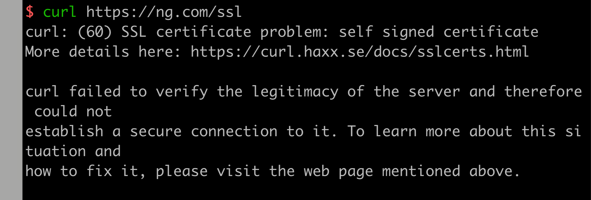
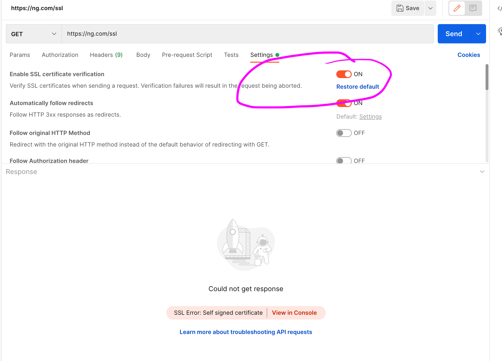
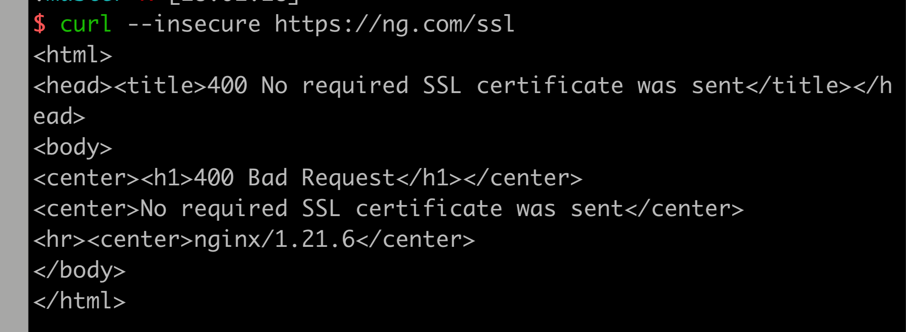
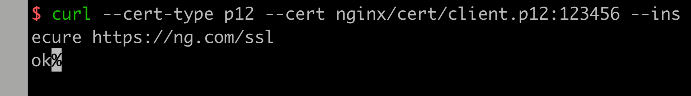
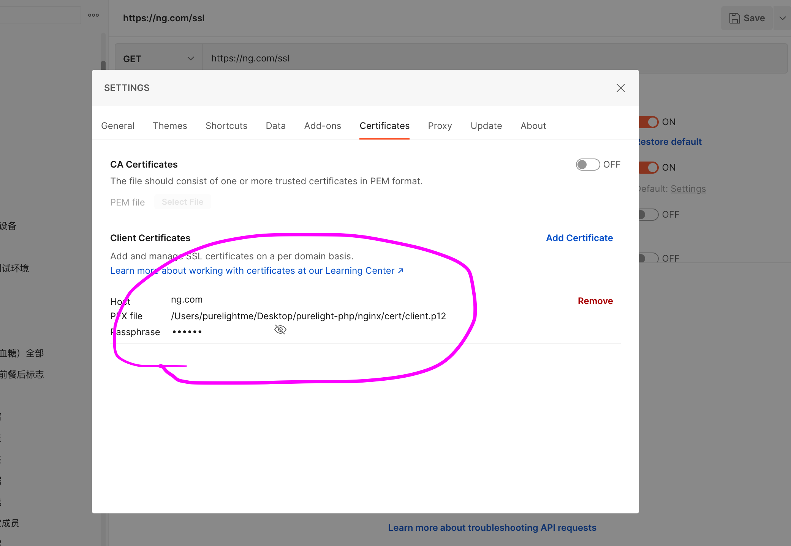

```
Directives
     ssl
     ssl_buffer_size
     ssl_certificate
     ssl_certificate_key
     ssl_ciphers
     ssl_client_certificate
     ssl_conf_command
     ssl_crl
     ssl_dhparam
     ssl_early_data
     ssl_ecdh_curve
     ssl_ocsp
     ssl_ocsp_cache
     ssl_ocsp_responder
     ssl_password_file
     ssl_prefer_server_ciphers
     ssl_protocols
     ssl_reject_handshake
     ssl_session_cache
     ssl_session_ticket_key
     ssl_session_tickets
     ssl_session_timeout
     ssl_stapling
     ssl_stapling_file
     ssl_stapling_responder
     ssl_stapling_verify
     ssl_trusted_certificate
     ssl_verify_client
     ssl_verify_depth
Error Processing
Embedded Variables
```

主要了解server证书，client证书生成及配置方式：

##### server证书生成

```
OpenSSL> genrsa -des3 -out server.key 2048
OpenSSL> req -new -key server.key -out server.csr
cp server.key server.key.org
openssl rsa -in server.key.org -out server.key # 去除口令
OpenSSL> x509 -req -days 365 -in server.csr -signkey server.key -out server.crt
```

##### client证书生成

```
OpenSSL> pkcs12 -export -clcerts -in server.crt -inkey server.key -out client.p12
```

##### 配置

```nginx
server {
    listen 443 ssl;
    ssl_certificate     /etc/nginx/cert/server.crt;
    ssl_certificate_key /etc/nginx/cert/server.key;
  
    #ssl_verify_client on;
    #ssl_client_certificate /etc/nginx/cert/server.crt;
    
  	server_name ng.com;
    
    location /ssl {
        add_header Content-Type text/plain;
        return 200 'ok';
    }
}
```

##### 测试

当不启用客户端证书校验时：




curl --insecure 即不校验服务端 ssl 证书。php http client Guzzle 使用请求选项 verify:false 。

postman 关闭 ssl verification 即可，开启则会校验服务端证书有效性：



##### 开启客户端证书校验

取消 nginx 配置这两句注释：

```nginx
#ssl_verify_client on;
#ssl_client_certificate /etc/nginx/cert/server.crt;
```

再次请求：



发现返回 400 状态码，因为此时客户端也必须携带证书。

使用创建的 client.p12 证书请求：



postman 设置 client certificate :



php guzzle：

```php
<?php
/**
 * Created by
 * Author purelight
 * Date 2022/3/20
 * Time 6:48 下午
 */

use GuzzleHttp\Client;

require_once __DIR__ . '/../vendor/autoload.php';

$client = new Client([
    'base_uri' => 'https://ng.com/',
    'timeout' => 3.0,
]);

$response = $client->get('/ssl', [
    'verify' => false,
    'cert' => [
        __DIR__ . '/client.p12',
        '123456'
    ],
    'curl' => [
        CURLOPT_SSLCERTTYPE => 'P12'
    ]
]);

var_dump((string) $response->getBody());

```

