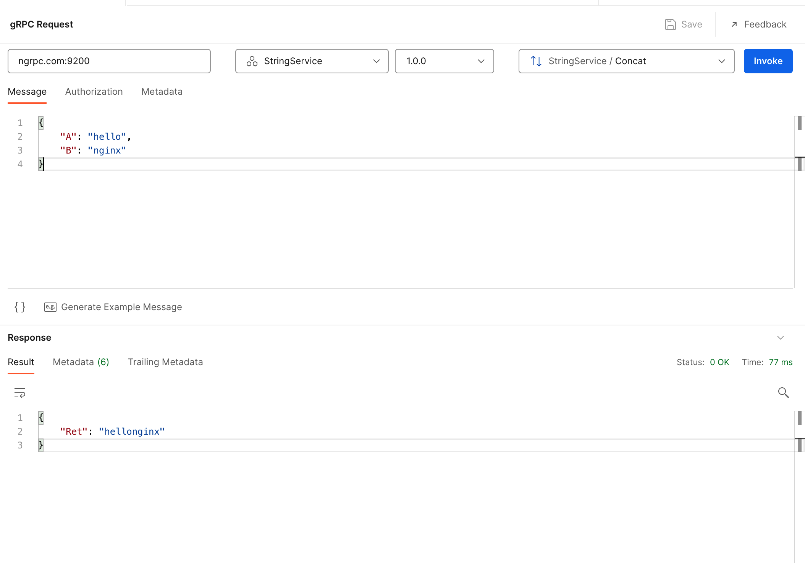
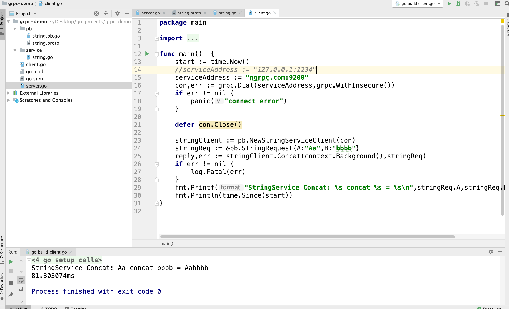

```
Directives
     grpc_bind
     grpc_buffer_size
     grpc_connect_timeout
     grpc_hide_header
     grpc_ignore_headers
     grpc_intercept_errors
     grpc_next_upstream
     grpc_next_upstream_timeout
     grpc_next_upstream_tries
     grpc_pass
     grpc_pass_header
     grpc_read_timeout
     grpc_send_timeout
     grpc_set_header
     grpc_socket_keepalive
     grpc_ssl_certificate
     grpc_ssl_certificate_key
     grpc_ssl_ciphers
     grpc_ssl_conf_command
     grpc_ssl_crl
     grpc_ssl_name
     grpc_ssl_password_file
     grpc_ssl_protocols
     grpc_ssl_server_name
     grpc_ssl_session_reuse
     grpc_ssl_trusted_certificate
     grpc_ssl_verify
     grpc_ssl_verify_depth
```

##### 服务端启动

string.proto:

```
syntax = "proto3";

package pb;

service StringService{
    rpc Concat(StringRequest) returns (StringResponse) {}
}

message StringRequest {
    string A = 1;
    string B = 2;
}

message StringResponse {
    string Ret = 1;
    string err = 2;
}
```

string.go:

```go
package service

import (
	"context"
	"grpc-demo/pb"
)

type StringService struct {

}

func (s *StringService)Concat(ctx context.Context,req *pb.StringRequest)(*pb.StringResponse,error)  {
	response := pb.StringResponse{Ret:req.A + req.B}
	return &response,nil
}
```

main.go:

```go
package main

import (
	"flag"
	"fmt"
	"google.golang.org/grpc"
	"grpc-demo/pb"
	"grpc-demo/service"
	"log"
	"net"
)

func main()  {

	port := flag.Int("port",1234,"端口")

	flag.Parse()

	lis,err := net.Listen("tcp",fmt.Sprintf(":%d",*port))
	if err != nil {
		log.Fatal("listen失败：",err)
	}

	grpcServer := grpc.NewServer()
	stringService := new(service.StringService)
	pb.RegisterStringServiceServer(grpcServer,stringService)
	grpcServer.Serve(lis)
}
```

交叉编译：

```shell
GOOS=linux go build -o grpc_service server.go
```

docker-composer.yaml:

```yaml
go:
    build:
      context: ./go
    ports:
      - "1234:1234"
    networks:
      - web-network
    volumes:
      - "./go/apps/:/apps"
    command: ["/apps/grpc_service"]
```

Dockerfile:

```dockerfile
From alpine:3.12

WORKDIR /apps
```

启动：

```shell
docker-compose up -d go
```

##### Nginx配置

```nginx
server {
    listen 9200 http2;
    server_name ngrpc.com;
    access_log /var/log/nginx/ngrpc.com.access.log;
    location / {
        grpc_pass grpc://go:1234;
    }
}
```

##### 测试



观察 access log：

```
172.18.0.1 - - [21/Mar/2022:18:01:24 +0800] "POST /pb.StringService/Concat HTTP/2.0" 200 17 "-" "grpc-node-js/1.4.2"
```

golang client 测试：


