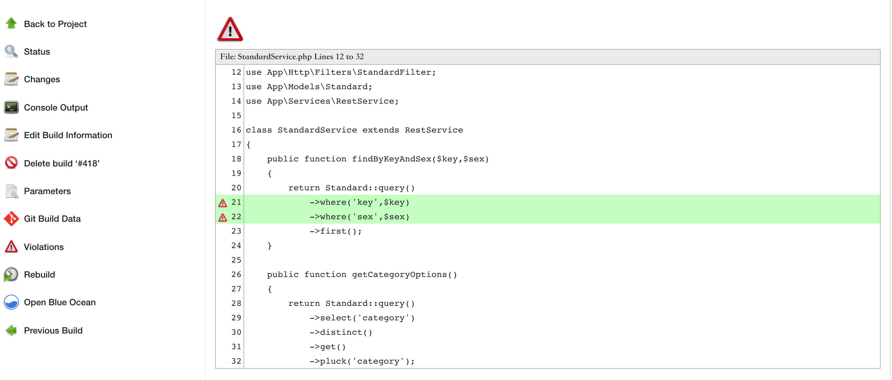

主要从原理，到实践，再到自定义(最佳实践)，全面讲解 PHP 代码规范应该如何做。

PHP 规范化的3个方向：

语法层面，运行时层面，规范层面。

### 语法层面

这一层是最基础的层面，存在语法错误的代码应该在第一时间被发现。

`php -l filename` php 自带语法检测命令。

使用 [https://github.com/overtrue/phplint](https://github.com/overtrue/phplint) ，提供更好的界面展示和更灵活的 CI 自定义功能，但其底层依然是使用 `php -l` 检测 php 语法：

https://github.com/overtrue/phplint/blob/8.0/src/Linter.php#L157

### 运行时层面

`运行时错误代码` 是指需要到真正运行的时候才能检测出问题的代码，这类问题没办法很好的检测，除你真的运行它。


### 规范层面

这一层是面向代码风格的，是我们关注的重点，一个好的开发，代码风格都是基于别人是否容易理解，自己后期回顾的可追溯性效率是否高效来编程。

目前，PHP 社区主要有3套编码风格。

- PSR 系列，http://phpfig.p2hp.com/
- PEAR 编码准则，https://pear.php.net/manual/en/standards.php
- Symfony 编码准则，https://symfony.com/doc/current/contributing/code/standards.html

#### php 代码解析器

[解析器代号列表](https://www.php.net/manual/zh/tokens.php)

解析php代码的扩展：https://www.php.net/manual/zh/ref.tokenizer.php

`php --re tokenizer` 内容只有一些代号常量和2个函数，`token_get_all(string $resource)，token_name(int $token)`

```php
<?php
/**
 * Created by
 * Author purelight
 * Date 2022/2/8
 * Time 9:14 上午
 */

$code = file_get_contents(__DIR__ . '/../src/Client.php');

$tokens = token_get_all($code);
foreach ($tokens as $token){
    if (is_array($token)){
        printf("%d - %s\t%s\n",$token[2],token_name($token[0]),$token[1]);
    }else{
        var_dump($token);
    }
}
```

有了这些基础，就可以去做代码规范分析了，但工作量依然很大，我们尽可能利用开源社区已有的轮子。

#### PHP_CodeSniffer

https://github.com/squizlabs/PHP_CodeSniffer

其提供2个命令：phpcs（代码规范分析），phpcbf（代码纠正）。

文档：https://github.com/squizlabs/PHP_CodeSniffer/wiki

A coding standard in PHP_CodeSniffer is a collection of sniff files.

The default coding standard used by PHP_CodeSniffer is the PEAR coding standard.

其默认采用 PEAR 编码规范，https://pear.php.net/manual/en/standards.php

更加直接的了解各种规范：

```shell
root@7e9a7a3b23b1:/var/www/html/daishu/ulucu# ./vendor/bin/phpcs -i
The installed coding standards are MySource, PEAR, PSR1, PSR12, PSR2, Squiz and Zend
```

```shell
root@7e9a7a3b23b1:/var/www/html/daishu/ulucu# ./vendor/bin/phpcs --standard=PSR1 --generator=HTML >> ./example/PSR1.html
root@7e9a7a3b23b1:/var/www/html/daishu/ulucu# ./vendor/bin/phpcs --standard=PSR2 --generator=HTML >> ./example/PSR2.html
root@7e9a7a3b23b1:/var/www/html/daishu/ulucu# ./vendor/bin/phpcs --standard=PSR12 --generator=HTML >> ./example/PSR12.html
root@7e9a7a3b23b1:/var/www/html/daishu/ulucu# ./vendor/bin/phpcs --standard=Squiz --generator=HTML >> ./example/Squiz.html
root@7e9a7a3b23b1:/var/www/html/daishu/ulucu# ./vendor/bin/phpcs --standard=Zend --generator=HTML >> ./example/Zend.html
root@7e9a7a3b23b1:/var/www/html/daishu/ulucu# ./vendor/bin/phpcs --standard=PEAR --generator=HTML >> ./example/PEAR.html
root@7e9a7a3b23b1:/var/www/html/daishu/ulucu# ./vendor/bin/phpcs --standard=MySource --generator=HTML >> ./example/MySource.html
root@7e9a7a3b23b1:/var/www/html/daishu/ulucu# ./vendor/bin/phpcs --standard=./DsStandard/ --generator=HTML >> ./example/DsStandard.html
```

PEAR 规范示例：


这些规范互相补充，也有交集，还有互相冲突的。

- phpcs

  > ./vendor/bin/phpcs src/Client.php
  >
  > ./vendor/bin/phpcs --report=summary src
  >
  > ./vendor/bin/phpcs --standard=PEAR,./DsStandard src/Client.php
  >
  > ./vendor/bin/phpcs -i
  >
  > ./vendor/bin/phpcs --standard=PEAR -e
  >
  > ./vendor/bin/phpcs --standard=./DsStandard -e
  >
  > ./vendor/bin/phpcs --standard=PEAR --sniffs=PEAR.Commenting.FileComment src/Client.php
  >
  > ./vendor/bin/phpcs --standard=PEAR --report=code src/Client.php

- phpcbf

  > ./vendor/bin/phpcs --report=diff src/Client.php
  > --- src/Client.php
  >
  > ./vendor/bin/phpcbf src/Client.php

#### 自定义规范

步骤：

```shell
mkdir ./DsStandard
cd DsStandard
vim ruleset.xml // 参考https://github.com/squizlabs/PHP_CodeSniffer/wiki/Annotated-Ruleset
mkdir Sniffs
cd Sniffs
... // touch sniff files
```

完整手册：https://github.com/squizlabs/PHP_CodeSniffer/wiki/Coding-Standard-Tutorial

##### 限制变量必须是驼峰命名的sniff例子：

```php
<?php

use PHP_CodeSniffer\Files\File;
use PHP_CodeSniffer\Sniffs\Sniff;

/**
 * Created by
 * Author purelight
 * Date 2022/2/9
 * Time 9:36 上午
 */

class VariableCamelCaseSniff implements Sniff
{

    public function register()
    {
        return [
            T_VARIABLE
        ];
    }

    public function process(File $phpcsFile, $stackPtr)
    {
        $tokens = $phpcsFile->getTokens();
        $variableName = substr($tokens[$stackPtr]['content'],1);
        $rs = preg_match_all('/[a-z]+[a-z|A-Z]+/',$variableName,$matches);
        if ($rs !== 1 || $matches[0][0] !== $variableName){
            $error = '变量不是驼峰命名';
            $data = [ trim($tokens[$stackPtr]['content']) ];
            $phpcsFile->addError($error,$stackPtr,'Found',$data);
        }
    }
}
```

测试效果：


#### 内置Standard

https://github.com/squizlabs/PHP_CodeSniffer/tree/master/src/Standards

#### 可配置的规则细项

比如 PEAR 规定每行最多80个字符，我们可以在 `ruleset.xml` 自定义这个值，比如改到100，从而适应我们自己的需求。

https://github.com/squizlabs/PHP_CodeSniffer/wiki/Customisable-Sniff-Properties#genericfileslinelength

##### .phpcs.xml

每个项目根目录下创建此文件，配置上要检查的代码路径，规范选择等等，相当于配置 phpcs 命令的各种参数，在项目根目录直接运行 phpcs 就会采用该配置文件运行代码检查。

具体配置手册参考：

https://raw.githubusercontent.com/squizlabs/PHP_CodeSniffer/master/phpcs.xml.dist

#### FAQ

https://github.com/squizlabs/PHP_CodeSniffer/wiki/FAQ

### 结合IDE PHPStorm

Preferences -> PHP -> Quality Tools -> 设置 PHP_CodeSniffer 安装目录

Editor -> Inspections -> Quality Tools -> 设置 PHP_CodeSniffer validation 规则

不同版本IDE具体操作不同，基本就是这两个步骤，推荐**全局安装**。

使用效果：

当使用 PEAR 规范，违反注释规范时ide给出提示如下


当设定自定义规范 DsStandard ，违反驼峰命名规范时ide给出提示如下


修正后：


### 结合 Jenkins

1，Jenkins 安装 Violations 插件

2，项目配置，Build 运行 phpcs 生成 checkstyle 文件，例如：

```
/root/.composer/vendor/bin/phpcs --report=checkstyle --report-file=./checkstyle.xml --standard=Zend ./app/Services/Common
```

3，配置 violations：


4，Build 查看效果：


点击文件名查看具体不符合规范的代码：




修改相应代码(仅 StandardService.php)之后再次 Build ，查看到已经没有该文件的提示了：


只要检测到含有不符合规范的代码，phpcs 命令返回错误码非0，构建会失败！后续可视情况调整相关参数。

### 最佳实践

默认的规范是比较严格的，就算拿优秀的社区package来验证，也会有一大堆ERROR和WARNING，所以，结合已有规范，选择性地制定自己的规范才是最佳选择。

即在已有 Standard 下选择部分 Sniff ，然后添加我们自定义的 Sniff 。


重心就是维护 N 多个自定义的 Sniffs ，然后用 ruleset 去配置，形成 Standard 。

### 总结

我们从3个层面逐步解释了 PHP 代码规范应该如何做，重点讲述了规范层面，包括原理，工具，IDE，advanced usage，已经有能力灵活控制代码质量了。