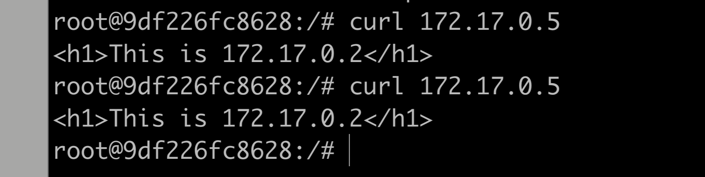
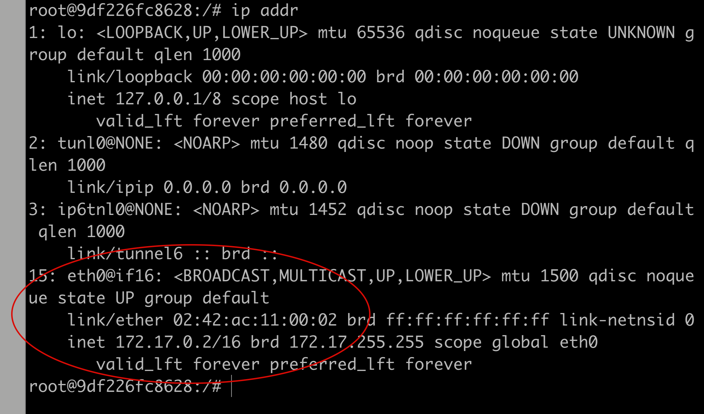
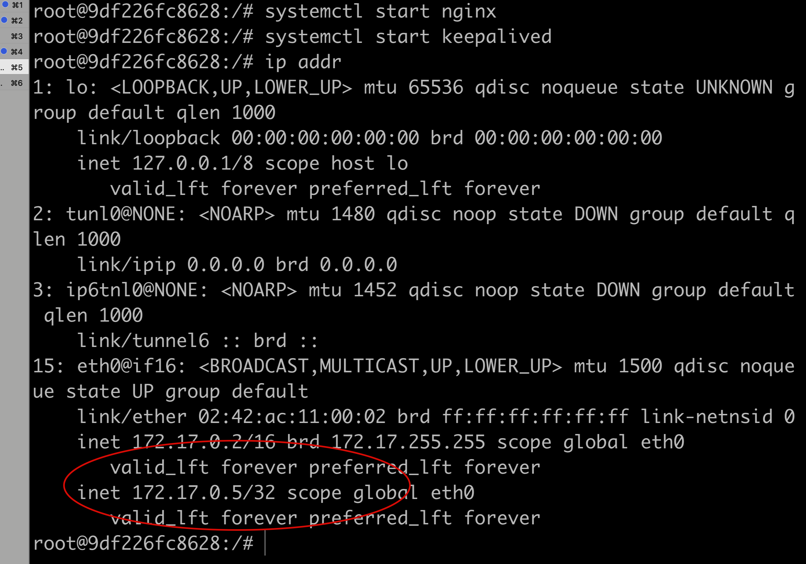

### 简介

Keepalived 是一款基于 vrrp 虚拟路由冗余协议实现的一款开源软件，通常用来实现高可用，本文将用 Docker 实践 Keepalived 的 vip 高可用，用 Nginx 做示例。

### 环境安装

使2个 ubuntu 镜像的 Docker 容器，分别安装实验需要的基础软件。

##### 启动容器

```shell
docker run -dit -p 8001:80 --privileged --name=server1 ubuntu /bin/bash
```

```shell
docker run -dit -p 8002:80 --privileged --name=server2 ubuntu /bin/bash
```

##### 安装软件

```shell
docker exec -it server1 bash
apt-get update
apt-get install -y net-tools curl systemctl psmisc vim keepalived nginx
```

期间会让我们选择时区，依次输入6,70，选择 Asia/Shanghai 。

##### 启动 nginx

先用 `ip addr` 查看两个容器的 ip 地址，分别为：

server1: 172.17.0.2 

server2:172.17.0.3

更改两个容器的 nginx 默认 index 页面，修改成：

vim /var/www/html/index.nginx-debian.html

server1: <h1>This is 172.17.0.2 </h1>

server2: <h1>This is 172.17.0.3 </h1>

启动 nginx: `systemctl start nginx`

##### 配置 keepalived

使用 `172.17.0.5` 作为 `vip` 。

server1 作为 Master，vim /etc/keepalived/keepalived.conf:

```
! Configuration File for keepalived

global_defs {
    router_id 172.17.0.2
    script_user root
    enable_script_security
}

vrrp_script chk_http_port {
    script /etc/keepalived/check_nginx.sh
    interval 10
    weight -20
}

vrrp_instance VI_1 {
    state MASTER
    interface eth0
    virtual_router_id 66
    priority 100
    advert_int 1
    authentication {
       auth_type PASS
       auth_pass 1111
    }
    track_script {
       chk_http_port
    }
    virtual_ipaddress {
       172.17.0.5
    }
}
```

server2 作为 Backup ，vim /etc/keepalived/keepalived.conf:

```
! Configuration File for keepalived

global_defs {
    router_id 172.17.0.3
    script_user root
    enable_script_security
}

vrrp_script chk_http_port {
    script "/etc/keepalived/check_nginx.sh"
    interval 10
    weight -20
}

vrrp_instance VI_1 {
    state BACKUP
    interface eth0
    virtual_router_id 66
    priority 90
    advert_int 1
    authentication {
       auth_type PASS
       auth_pass 1111
    }
    track_script {
       chk_http_port
    }
    virtual_ipaddress {
       172.17.0.5
    }
}
```

两台 server 都使用 `/etc/keepalived/check_nginx.sh` 脚本检测服务是否正常：

```shell
#!/bin/bash
echo  $(date)  " start check nginx..." >> /etc/keepalived/check_nginx.log
A=`ps -C nginx --no-header | wc -l`
if [ $A -eq 0 ];then
        echo $(date)  "nginx is not running, restarting..." >> /etc/keepalived/check_nginx.log
            systemctl restart nginx
                if [ `ps -C nginx --no-header | wc -l` -eq 0 ];then
                        echo $(date) "nginx is down, kill all keepalived..." >> /etc/keepalived/check_nginx.log
                        killall keepalived
                                    fi
fi
```

### 测试

server1 先启动 keepalived ，server2 后启动 keepalived ，观察：

server1 已获取 vip :


访问虚拟 ip 服务：



因为停掉 nginx ，keepalived 检测脚本会尝试拉起，所以我们将 /etc/nginx/nginx.conf 文件故意改错，重新拉起也失败，keepalived 进程就会退出，理论上 vip 就会 `漂移` 到 server2 。

停掉 server1 的 nginx ： 

```shell
systemctl stop nginx
```

再次观察 server1 ，其 `vip` 已经不见了：



去 server2 上查看，server2 已经抢到 `vip` :


访问服务：


此时，将 server1 的 nginx 配置改正确，重启：

```
systemctl start nginx 
systemctl start keepalived
```

稍等片刻，发现 server1 重新夺回 `vip` ：



访问 `vip` 服务：


至此，keepalived 高可用试验成功。

### 总结

keepalived 不仅能做 nginx 高可用，还可以做 mysql，redis 等等，其本质通过 vip 漂移来实现动态高可用，在实践中有很多应用场景。

在 docker 容器中实践，需要注意使用 `--privileged` 选项。


`2022-04-25`

