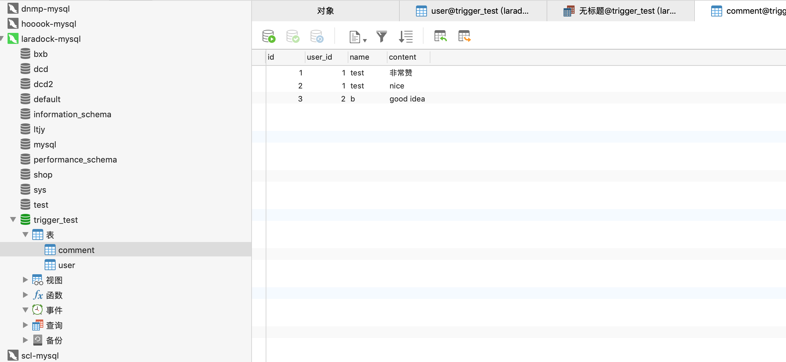

先参考下答案：

> 触发器与存储过程非常相似，触发器也是SQL语句集，两者唯一的区别是触发器不能用EXECUTE语句调用，而是在用户执行Transact-SQL语句时自动触发（激活）执行。触发器是在一个修改了指定表中的数据时执行的存储过程。通常通过创建触发器来强制实现不同表中的逻辑相关数据的引用完整性和一致性。由于用户不能绕过触发器，所以可以用它来强制实施复杂的业务规则，以确保数据的完整性。触发器不同于存储过程，触发器主要是通过事件执行触发而被执行的，而存储过程可以通过存储过程名称名字而直接调用。当对某一表进行诸如UPDATE、INSERT、DELETE这些操作时，SQLSERVER就会自动执行触发器所定义的SQL语句，从而确保对数据的处理必须符合这些SQL语句所定义的规则。

### 触发器

#### 创建实验需要的表并插入测试数据

```mysql
CREATE TABLE `user` (   
    `id` int(11) NOT NULL auto_increment COMMENT '用户ID',   
    `name` varchar(50) NOT NULL default '' COMMENT '名称',   
    `sex` int(1) NOT NULL default '0' COMMENT '0为男，1为女',   
    PRIMARY KEY  (`id`)   
) DEFAULT CHARSET=utf8mb4;

INSERT INTO `user` ( `name`, `sex`) VALUES   
    ('a', 0),   
    ('b', 1);
    
CREATE TABLE `comment` (   
`id` int(11) NOT NULL auto_increment COMMENT '评论ID',   
`user_id` int(11) NOT NULL COMMENT '用户ID',   
`name` varchar(50) NOT NULL default '' COMMENT '用户名称',   
`content` varchar(1000) NOT NULL default '' COMMENT '评论内容',   
PRIMARY KEY  (`id`)   
) DEFAULT CHARSET=utf8mb4;   
  
INSERT INTO `comment` ( `user_id`, `name`, `content`) VALUES   
( 1, 'a', '非常赞'),   
( 1, 'a', 'nice'),   
( 2, 'b', 'good idea');     
```

#### 创建触发器

```mysql
CREATE TRIGGER updatename AFTER UPDATE ON `user`
FOR EACH ROW
BEGIN
IF new.name != old.name THEN
UPDATE `comment` SET `comment`.name=new.name WHERE `comment`.user_id=old.id;
END IF;
END;
```

#### 测试触发器

```mysql
UPDATE `user` SET name='test' where id=1;
```

#### 查看结果



:wink: comment表已成功更新

### 存储过程

存储过程比较灵活，可以带参数，参考文章 [mysql存储过程demo:初始化10000条学生记录](https://blog.csdn.net/wangjinsu7/article/details/52257639)


```2019-07-17```