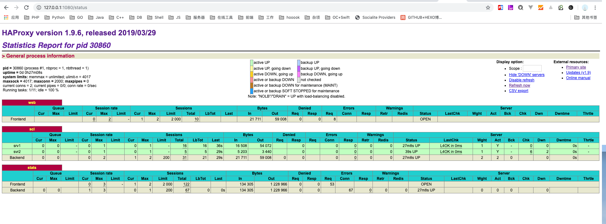

### HAProxy是什么

HAProxy是一个免费的负载均衡软件，可以运行于大部分主流的Linux操作系统上。

HAProxy提供了L4(TCP)和L7(HTTP)两种负载均衡能力，具备丰富的功能。HAProxy的社区非常活跃，版本更新快速（最新稳定版1.7.2于2017/01/13推出）。最关键的是，HAProxy具备媲美商用负载均衡器的性能和稳定性。

因为HAProxy的上述优点，它当前不仅仅是免费负载均衡软件的首选，更几乎成为了唯一选择。

### HAProxy的核心能力

- 负载均衡：L4和L7两种模式，支持RR/静态RR/LC/IP Hash/URI Hash/URL_PARAM Hash/HTTP_HEADER Hash等丰富的负载均衡算法
- 健康检查：支持TCP和HTTP两种健康检查模式
- 会话保持：对于未实现会话共享的应用集群，可通过Insert Cookie/Rewrite Cookie/Prefix Cookie，以及上述的多种Hash方式实现会话保持
- SSL：HAProxy可以解析HTTPS协议，并能够将请求解密为HTTP后向后端传输
- HTTP请求重写与重定向
- 监控与统计：HAProxy提供了基于Web的统计信息页面，展现健康状态和流量数据。基于此功能，使用者可以开发监控程序来监控HAProxy的状态

### HAProxy的关键特性

###### 性能

- 采用单线程、事件驱动、非阻塞模型，减少上下文切换的消耗，能在1ms内处理数百个请求。并且每个会话只占用数KB的内存。
- 大量精细的性能优化，如O(1)复杂度的事件检查器、延迟更新技术、Single-buffereing、Zero-copy forwarding等等，这些技术使得HAProxy在中等负载下只占用极低的CPU资源。
- HAProxy大量利用操作系统本身的功能特性，使得其在处理请求时能发挥极高的性能，通常情况下，HAProxy自身只占用15%的处理时间，剩余的85%都是在系统内核层完成的。
- HAProxy作者在8年前（2009）年使用1.4版本进行了一次测试，单个HAProxy进程的处理能力突破了10万请求/秒，并轻松占满了10Gbps的网络带宽。

###### 稳定性

- 作为建议以单进程模式运行的程序，HAProxy对稳定性的要求是十分严苛的。按照作者的说法，HAProxy在13年间从未出现过一个会导致其崩溃的BUG，HAProxy一旦成功启动，除非操作系统或硬件故障，否则就不会崩溃（我觉得可能多少还是有夸大的成分）。


### 实验

> 实验环境：mac，docker，brew

#### 1，安装两个webserver

由于我本地已经在用[laradock](http://laradock.io/)开发项目了，运行在本机80端口，所以我选择在本机81端口用docker搭建一个nginx，命令：

```dockerfile
docker run -d -p 81:80 --name haproxy-nginx nginx
```

#### 2，下载HAProxy

```bash
brew install haproxy
```

brew 安装较慢的可以参考设置清华大学的homebrew镜像：[Homebrew 镜像使用帮助](https://mirrors.tuna.tsinghua.edu.cn/help/homebrew/)

#### 3，HAProxy配置文件

```config
frontend web
    bind *:8080
    default_backend scl
defaults
    mode http
    timeout client 50000ms
    timeout connect 50000ms
    timeout server 50000ms
backend scl
    balance roundrobin
    server srv1 127.0.0.1:80 check
    server svr2 127.0.0.1:81 check
listen stats
    bind *:1080
    stats enable
    stats uri /status
    stats refresh 30s
    stats auth admin:admin
    stats realm HAProxy\ Stats
```

#### 4，查看结果

本机访问 http://127.0.0.1:8080

轮询出现以下两个界面：

1，这个是我本地80端口的laradock项目首页


2，这个是新建的docker容器，映射到本机81端口的nginx默认欢迎页


3，还有一个自带的状态监控页：



```2019-07-18```

