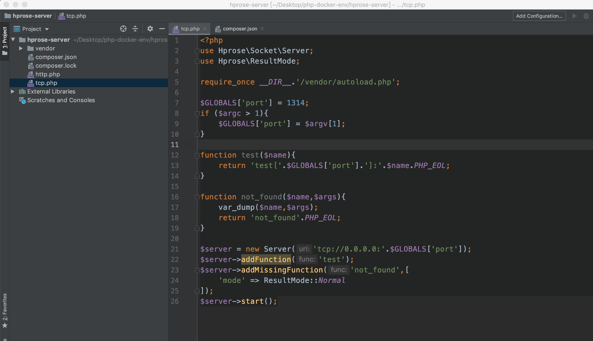

### 简介

[Hprose](https://hprose.com/#)（High Performance Remote Object Service Engine）是一款先进的轻量级、跨语言、跨平台、无侵入式、高性能动态远程对象调用引擎库。它不仅简单易用，而且功能强大。你无需专门学习，只需看上几眼，就能用它轻松构建分布式应用系统。

### 实践

##### tcp-server （php）

- 新建目录，cd进去，composer init，然后require hprose就可以了。

  

- 编写业务代码。

  

- 运行服务。这里运行两个实例，分别监听不同的端口：

  默认的1314端口： 另一个1315端口：

#### tcp-client（php）

- 新建目录，引入composer依赖同server。

- 编写业务代码。

  

  ！！！这里设置了两个地址，有***负载均衡***的作用。

- 运行客户端：

  

  查看server端输出：

  

#### tcp-client（node-js）

- 安装npm依赖。

  

- 编写业务代码

  

- 执行：

  

# 总结

至此，完成了php的server，并且通过php，nodejs都成功调用了服务。

```2019-08-06```

